**Arquitectura y Sistemas Operativos**

# Clase 1 — Introducción a la arquitectura

**Tecnicatura Universitaria en Programación**

---

## Objetivos de la clase

Al finalizar esta clase deberías poder:

- reconocer los componentes básicos de un sistema computacional;
- diferenciar hardware y software;
- explicar, a grandes rasgos, cómo se relacionan CPU, memoria, almacenamiento y entrada/salida;
- comprender al sistema operativo como intermediario y administrador de recursos;
- distinguir modo usuario y modo kernel;
- comenzar a observar el sistema desde una terminal Linux.

---

## Entorno de trabajo

Durante la materia vamos a utilizar Linux como laboratorio del sistema operativo.

Podés trabajar de dos maneras:

1. **Linux nativo**.
2. **Windows + WSL2 + Ubuntu**.

En ambos casos los comandos de Linux y Bash se ejecutan **dentro de una terminal Linux**.

Si usás Windows, podés abrir PowerShell y ejecutar:

```powershell
wsl
```

o, si tenés varias distribuciones instaladas:

```powershell
wsl -l -v
wsl -d Ubuntu
```

Una vez dentro de Ubuntu, el prompt cambia y ya estás trabajando en un entorno Linux.

Ejemplo:

```text
sergio@equipo:~$
```

> **Importante:** PowerShell y Bash son shells diferentes. En esta materia usaremos
> PowerShell principalmente para iniciar o administrar WSL2, y Bash para trabajar
> dentro de Linux.

### Visual Studio Code

Usaremos Visual Studio Code para editar:

- documentos Markdown (`.md`);
- scripts Bash (`.sh`);
- programas y archivos de práctica.

Si VS Code está preparado para trabajar con WSL, desde Ubuntu se puede abrir la carpeta actual con:

```bash
code .
```

Esto permite editar los archivos con VS Code mientras los comandos se ejecutan en Linux.

---

## 1. Una visión general del sistema computacional

Cuando usamos una computadora para escribir, navegar por Internet, programar o escuchar
música solemos ver solamente la parte superficial: pantalla, ventanas, teclado, mouse,
aplicaciones y archivos.

Por debajo existe una organización de componentes físicos y programas que trabajan
coordinadamente.

Una computadora moderna integra, entre otras cosas:

- procesador;
- memoria principal;
- almacenamiento secundario;
- dispositivos y módulos de entrada/salida;
- mecanismos de comunicación entre esos componentes.

Administrar directamente todos esos recursos sería extremadamente complejo para un
programador o un usuario. Por eso existe una capa fundamental de software: el
**sistema operativo**.

En esta primera clase buscamos construir una visión general. Más adelante estudiaremos
con mayor profundidad CPU, memoria, procesos, planificación, sistemas de archivos,
entrada/salida, redes y virtualización.

---

## 2. ¿Qué es una computadora?

En un sentido general, una computadora es una máquina electrónica capaz de:

> recibir datos, procesarlos de acuerdo con un conjunto de instrucciones y producir
> resultados.

Dicho de otra forma:

> **una computadora ejecuta programas.**

Para lograrlo necesita componentes que permitan:

- procesar información;
- almacenarla;
- conservarla;
- intercambiarla con el exterior;
- coordinar la circulación de datos.

En un modelo general podemos considerar:

- **procesador o CPU**;
- **memoria principal**;
- **módulos de entrada/salida**;
- **interconexiones o buses**.

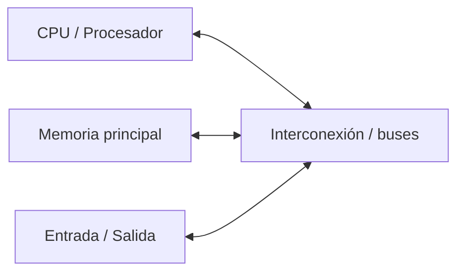

Una computadora no es solamente “la CPU” ni la caja de una PC. Es un **sistema**
formado por partes con funciones diferentes pero complementarias.

---

## 3. Hardware y software

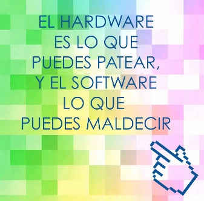

*Una forma humorística de recordar la diferencia: el hardware es lo tangible;
el software, lo que falla sin que puedas tocarlo.*

### Hardware

El **hardware** es la parte física del sistema.

Ejemplos:

- procesador;
- memoria RAM;
- SSD o HDD;
- teclado;
- monitor;
- mouse;
- interfaces de red;
- placas;
- controladores;
- buses e interconexiones.

### Software

El **software** es el conjunto de programas, instrucciones y datos que permiten utilizar
el hardware.

Podemos distinguir, en forma simplificada:

- **programas de aplicación**: navegador, editor, reproductor, IDE;
- **utilidades y programas de sistema**;
- **sistema operativo**.

El hardware aporta los recursos físicos y el software permite utilizarlos.

---

## 4. Componentes básicos de un computador

### 4.1 Procesador o CPU

La CPU, *Central Processing Unit*, es el componente encargado de ejecutar instrucciones.

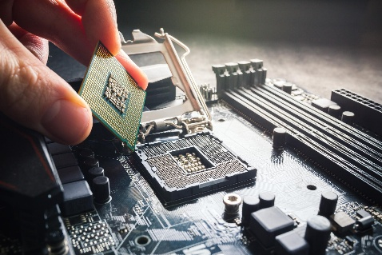

*El procesador es un chip que se instala en el zócalo de la placa madre. No hay
que confundirlo con el gabinete o "caja" de la PC.*

Su actividad básica consiste en:

1. obtener una instrucción;
2. interpretarla;
3. ejecutarla;
4. continuar con la siguiente.

También:

- realiza operaciones sobre datos;
- coordina actividades internas;
- interactúa con memoria;
- participa en la comunicación con dispositivos.

En la clase siguiente estudiaremos su estructura con mayor profundidad.

---

### 4.2 Memoria principal

La **memoria principal**, habitualmente implementada como memoria RAM, contiene datos
e instrucciones que están siendo utilizados durante la ejecución.

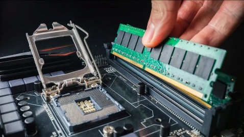

*Los módulos de RAM se insertan en ranuras cercanas al procesador: CPU y memoria
mantienen una relación muy estrecha.*

En los sistemas habituales es **volátil**: pierde su contenido cuando se interrumpe la
alimentación.

Podemos pensarla como el espacio de trabajo rápido del sistema.

> Para que un programa pueda ejecutarse, sus instrucciones y los datos necesarios deben
> estar accesibles en memoria.

---

### 4.3 Almacenamiento secundario

El almacenamiento secundario permite conservar información de forma persistente.

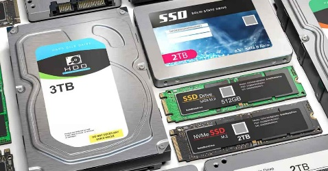

*Formatos habituales de almacenamiento: el disco rígido HDD (mayor tamaño) y las
unidades de estado sólido SSD, tanto en formato de 2,5" como en placas M.2/NVMe.*

Ejemplos:

- SSD;
- HDD;
- unidades externas.

Allí pueden almacenarse:

- el sistema operativo;
- programas;
- documentos;
- bases de datos;
- configuraciones;
- copias de seguridad.

Una comparación inicial útil es:

| Memoria principal                       | Almacenamiento secundario   |
| --------------------------------------- | --------------------------- |
| rápida                                  | más lento que la RAM        |
| espacio de trabajo                      | conservación de datos       |
| normalmente volátil                     | persistente                 |
| usada directamente durante la ejecución | guarda programas y archivos |

Esta comparación es deliberadamente general. Más adelante veremos cachés, memoria
virtual, buffers y otros mecanismos que hacen que la realidad sea más compleja.

---

### 4.4 Entrada/Salida

Los dispositivos de **entrada/salida**, también llamados **E/S** o **I/O**, permiten que
la computadora intercambie información con el exterior.

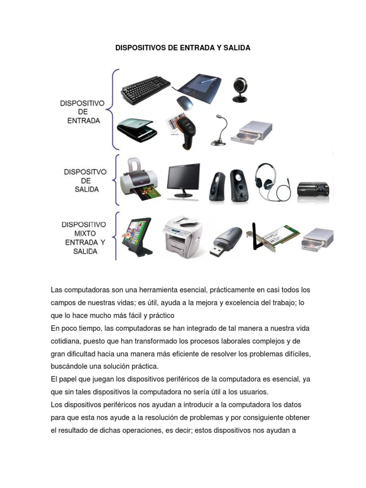

*Los dispositivos se clasifican según el sentido en que fluye la información:
entrada, salida o ambas (mixtos).*

Ejemplos:

#### Entrada

- teclado;
- mouse;
- micrófono;
- cámara;
- sensores.

#### Salida

- monitor;
- impresora;
- parlantes.

#### Entrada y salida

- interfaces de red;
- unidades de almacenamiento;
- pantallas táctiles.

Los dispositivos no se conectan conceptualmente “directo al programa”. Existen
controladores, módulos de E/S y mecanismos del sistema operativo que coordinan la
comunicación.

Más adelante estudiaremos:

- interrupciones;
- controladores;
- buffers;
- operaciones de E/S.

---

## 5. Interconexiones y buses

En el modelo clásico se habla de **bus del sistema** como el medio de comunicación entre
CPU, memoria y módulos de E/S.

Desde el punto de vista funcional suele distinguirse:

- **bus de datos**: transporta datos;
- **bus de direcciones**: permite identificar ubicaciones;
- **bus de control**: transporta señales de coordinación y control.

Físicamente, un bus puede tomar la forma de pistas o senderos grabados sobre la placa
madre (buses serie como PCI Express o SATA) o de cables anchos con muchos conductores
en paralelo (buses paralelos como el antiguo IDE/ATA).

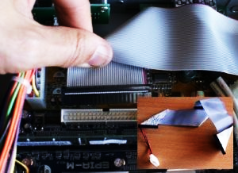

*Un cable IDE/ATA: cada conductor transporta un bit y todos viajan en paralelo. Es un
ejemplo visible de bus, hoy reemplazado por enlaces serie más rápidos.*

En computadoras actuales la organización física es más compleja y existen múltiples
interconexiones, controladores y enlaces especializados, como PCI Express o SATA.

Por eso, en esta etapa usaremos el concepto de “bus” como **modelo para comprender la
comunicación entre componentes**, sin asumir que una computadora moderna posee un
único bus físico compartido.

---

## 6. Firmware, hardware programable y virtualización

La distinción entre hardware y software sigue siendo válida, aunque en algunos sistemas
su relación es muy estrecha.

### Firmware

El **firmware es software** diseñado para controlar o inicializar hardware y normalmente
se almacena en memoria no volátil.

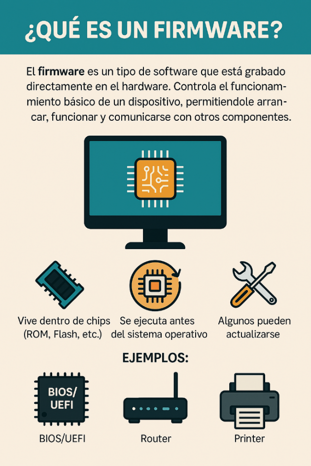

Ejemplos:

- firmware UEFI;
- firmware de routers;
- firmware de impresoras;
- firmware de dispositivos embebidos.

No deja de ser software por estar almacenado dentro de un dispositivo.

### Hardware programable

Dispositivos como los FPGA permiten configurar mediante información digital el
comportamiento del hardware.

### Sistemas embebidos

En un sistema embebido, software y hardware forman parte de un producto específico:

- automóviles;
- electrodomésticos;
- routers;
- sensores;
- dispositivos industriales.

### Virtualización

La virtualización permite presentar mediante software recursos que se comportan como
hardware para otro sistema.

Una máquina virtual puede disponer de:

- CPU virtual;
- memoria virtualizada;
- disco virtual;
- interfaz de red virtual.

WSL2 también será útil más adelante para discutir virtualización, porque el Linux que
ejecutamos desde Windows no accede de la misma manera al hardware físico que un Linux
instalado directamente en la computadora.

Un caso relacionado es el *cloud computing*: usamos software que se ejecuta sobre
hardware que no vemos ni tocamos, y la infraestructura se vuelve una abstracción.


---

## 7. Modelo general de funcionamiento

Una forma simple de representar el sistema es mediante capas:

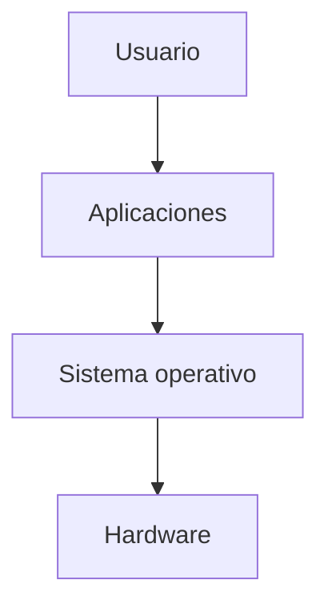

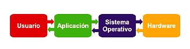

El usuario trabaja con aplicaciones.

Las aplicaciones solicitan servicios al sistema operativo.

El sistema operativo administra recursos y controla el acceso al hardware.

Podemos imaginar la ejecución de un programa así:

1. el programa se encuentra almacenado;
2. se carga en memoria;
3. la CPU ejecuta instrucciones;
4. se procesan datos;
5. eventualmente se realizan operaciones de entrada/salida;
6. el sistema operativo coordina y administra los recursos utilizados.

---

## 8. El sistema operativo como intermediario

El sistema operativo cumple un papel central entre las aplicaciones y el hardware.

Podemos estudiarlo desde dos ideas complementarias.

### 8.1 El sistema operativo como máquina extendida

Programar directamente cada dispositivo físico sería extremadamente complejo.

El sistema operativo ofrece abstracciones más simples.

Ejemplos:

- **archivo** en lugar de sectores físicos;
- **proceso** en lugar de administrar directamente el uso de CPU;
- **memoria virtual** en lugar de trabajar solamente con direcciones físicas;
- **socket** para facilitar comunicaciones de red.

Esto permite que los programas trabajen con interfaces más manejables.

---

### 8.2 El sistema operativo como administrador de recursos

Los recursos son limitados:

- tiempo de CPU;
- memoria;
- almacenamiento;
- dispositivos de E/S;
- interfaces de red.

El sistema operativo decide cómo se asignan y utilizan esos recursos.

Más adelante veremos ejemplos concretos:

- planificación de procesos;
- asignación de memoria;
- administración de archivos;
- acceso a dispositivos.

---

## 9. Modo usuario y modo kernel

Los procesadores modernos poseen mecanismos de protección que permiten ejecutar código
con distintos niveles de privilegio.

### Modo kernel

El **kernel** del sistema operativo ejecuta código con privilegios elevados y puede
realizar operaciones sensibles sobre el hardware y la memoria.

### Modo usuario

Las aplicaciones normales se ejecutan con restricciones.

No deberían poder, por ejemplo:

- acceder arbitrariamente a cualquier zona de memoria;
- controlar libremente dispositivos;
- ejecutar instrucciones privilegiadas.

Cuando necesitan un servicio protegido deben solicitarlo al kernel mediante mecanismos
provistos por el sistema operativo.

> Es más preciso decir que **el kernel se ejecuta en modo kernel**. Muchos programas que
> forman parte del entorno del sistema operativo —servicios, demonios y utilidades— se
> ejecutan en modo usuario.

Esta separación mejora:

- estabilidad;
- seguridad;
- aislamiento;
- control de recursos.

---

## 10. Un ejemplo: guardar un documento

Supongamos que escribimos un archivo en un editor.

En forma simplificada:

1. el teclado genera eventos de entrada;
2. el sistema operativo recibe y procesa esa entrada mediante sus controladores;
3. la aplicación interpreta los caracteres;
4. la CPU ejecuta instrucciones del programa;
5. memoria principal contiene instrucciones y datos;
6. al guardar, la aplicación solicita al sistema operativo crear o modificar un archivo;
7. el sistema operativo coordina el acceso al sistema de archivos y al almacenamiento.

Los datos no “aparecen” mágicamente en pantalla ni en el disco: atraviesan varias capas
del sistema.

Cada paso involucra componentes concretos: por ejemplo, la CPU ejecuta las instrucciones
del editor y la memoria principal guarda temporalmente datos e instrucciones. En el
equipo que se usa como ejemplo en clase, esa CPU es un AMD Ryzen 7 7730U a 2,00 GHz y la
memoria principal son 16 GB DDR4; en tu equipo los valores serán distintos. En Windows,
herramientas como **CPU-Z** permiten observar esos detalles del hardware.

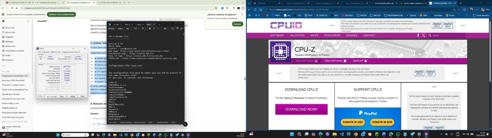

*CPU-Z es una herramienta gratuita que permite "ver" detalles del hardware. En Linux
usaremos los comandos del laboratorio siguiente para obtener información equivalente.*

---

## 11. Primer laboratorio Linux

El objetivo no es memorizar comandos. Queremos empezar a **observar el sistema**.

### 11.1 ¿Dónde estoy?

```bash
pwd
```

`pwd` muestra el directorio de trabajo actual.

### 11.2 ¿Quién soy?

```bash
whoami
```

### 11.3 ¿Qué equipo y sistema estoy usando?

```bash
hostname
uname
uname -a
```

### 11.4 Información del procesador

```bash
lscpu
```

### 11.5 Memoria

```bash
free -h
```

### 11.6 Almacenamiento

```bash
lsblk
df -h
```

---

## 12. WSL2 y Linux nativo: una diferencia importante

Los resultados de algunos comandos pueden ser diferentes según el entorno.

### Linux nativo

El sistema operativo accede directamente al hardware de la computadora mediante sus
controladores.

### WSL2

Linux se ejecuta dentro de un entorno virtualizado administrado por Windows.

Por eso comandos como:

```bash
lscpu
free -h
lsblk
```

pueden describir recursos presentados a Linux por WSL2 y no necesariamente representar
de forma idéntica el hardware físico del equipo.

Esto no es un problema: más adelante lo aprovecharemos para estudiar **virtualización**.

---

## 13. Actividad de laboratorio

Registrá la salida de los siguientes comandos:

```bash
whoami
hostname
uname -a
lscpu
free -h
lsblk
df -h
```

Luego respondé:

1. ¿Qué usuario está ejecutando la terminal?
2. ¿Qué nombre tiene el equipo?
3. ¿Qué arquitectura informa Linux?
4. ¿Cuántas CPU lógicas aparecen?
5. ¿Cuánta memoria tiene disponible el sistema?
6. ¿Qué dispositivos o volúmenes de almacenamiento aparecen?
7. Si usás WSL2, ¿qué datos pensás que corresponden al entorno virtual y cuáles al
   equipo físico?

> Guardá las respuestas en un archivo Markdown. Más adelante volveremos a este informe
> y lo compararemos con otros mecanismos de observación del sistema.

---

## 14. Ideas para recordar

Una síntesis inicial puede organizarse en cuatro niveles:

### Usuario

Necesita resolver una tarea.

### Aplicaciones

Ofrecen funciones concretas al usuario.

### Sistema operativo

Ofrece servicios, administra recursos y controla el acceso al hardware.

### Hardware

Hace posible la ejecución: CPU, memoria, almacenamiento y dispositivos.

```text
Usuario
   ↓
Aplicaciones
   ↓
Sistema operativo
   ↓
Hardware
```

---

## Glosario

**CPU:** unidad central de procesamiento; ejecuta instrucciones.

**Hardware:** componentes físicos del sistema.

**Software:** programas y datos que se ejecutan o utilizan sobre el hardware.

**Memoria principal:** memoria de trabajo utilizada durante la ejecución.

**Almacenamiento secundario:** almacenamiento persistente, como SSD o HDD.

**Entrada/Salida (E/S, I/O):** intercambio de información entre el computador y su
entorno.

**Bus / interconexión:** mecanismo utilizado para comunicar componentes.

**Sistema operativo:** software que ofrece servicios y administra recursos del sistema.

**Kernel:** núcleo privilegiado del sistema operativo.

**Modo kernel:** modo de ejecución privilegiado.

**Modo usuario:** modo de ejecución restringido para aplicaciones comunes.

**Firmware:** software asociado estrechamente al control o inicialización de un
dispositivo.

**Virtualización:** técnica que permite presentar recursos computacionales virtuales a
un sistema invitado.

---

## Desafiate con preguntas de examen

1. ¿Qué significa decir que una computadora ejecuta programas?
2. ¿Cuáles son los componentes básicos de un computador?
3. ¿Qué diferencia existe entre memoria principal y almacenamiento secundario?
4. ¿Qué función cumple la CPU?
5. ¿Qué papel tienen los dispositivos de entrada/salida?
6. ¿Qué función cumple un bus o interconexión?
7. ¿Por qué no resulta práctico que una aplicación controle directamente el hardware?
8. ¿Qué significa estudiar al sistema operativo como máquina extendida?
9. ¿Qué significa estudiar al sistema operativo como administrador de recursos?
10. ¿Qué diferencia existe entre modo usuario y modo kernel?
11. ¿Por qué es más preciso decir que el kernel, y no todo el sistema operativo, se
    ejecuta en modo kernel?
12. ¿Qué relación existe entre usuario, aplicaciones, sistema operativo y hardware?
13. ¿Qué diferencias pueden aparecer al observar hardware desde Linux nativo y desde
    WSL2?

---

## Próxima clase

En la [próxima clase](CLASE_02_ARQUITECTURA_CPU.md) vamos a estudiar con mayor profundidad:

- representación de la información;
- CPU;
- ALU;
- unidad de control;
- registros;
- ciclo de instrucción;
- frecuencia y rendimiento;
- arquitectura de Von Neumann.

Y volveremos a Linux para observar qué información expone el sistema acerca del
procesador.
