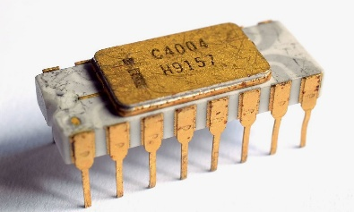
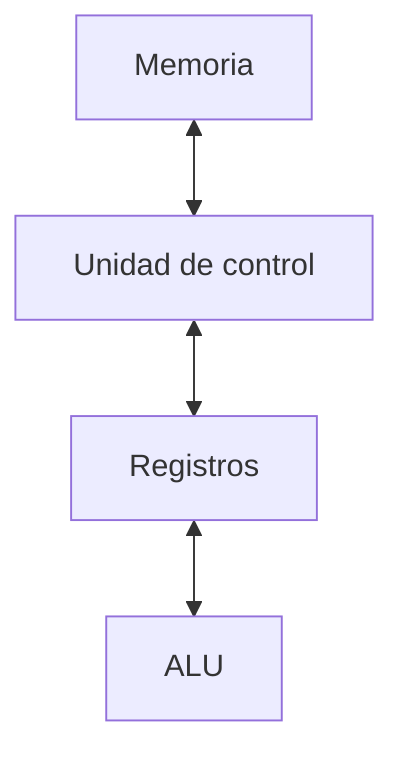
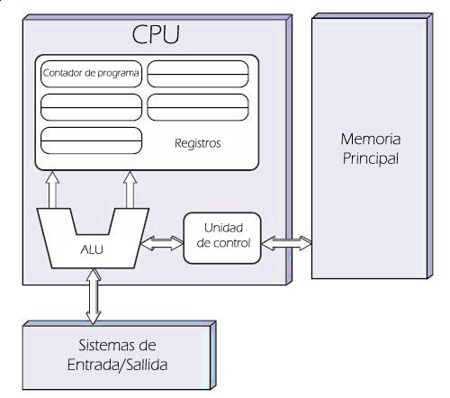
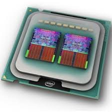
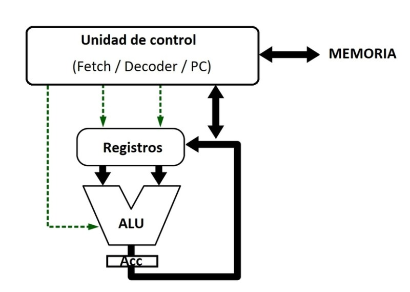
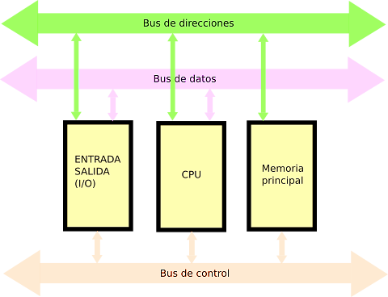

**Arquitectura y Sistemas Operativos**

# Clase 2 — Arquitectura: la CPU

**Tecnicatura Universitaria en Programación**

---

## Objetivos de la clase

Al finalizar esta clase deberías poder:

- explicar por qué la información se representa digitalmente mediante bits;
- reconocer los componentes fundamentales de una CPU;
- describir el papel de la ALU, la unidad de control y los registros;
- diferenciar procesador, núcleo y procesador lógico;
- explicar el ciclo de instrucción;
- relacionar frecuencia, núcleos y arquitectura con el rendimiento;
- describir el modelo de Von Neumann;
- observar características reales del procesador desde Linux.

---

## 1. Representación de la información

Las computadoras digitales representan internamente datos e instrucciones mediante
patrones binarios.


El sistema binario utiliza dos símbolos:

```text
0
1
```

Desde el punto de vista físico, distintos dispositivos pueden implementar esos estados
mediante niveles eléctricos, carga, magnetización u otros mecanismos. Lo importante es
que el hardware puede distinguir de forma confiable **dos estados lógicos**.

Con secuencias de bits pueden representarse:

- números;
- caracteres;
- imágenes;
- audio;
- direcciones;
- instrucciones;
- datos de todo tipo.

> Para la máquina, datos e instrucciones terminan representados mediante secuencias de
> bits cuya interpretación depende del contexto.

---

## 2. Bit, byte y palabra

### Bit

Un **bit** es la unidad mínima de información binaria.

Puede tomar uno de dos valores:

```text
0 o 1
```

### Byte

Un **byte** está formado habitualmente por 8 bits.

```text
1 byte = 8 bits
```

### Palabra

La **palabra** (*word*) es una unidad de datos que el procesador puede manejar de forma
natural de acuerdo con su arquitectura.

Su tamaño depende de la arquitectura.

Ejemplos históricos y actuales:

- 8 bits;
- 16 bits;
- 32 bits;
- 64 bits.

No debe confundirse “palabra” con “cantidad total de memoria”. Es una característica
relacionada con la organización del procesador y su conjunto de instrucciones.

---

## 3. La CPU

CPU significa **Central Processing Unit**, o Unidad Central de Procesamiento.

Su tarea fundamental consiste en obtener instrucciones, interpretarlas y ejecutarlas.

La CPU trabaja en permanente relación con:

- memoria;
- dispositivos de entrada/salida;
- interconexiones internas;
- sistema operativo.

Cuando decimos que una computadora ejecuta un programa, estamos diciendo que el
procesador ejecuta una secuencia de instrucciones que representan ese programa.



*El Intel 4004 (1971), considerado el primer microprocesador comercial. Integraba en
un solo chip lo que antes ocupaba varias placas.*

---

## 4. Componentes básicos de la CPU

Para un primer modelo distinguiremos:

- ALU;
- unidad de control;
- registros.





*Modelo clásico: la unidad de control dialoga con la memoria principal, los registros
alimentan a la ALU y todo el conjunto se comunica con los sistemas de entrada/salida.*

Los procesadores actuales son mucho más complejos, pero este modelo permite comprender
el funcionamiento fundamental.

---

### 4.1 ALU — Unidad aritmético-lógica

La **ALU** realiza operaciones aritméticas y lógicas.

Ejemplos:

- suma;
- resta;
- comparación;
- AND;
- OR;
- desplazamientos;
- otras operaciones definidas por la arquitectura.

Cuando una instrucción necesita realizar un cálculo o comparación, alguna unidad de
ejecución participa en esa tarea.

---

### 4.2 Unidad de control

La unidad de control interpreta instrucciones y coordina su ejecución.

En un modelo simple determina:

- qué instrucción debe procesarse;
- qué datos necesita;
- qué registros intervienen;
- qué operación corresponde realizar;
- cómo continúa la ejecución.

Podemos pensarla como el componente que organiza el flujo de trabajo del procesador.

---

### 4.3 Registros

Los **registros** son espacios de almacenamiento muy pequeños y muy rápidos ubicados
dentro del procesador.

Pueden contener:

- datos;
- direcciones;
- resultados intermedios;
- información de estado;
- información de control.

Son mucho más rápidos que la memoria principal porque forman parte directa del
procesador.

---

## 5. Procesador, CPU, core y procesador lógico

Estos términos suelen generar confusión.

### Procesador

En el uso cotidiano, “procesador” suele referirse al chip o paquete físico instalado en
la computadora.

### CPU

En muchos contextos actuales **CPU y procesador se utilizan como sinónimos**.

Sin embargo, herramientas de sistemas operativos también pueden utilizar la palabra
“CPU” para referirse a una unidad lógica de ejecución visible para el planificador.

### Core o núcleo

Un **núcleo** es una unidad física de procesamiento dentro de un procesador.

Un procesador moderno puede tener varios núcleos.



*Un procesador físico con dos núcleos: dentro del mismo encapsulado hay dos conjuntos
completos de ALU, unidad de control y registros.*

### Procesador lógico o hardware thread

Algunos núcleos permiten mantener más de un contexto de ejecución mediante tecnologías
como SMT.

Por eso el sistema operativo puede observar más **procesadores lógicos** que núcleos
físicos.

Ejemplo conceptual:

```text
1 procesador físico
4 núcleos
2 hilos de hardware por núcleo
------------------------------
8 procesadores lógicos visibles para el SO
```

Esta diferencia será importante cuando estudiemos **procesos, hilos y planificación**.

---

## 6. Registros importantes

Un procesador real posee muchos registros. Para comprender el ciclo de instrucción
vamos a utilizar dos conceptos clásicos.

### 6.1 Contador de programa — PC

El **Program Counter (PC)** contiene información que permite determinar la próxima
instrucción a ejecutar.

En muchas arquitecturas modernas es un registro asociado al flujo de ejecución.

Su tamaño depende de la arquitectura. En una arquitectura de 64 bits puede utilizarse
un registro de 64 bits, aunque esto no significa necesariamente que todos los bits
posibles se utilicen para direccionar memoria física o virtual.

Cuando existe un salto, llamada o retorno, el flujo de ejecución cambia y el valor
correspondiente debe actualizarse.

---

### 6.2 Registro de instrucción — IR

En el modelo clásico, el **Instruction Register (IR)** contiene la instrucción que está
siendo decodificada o ejecutada.

En procesadores modernos la implementación interna es bastante más compleja y puede
haber pipelines, buffers y múltiples instrucciones simultáneamente en distintas etapas.

Por eso utilizaremos el IR principalmente como **modelo conceptual** para comprender el
ciclo de instrucción.

---

## 7. El ciclo de instrucción

Un modelo básico de ejecución puede representarse mediante estas etapas:

1. **FETCH** — buscar la instrucción;
2. **DECODE** — interpretarla;
3. **EXECUTE** — ejecutar la operación;
4. **STORE** — almacenar un resultado, si corresponde;
5. **UPDATE PC** — determinar la siguiente instrucción.




*Las líneas punteadas representan las señales de control; las líneas gruesas, el flujo
de datos entre memoria, registros y ALU durante el ciclo.*

> **Hay distintas formas de presentarlo.** La bibliografía clásica (Tanenbaum,
> Stallings) suele describir el ciclo con **tres etapas**: búsqueda (*fetch*),
> decodificación (*decode*) y ejecución (*execute*), y deja el almacenamiento del
> resultado y la actualización del PC como pasos implícitos dentro de la ejecución.
> El modelo de cinco etapas que usamos acá separa esos pasos para hacerlos visibles;
> ambos describen el mismo proceso.

---

### FETCH

El procesador obtiene la instrucción correspondiente desde la jerarquía de memoria.

### DECODE

Se interpreta qué operación representa y qué operandos necesita.

### EXECUTE

Se ejecuta la operación.

Puede ser:

- una operación aritmética;
- una comparación;
- una carga;
- una escritura;
- un salto;
- otra operación definida por la arquitectura.

### STORE

Si se produce un resultado, puede almacenarse en un registro o en memoria.

### UPDATE PC

Se determina cuál será la siguiente instrucción.

---

## 8. Ejemplo simple

Supongamos la expresión:

```c
c = a + b;
```

En un nivel muy simplificado:

1. se obtienen instrucciones de memoria;
2. se decodifica la operación;
3. se obtienen los operandos;
4. se realiza la suma;
5. se guarda el resultado;
6. se continúa con la siguiente instrucción.

> Un lenguaje de programación no se ejecuta literalmente como aparece escrito.
> Existen compiladores, intérpretes, máquinas virtuales y otras capas que terminan
> provocando la ejecución de instrucciones de máquina.

---

## 9. El reloj del procesador

El reloj proporciona una referencia temporal que permite sincronizar operaciones
internas.

Su frecuencia se expresa en Hertz.

Ejemplo:

```text
2 GHz = 2.000.000.000 ciclos por segundo
```

Pero debemos evitar una conclusión incorrecta:

> **2 GHz no significa necesariamente 2.000 millones de instrucciones por segundo.**

Una instrucción puede requerir diferente cantidad de trabajo y un procesador moderno
puede:

- completar más de una instrucción por ciclo;
- necesitar varios ciclos para determinadas operaciones;
- ejecutar instrucciones fuera de orden;
- trabajar con pipelines;
- ejecutar tareas sobre varios núcleos.

Por eso:

```text
frecuencia de reloj ≠ cantidad de instrucciones ejecutadas
```

---

## 10. Rendimiento: no alcanza con mirar los GHz

El rendimiento depende de muchos factores.

Para un primer análisis podemos observar:

### Frecuencia

Indica el ritmo de reloj.

### Núcleos

Permiten ejecutar trabajo realmente en paralelo cuando existen tareas independientes y
el software puede aprovecharlos.

### Procesadores lógicos

SMT puede aumentar la utilización de un núcleo, pero dos procesadores lógicos no son
equivalentes a dos núcleos físicos completos.

### Arquitectura

Influyen, entre otros factores:

- diseño interno;
- conjunto de instrucciones;
- profundidad y organización del pipeline;
- capacidad de ejecución en paralelo;
- predicción de saltos;
- memoria caché.

### Jerarquía de memoria

La velocidad con que la CPU obtiene instrucciones y datos influye enormemente en el
rendimiento.

---

## 11. Una ficha técnica: cómo mirar un procesador

Cuando analices un procesador no conviene observar solamente los GHz.

Podés revisar:

- generación o arquitectura;
- cantidad de núcleos;
- cantidad de hilos de hardware;
- frecuencia base y máxima;
- memoria caché;
- soporte de memoria;
- conectividad PCIe;
- gráficos integrados;
- consumo o límites de potencia;
- plataforma y socket, en equipos de escritorio.

> El TDP no debe interpretarse simplemente como “cuánto consume el procesador”.
> Es un dato térmico o de potencia definido por el fabricante y debe analizarse junto
> con la documentación del modelo.

Para comparar dos procesadores conviene además utilizar pruebas relacionadas con el uso
real:

- compilación;
- virtualización;
- productividad;
- juegos;
- procesamiento multimedia;
- otras cargas específicas.

---

## 12. Arquitectura de Von Neumann

El modelo de Von Neumann es una referencia clásica para comprender la organización de
una computadora.

Su idea central es el **programa almacenado**.

### Programa almacenado

Datos e instrucciones se almacenan en memoria.

Esto significa que un programa también puede representarse como información almacenada
y ser leído por el procesador.




*CPU, memoria y E/S se comunican por tres buses: direcciones (a qué celda), datos (qué
se transfiere) y control (señales de coordinación). Datos e instrucciones comparten la
misma memoria y el mismo camino: de ahí surge el cuello de botella de Von Neumann.*

---

## 13. Componentes del modelo

En una presentación simplificada aparecen:

- CPU;
- memoria;
- entrada/salida;
- interconexiones.

La misma memoria contiene:

- datos;
- instrucciones.

Esto distingue conceptualmente al modelo de Von Neumann del modelo Harvard clásico, en
el cual datos e instrucciones utilizan memorias o caminos separados.

---

## 14. El cuello de botella de Von Neumann

CPU y memoria no poseen la misma velocidad.

Además, instrucciones y datos deben circular a través de una jerarquía y mecanismos de
comunicación limitados.

La necesidad constante de transportar datos e instrucciones entre memoria y CPU puede
convertirse en una limitación de rendimiento.

A esta idea se la conoce como **cuello de botella de Von Neumann**.

Los sistemas actuales utilizan múltiples técnicas para disminuir su impacto:

- memoria caché;
- prefetch;
- pipelines;
- ejecución fuera de orden;
- múltiples canales de memoria;
- paralelismo;
- jerarquías de memoria más complejas.

Muchas CPU actuales también utilizan internamente organizaciones parecidas a una
**Harvard modificada**, por ejemplo separando cachés de instrucciones y datos, aunque
mantengan un espacio de memoria unificado desde el punto de vista del programador.

---

## 15. Primer laboratorio sobre CPU en Linux

Vamos a observar cómo Linux presenta información del procesador.

### 15.1 `lscpu`

```bash
lscpu
```

Buscá campos relacionados con:

- arquitectura;
- CPU(s);
- core(s) por socket;
- thread(s) por core;
- modelo;
- cachés;
- virtualización.

---

### 15.2 Cantidad de procesadores lógicos

```bash
nproc
```

El número informado normalmente representa cuántas unidades de ejecución lógicas están
disponibles para el sistema o proceso.

No implica necesariamente que exista esa misma cantidad de núcleos físicos.

---

### 15.3 Información expuesta por el kernel

```bash
cat /proc/cpuinfo
```

Este archivo virtual contiene información que el kernel expone sobre las CPU visibles
para Linux.

Para no leer todo de una vez:

```bash
less /proc/cpuinfo
```

Salir de `less`:

```text
q
```

---

### 15.4 Filtrar información

Podemos comenzar a combinar herramientas:

```bash
lscpu | grep -i "model name"
```

o:

```bash
lscpu | grep -i "architecture"
```

El símbolo:

```text
|
```

se llama **pipe**.

Permite enviar la salida de un comando como entrada de otro.

Todavía no necesitamos estudiarlo en profundidad. Más adelante será fundamental cuando
veamos entrada/salida y comunicación entre procesos.

---

## 16. Linux nativo vs WSL2

Si trabajás con Linux nativo, `lscpu` describe directamente la CPU que Linux administra.

En WSL2, Linux se ejecuta dentro de un entorno virtualizado.

Por eso algunos campos pueden representar cómo Windows y WSL2 exponen la CPU al sistema
Linux invitado.

Esto nos deja una pregunta que retomaremos más adelante:

> ¿Qué significa que un sistema operativo “vea” una CPU?

La respuesta estará relacionada con:

- hardware;
- virtualización;
- planificador;
- núcleos;
- procesadores lógicos.

---

## 17. Actividad práctica

Ejecutá:

```bash
lscpu
nproc
cat /proc/cpuinfo
```

Después respondé:

1. ¿Qué arquitectura informa el sistema?
2. ¿Cuál es el modelo del procesador?
3. ¿Cuántas CPU lógicas aparecen?
4. ¿Cuántos núcleos aparecen?
5. ¿Cuántos hilos por núcleo aparecen?
6. ¿Coinciden `nproc` y el campo `CPU(s)` de `lscpu`?
7. ¿Aparece información sobre virtualización?
8. Si usás WSL2, ¿qué diferencias esperás encontrar respecto de un Linux nativo?
9. ¿Por qué una frecuencia mayor no garantiza por sí sola mejor rendimiento?

---

## 18. Mini desafío Bash

Creá un archivo llamado:

```text
cpu_info.sh
```

con este contenido:

```bash
#!/bin/bash

echo "=== INFORME DE CPU ==="
echo

echo "Equipo:"
hostname
echo

echo "Arquitectura:"
uname -m
echo

echo "Procesadores lógicos:"
nproc
echo

echo "Resumen:"
lscpu
```

Dale permiso de ejecución:

```bash
chmod +x cpu_info.sh
```

Ejecutalo:

```bash
./cpu_info.sh
```

Por ahora no hace falta comprender todos los detalles del script.

En clases posteriores veremos:

- permisos;
- ejecución;
- variables;
- redirecciones;
- pipes;
- procesos.

---

## 19. Ideas para recordar

```text
Programa
   ↓
Instrucciones
   ↓
Memoria
   ↓
CPU
   ↓
Fetch → Decode → Execute
```

Y, para rendimiento:

```text
Rendimiento
   ≠
solo GHz
```

También importan:

- arquitectura;
- núcleos;
- procesadores lógicos;
- cachés;
- memoria;
- tipo de carga de trabajo.

---

## Glosario

**Bit:** unidad mínima de información binaria.

**Byte:** agrupación habitual de 8 bits.

**Palabra:** unidad de datos natural de una arquitectura.

**CPU:** unidad central de procesamiento.

**ALU:** unidad aritmético-lógica.

**Unidad de control:** componente conceptual que coordina la ejecución de instrucciones.

**Registro:** almacenamiento interno muy rápido del procesador.

**PC:** contador de programa; permite determinar la siguiente instrucción.

**IR:** registro de instrucción del modelo clásico.

**Core / núcleo:** unidad física de procesamiento dentro de un procesador.

**Procesador lógico:** unidad de ejecución que el sistema operativo puede planificar.

**SMT:** técnica mediante la cual un núcleo mantiene más de un hilo de hardware.

**Ciclo de instrucción:** modelo formado por búsqueda, decodificación y ejecución.

**Frecuencia:** cantidad de ciclos de reloj por segundo.

**Arquitectura de Von Neumann:** modelo de programa almacenado con memoria compartida
para datos e instrucciones.

**Cuello de botella de Von Neumann:** limitación asociada a la transferencia de datos e
instrucciones entre CPU y memoria.

---

## Desafiate con preguntas de examen

1. ¿Por qué una computadora digital representa información mediante bits?
2. ¿Qué diferencia existe entre bit, byte y palabra?
3. ¿Qué función cumple la CPU?
4. ¿Qué diferencia existe entre la ALU y la unidad de control?
5. ¿Por qué los registros son importantes?
6. ¿Qué función cumple el contador de programa?
7. ¿Qué representa el registro de instrucción en el modelo clásico?
8. ¿Cuáles son las etapas principales del ciclo de instrucción?
9. ¿Qué diferencia existe entre procesador, núcleo y procesador lógico?
10. ¿Por qué 2 GHz no significa necesariamente 2.000 millones de instrucciones por
    segundo?
11. ¿Por qué no alcanza con comparar procesadores solamente por frecuencia?
12. ¿Qué significa la idea de programa almacenado?
13. ¿Cuáles son los componentes centrales del modelo de Von Neumann?
14. ¿Qué es el cuello de botella de Von Neumann?
15. ¿Qué mecanismos utilizan los procesadores actuales para disminuir ese cuello de
    botella?
16. ¿Por qué la cantidad de CPU que informa Linux puede no coincidir con la cantidad de
    chips físicos instalados?
17. ¿Por qué WSL2 es un buen ejemplo para comenzar a discutir virtualización?

---

## Próxima relación con Sistemas Operativos

Los conceptos de esta clase volverán a aparecer cuando estudiemos:

- procesos e hilos;
- planificación;
- cambio de contexto;
- memoria virtual;
- interrupciones;
- entrada/salida;
- virtualización.

En especial, la diferencia entre **núcleo físico** y **procesador lógico** será central
para comprender qué recursos puede administrar el planificador del sistema operativo.
