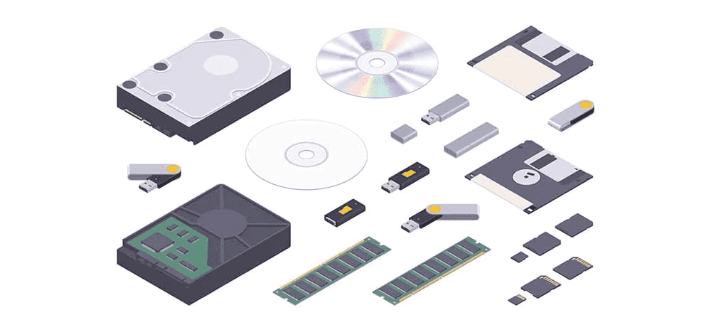
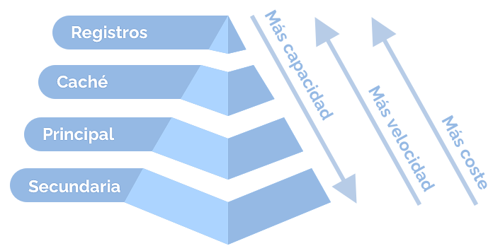
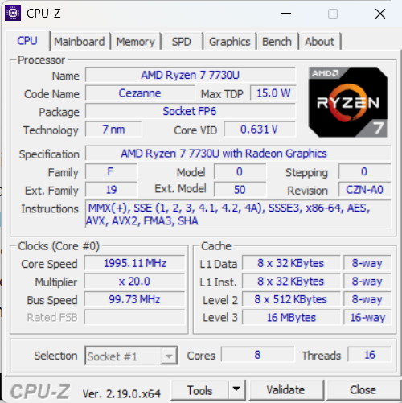
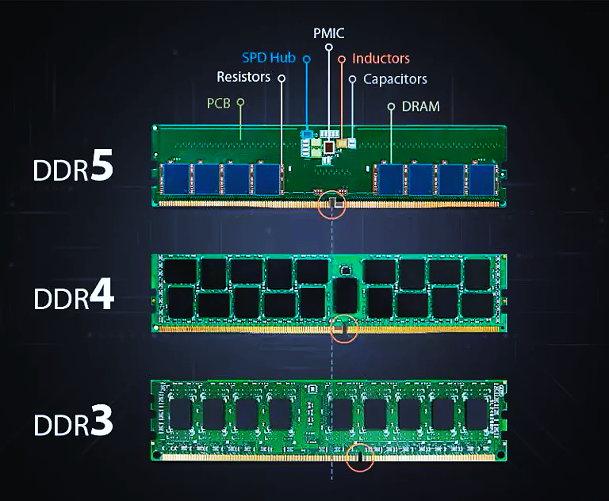
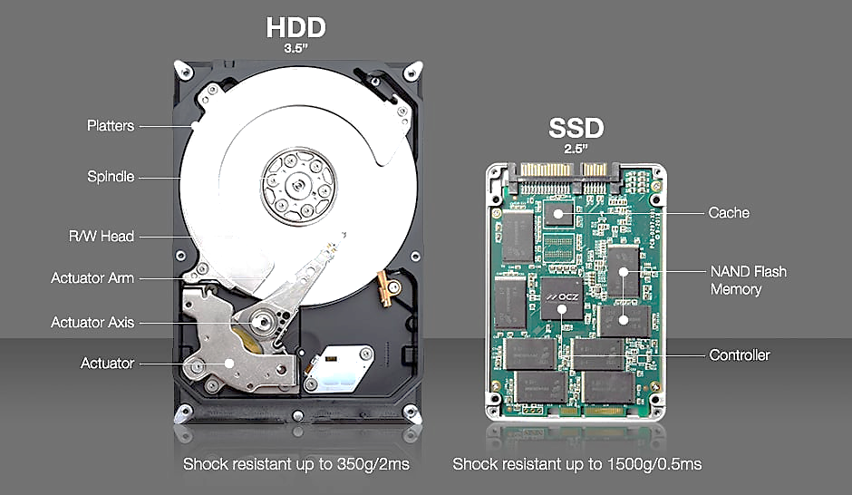
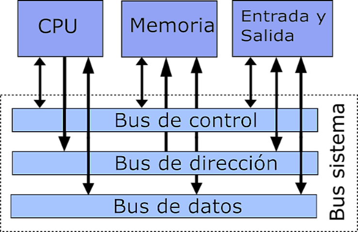
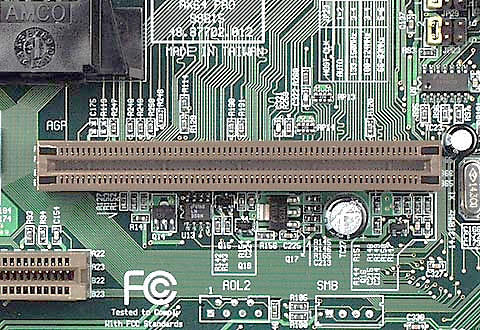

**Arquitectura y Sistemas Operativos**

# Clase 3 — Arquitectura: memoria, almacenamiento, buses y firmware

**Tecnicatura Universitaria en Programación**

---

## Objetivos de la clase

Al finalizar esta clase deberías poder:

- explicar por qué una computadora utiliza una jerarquía de memoria;
- diferenciar registros, caché, memoria principal y almacenamiento secundario;
- comprender la función de la localidad temporal y espacial;
- diferenciar DRAM y SRAM;
- interpretar, en forma introductoria, las generaciones DDR;
- comparar HDD, SSD SATA y SSD NVMe;
- explicar la función conceptual de los buses de datos, direcciones y control;
- reconocer algunas interconexiones actuales;
- definir firmware y relacionarlo con BIOS, UEFI y el proceso de arranque;
- observar memoria y almacenamiento desde Linux.

---

## 1. La memoria como recurso central

En la [clase anterior](CLASE_02_ARQUITECTURA_CPU.md) estudiamos la CPU y el ciclo de instrucción.



*Bajo la palabra "memoria" conviven tecnologías muy distintas: RAM, discos duros,
pendrives, tarjetas SD y los viejos diskettes, CD y DVD.*

El procesador necesita obtener continuamente:

- instrucciones;
- datos;
- direcciones;
- resultados intermedios.

El problema es que **no existe una memoria ideal** que sea al mismo tiempo:

- extremadamente rápida;
- de capacidad prácticamente ilimitada;
- barata;
- de bajo consumo;
- no volátil.

Por eso los sistemas reales utilizan distintos niveles de almacenamiento.

A esta organización la llamamos **jerarquía de memoria**.

---

## 2. Jerarquía de memoria

Un modelo simplificado es:

```text
Más rápida
más pequeña
más costosa por byte
        │
        ▼
+--------------------+
|     Registros      |
+--------------------+
|      Caché L1      |
+--------------------+
|      Caché L2      |
+--------------------+
|      Caché L3      |
+--------------------+
|        RAM         |
+--------------------+
|      SSD / HDD     |
+--------------------+
        ▲
        │
Más capacidad
más lenta
más barata por byte
```

La regla general es:

> cuanto más cerca del procesador se encuentra un nivel, menor suele ser su latencia,
> pero también menor su capacidad y mayor su costo por byte.

No es una ley absoluta para todos los dispositivos, pero es un buen modelo inicial.



*Al subir en la pirámide crece la velocidad; al bajar, crecen la capacidad y el costo
por byte.*

---

## 3. Una analogía para pensar la jerarquía


Imaginemos que estamos trabajando en una mesa.

Los elementos que usamos todo el tiempo los dejamos **al alcance de la mano**.

Eso se parece a los registros y a la caché.

Si necesitamos algo que no está sobre la mesa, podemos buscarlo en un armario cercano.

Eso puede ayudarnos a imaginar la memoria principal.

Si el material ni siquiera está en la habitación y debemos buscarlo en otro lugar,
el acceso tarda mucho más. Esa idea se aproxima al almacenamiento secundario.

La analogía no describe literalmente el hardware. Sirve para recordar una idea:

> **cuanto más lejos está la información de la CPU, normalmente más costoso resulta
> obtenerla en tiempo.**

---

## 4. La memoria caché

La memoria caché es una memoria pequeña y muy rápida situada entre las unidades de
ejecución del procesador y niveles más lentos de la jerarquía.

Su objetivo es reducir el tiempo medio necesario para obtener instrucciones y datos.

Los programas no acceden a memoria completamente al azar. Suelen mostrar patrones.

### Localidad temporal

Si un dato o una instrucción fue utilizado recientemente, existe una probabilidad
razonable de que vuelva a utilizarse pronto.

Ejemplo (en pseudocódigo):

```text
total = 0
para cada numero en la lista:
    total = total + numero
```

La variable `total` se utiliza repetidamente.

### Localidad espacial

Si se accede a una posición de memoria, es frecuente que poco después se acceda a
posiciones cercanas.

Ejemplo típico (en pseudocódigo):

```text
para cada numero en la lista:
    mostrar numero
```

Los elementos de una estructura almacenada de manera contigua pueden encontrarse
próximos en memoria.

La caché aprovecha estos patrones para mantener cerca del procesador información que
probablemente vuelva a necesitarse.

---

## 5. Niveles de caché

En muchos procesadores actuales encontramos:

### L1

- muy pequeña;
- extremadamente rápida;
- normalmente asociada a cada núcleo;
- suele existir una caché para instrucciones y otra para datos.

### L2

- mayor que L1;
- algo más lenta;
- en muchos diseños está asociada a un núcleo.

### L3

- mayor que L1 y L2;
- más lenta que ellas;
- habitualmente compartida por varios núcleos o por grupos de núcleos.

> La organización exacta depende del procesador. No todos los diseños implementan la
> caché de la misma manera.

---

## 6. Línea de caché y asociatividad



*Un caso real (AMD Ryzen 7 7730U, 8 núcleos): hay una L1 de datos y otra de
instrucciones por núcleo, una L2 por núcleo y una L3 de 16 MB compartida. "8-way" y
"16-way" indican la asociatividad de cada nivel.*

La caché no mueve normalmente un único byte cada vez.

Trabaja con bloques denominados **líneas de caché**.

En muchos procesadores una línea tiene:

```text
64 bytes
```

aunque el tamaño depende de la arquitectura.

Supongamos una caché de:

```text
32 KiB
8-way
línea de 64 B
```

La cantidad de conjuntos puede calcularse como:

```text
32 KiB / (8 vías × 64 B) = 64 conjuntos
```

Cada conjunto puede contener 8 líneas: una por cada vía.

```text
Conjunto 0
 ├── vía 0 → línea
 ├── vía 1 → línea
 ├── ...
 └── vía 7 → línea
```

La asociatividad ayuda a reducir conflictos cuando distintas direcciones competirían por
la misma ubicación de caché.

No es necesario memorizar el cálculo. Lo importante es comprender que:

> una caché no es simplemente “un espacio rápido”; posee una organización interna que
> determina dónde puede guardarse cada bloque.

---

## 7. CPU caché no es caché del navegador

La palabra **caché** se utiliza en muchos niveles de informática.

Por ejemplo:

- caché del procesador;
- caché del navegador;
- caché de una aplicación;
- caché del sistema operativo;
- caché de un servidor web.

Todas comparten una idea:

> conservar temporalmente información para evitar repetir un acceso más costoso.

Pero **no son la misma caché**.

Borrar la caché de un navegador puede liberar almacenamiento o solucionar problemas de
una aplicación web.

Eso **no significa borrar la caché L1, L2 o L3 del procesador**.

---

## 8. La memoria principal: RAM

RAM significa **Random Access Memory**.

La memoria principal contiene datos e instrucciones necesarios durante la ejecución de
los programas.

En los sistemas habituales es volátil:

> al quitar la alimentación eléctrica, su contenido se pierde.

Cuando ejecutamos un programa que estaba almacenado en un SSD o HDD, parte de ese
programa debe cargarse en memoria para poder ser utilizado.

Una representación simplificada:

```text
SSD / HDD
   │
   │ cargar programa
   ▼
RAM
   │
   │ instrucciones y datos
   ▼
Caché
   │
   ▼
CPU
```

Más adelante, cuando estudiemos **gestión de memoria**, veremos que este modelo se
completa con:

- memoria virtual;
- páginas;
- traducción de direcciones;
- swap;
- caché de páginas.

---

## 9. DRAM y SRAM

### DRAM — Dynamic RAM

La DRAM es la tecnología habitualmente utilizada para la memoria principal.

Cada bit necesita conservarse mediante un mecanismo que requiere refresco periódico.

Características generales:

- gran densidad;
- costo relativamente bajo por bit;
- gran capacidad;
- más lenta que la SRAM.

### SRAM — Static RAM

Mientras tiene alimentación, la SRAM no requiere el mismo mecanismo periódico de
refresco utilizado por la DRAM.

Características:

- muy rápida;
- más costosa;
- menor densidad;
- utilizada habitualmente en memorias caché.

En forma resumida:

| Característica     | DRAM          | SRAM                           |
| ------------------ | ------------- | ------------------------------ |
| Uso habitual       | RAM principal | cachés                         |
| Densidad           | mayor         | menor                          |
| Costo por bit      | menor         | mayor                          |
| Velocidad          | menor         | mayor                          |
| Refresco periódico | sí            | no, mientras haya alimentación |

---

## 10. Memorias DDR

Las memorias DDR son generaciones de DRAM utilizadas ampliamente como memoria
principal.



*Cada generación cambia la organización del módulo: la muesca está en otra posición
(no son intercambiables) y DDR5 incorpora regulación de energía (PMIC) sobre la propia
placa.*

La evolución más conocida en computadoras personales incluye:

```text
DDR
DDR2
DDR3
DDR4
DDR5
```

Cada generación introdujo cambios en:

- tasa de transferencia;
- ancho de banda;
- voltaje y consumo;
- señalización;
- organización interna.

### DDR5, la generación actual

DDR5 es el estándar en las plataformas nuevas: Intel lo adoptó desde *Alder Lake*
(2021) y AMD desde la plataforma AM5 (2022). Sus velocidades base estándar arrancan en
**4800 MT/s**, frente a los 3200 MT/s habituales en DDR4.

Además, cada módulo DDR5 se organiza internamente en **dos subcanales independientes**
de 32 bits, en lugar del único canal de 64 bits de DDR4. Esto mejora el acceso
concurrente a la memoria y cambia la forma de comparar el ancho de banda entre
generaciones.

### MT/s y MHz no son lo mismo

En memoria DDR conviene distinguir:

- **MHz**: frecuencia de reloj;
- **MT/s**: millones de transferencias por segundo.

DDR significa *Double Data Rate* porque transfiere datos en ambos flancos de la señal de
reloj.

Ejemplo conceptual:

```text
DDR4   reloj: 1600 MHz    tasa efectiva: 3200 MT/s
DDR5   reloj: 2400 MHz    tasa efectiva: 4800 MT/s
```

> Esto no tiene relación directa con el ciclo `fetch-decode-execute` de la CPU.
> Son dos conceptos diferentes: uno describe transferencias de memoria y el otro un
> modelo de ejecución de instrucciones.

---

## 11. Memorias no volátiles

Una memoria **no volátil** conserva información aunque el equipo deje de recibir
alimentación.

Ejemplos:

- ROM;
- EEPROM;
- memoria flash.

Actualmente gran parte del firmware modificable se almacena en memoria flash.

Estas memorias nos permiten conectar dos conceptos:

```text
memoria no volátil
        │
        ▼
     firmware
```

---

## 12. Almacenamiento secundario

El almacenamiento secundario conserva información de forma persistente.

Allí se encuentran, entre otras cosas:

- sistema operativo;
- aplicaciones;
- documentos;
- bases de datos;
- configuraciones;
- copias de seguridad.

Comparación inicial:

| RAM                        | Almacenamiento secundario   |
| -------------------------- | --------------------------- |
| espacio de trabajo         | conservación                |
| rápida                     | más lento                   |
| volátil                    | persistente                 |
| menor capacidad            | mayor capacidad             |
| usada durante la ejecución | guarda archivos y programas |

---

## 13. HDD



*Un HDD tiene partes móviles (platos, eje, cabezales de lectura/escritura); un SSD es
solo electrónica: controladora, memoria NAND flash y una pequeña caché. De ahí la
diferencia de latencia y de resistencia a golpes.*

Los HDD almacenan información magnéticamente sobre platos giratorios.

Poseen componentes mecánicos:

- platos;
- motor;
- cabezales;
- brazo actuador.

Por eso su tiempo de acceso está condicionado por movimientos físicos.

Ventajas:

- gran capacidad;
- bajo costo por unidad de almacenamiento.

Desventajas:

- mayor latencia;
- menor resistencia mecánica;
- menor rendimiento en accesos aleatorios que un SSD.

---

## 14. SSD

Los SSD utilizan memoria flash y no poseen las partes móviles de un HDD.

Ventajas típicas:

- menor latencia;
- acceso aleatorio mucho más rápido;
- menor ruido;
- mayor resistencia a movimientos físicos.

No todos los SSD se comunican de la misma manera.

---

## 15. SSD SATA y SSD NVMe

### SSD SATA

Utiliza la interfaz SATA y suele comunicarse mediante el protocolo AHCI.

SATA III posee una tasa nominal de enlace de:

```text
6 Gb/s
```

La transferencia útil real es menor debido a codificación y otros factores.

### SSD NVMe

**NVMe es un protocolo diseñado para almacenamiento no volátil**, pensado para trabajar
de forma eficiente sobre PCI Express.

Por eso un SSD NVMe conectado mediante varias líneas PCIe puede disponer de un ancho de
banda muy superior al de SATA.

```text
SSD SATA
   │
  SATA
   ▼

SSD NVMe
   │
 PCI Express
   ▼
CPU / chipset
```

> Que un SSD sea NVMe no significa solamente “un SATA más rápido”. Cambian tanto el
> enlace utilizado como el protocolo de comunicación.

### Generación actual de PCIe

En equipos nuevos, PCIe 4.0 es el piso y PCIe 5.0 ya es habitual, tanto en plataformas
de escritorio (AMD AM5, Intel *Raptor Lake* y *Arrow Lake*) como en servidores.

Como referencia aproximada de lectura secuencial:

```text
SATA III            ~0,55 GB/s útiles
NVMe PCIe 4.0       ~7 GB/s
NVMe PCIe 5.0       más de 14 GB/s
```

Los números concretos dependen del modelo, del controlador y del tipo de acceso.

---

## 16. Medios extraíbles

También forman parte del almacenamiento secundario:

- pendrives USB;
- discos externos;
- SSD externos;
- tarjetas SD;
- tarjetas microSD.

En estos dispositivos el rendimiento depende de varios factores:

- tecnología de memoria;
- controlador;
- interfaz;
- versión del protocolo;
- tipo de acceso;
- calidad del dispositivo.

Por eso no conviene identificar simplemente “USB” con una única velocidad.

---

## 17. Los buses y las interconexiones

Para cooperar, CPU, memoria y dispositivos necesitan mecanismos de comunicación.

En un modelo clásico hablamos de un **bus del sistema**.

Desde un punto de vista funcional podemos distinguir:

- bus de datos;
- bus de direcciones;
- bus de control.

Este modelo sigue siendo útil para aprender, aunque las computadoras modernas poseen
interconexiones mucho más complejas.



*Modelo clásico: los tres buses (datos, direcciones y control) forman el "bus del
sistema" que comunica CPU, memoria y E/S.*

---

### Bus de datos

Transporta información entre componentes.

Ejemplo:

```text
RAM ───── dato ─────> CPU
```

---

### Bus de direcciones

Permite indicar qué posición o destino debe utilizarse.

Ejemplo conceptual:

```text
CPU: quiero leer la posición X
                │
                ▼
            memoria
```

---

### Bus de control

Transporta señales utilizadas para coordinar operaciones.

Por ejemplo:

- lectura;
- escritura;
- interrupciones;
- sincronización;
- estados de dispositivos.

---

## 18. De un bus conceptual a múltiples interconexiones

Una computadora actual no posee necesariamente un único bus físico compartido.

Encontramos tecnologías diferentes, cada una diseñada para distintos usos.



*Sobre la placa madre conviven ranuras y conectores de distinto tipo. Hoy PCI Express
reemplazó a AGP y PCI, pero la idea es la misma: cada interconexión resuelve un tipo de
comunicación.*

### SATA

Utilizada principalmente para:

- HDD;
- SSD SATA;
- algunas unidades ópticas.

### PCI Express — PCIe

Interconexión serie de alta velocidad utilizada por:

- GPU;
- SSD NVMe;
- placas de red;
- aceleradores;
- otras expansiones.

PCIe utiliza **líneas o lanes**.

Ejemplos:

```text
x1
x4
x8
x16
```

Cuando una especificación indica, por ejemplo:

```text
PCIe 4.0 = 16 GT/s por línea
```

`GT/s` significa **gigatransferencias por segundo**, no directamente gigabytes por
segundo.

La velocidad útil depende, entre otras cosas, de:

- cantidad de líneas;
- codificación;
- protocolo;
- implementación.

### USB

Interfaz muy utilizada para:

- periféricos;
- almacenamiento;
- cámaras;
- teléfonos;
- transferencia de datos;
- suministro de energía.

### I²C y SPI

Son ejemplos de buses muy utilizados dentro de placas y sistemas embebidos para
comunicar microcontroladores, sensores y otros circuitos.

No necesitamos memorizar sus velocidades. Nos interesa reconocer que:

> distintos problemas de comunicación utilizan interconexiones diferentes.

---

## 19. Firmware

El **firmware es software** asociado estrechamente al funcionamiento de un dispositivo y
almacenado habitualmente en memoria no volátil.

Ejemplos:

- UEFI de una computadora;
- firmware de un SSD;
- firmware de una placa de red;
- firmware de un router;
- firmware de una impresora.

Por estar almacenado dentro de un dispositivo no deja de ser software.

En muchos casos puede actualizarse.

---

## 20. BIOS y UEFI

### BIOS

BIOS es el modelo histórico de firmware utilizado durante décadas en computadoras
compatibles con PC.

Entre otras tareas:

- inicializa componentes básicos;
- realiza verificaciones iniciales;
- localiza un mecanismo de arranque;
- transfiere el control al software que continuará iniciando el sistema.

### UEFI

UEFI es una interfaz de firmware moderna que reemplazó al esquema BIOS tradicional en
la mayoría de las computadoras actuales.

Puede incorporar:

- gestor de arranque;
- variables persistentes;
- soporte para aplicaciones UEFI;
- Secure Boot;
- acceso a una EFI System Partition.

---

## 21. Secuencia simplificada de arranque UEFI

Una secuencia conceptual es:

```text
Encendido
   │
   ▼
CPU comienza desde un punto definido por la arquitectura
   │
   ▼
Firmware UEFI
   │
   ├── inicializa plataforma
   ├── consulta configuración de arranque
   └── localiza cargador
   │
   ▼
EFI System Partition
   │
   ▼
Boot loader
   │
   ▼
Kernel del sistema operativo
   │
   ▼
Servicios y procesos de usuario
```

La implementación real depende de la plataforma y del sistema operativo.

---

## 22. UEFI, GPT y Secure Boot

Estos conceptos suelen aparecer juntos, pero no son exactamente lo mismo.

### GPT

GPT es un esquema moderno para describir particiones de un disco.

Permite superar varias limitaciones históricas del esquema MBR.

### UEFI

UEFI define una interfaz moderna de firmware.

En instalaciones actuales es muy frecuente encontrar:

```text
UEFI + GPT + EFI System Partition
```

pero conviene no pensar que **UEFI y GPT son el mismo concepto**.

### Secure Boot

Secure Boot es un mecanismo de UEFI que permite verificar firmas criptográficas en
componentes del proceso de arranque.

Su objetivo es ayudar a impedir que software no autorizado se ejecute en etapas
tempranas del inicio del sistema.

---

## 23. Laboratorio Linux — observar memoria

Los comandos siguientes se ejecutan **dentro de Linux**.

Si utilizás Windows:

```powershell
wsl
```

Una vez dentro de Ubuntu:

```bash
free -h
```

Ejemplo de información disponible:

- memoria total;
- memoria utilizada;
- memoria disponible;
- swap.

También:

```bash
cat /proc/meminfo
```

Como el resultado es extenso, podemos filtrar:

```bash
grep -E 'MemTotal|MemAvailable|SwapTotal|SwapFree' /proc/meminfo
```

---

## 24. Laboratorio Linux — observar cachés y CPU

```bash
lscpu
```

Buscá:

- L1d;
- L1i;
- L2;
- L3.

Según la versión de las herramientas también puede estar disponible:

```bash
lscpu -C
```

Si esa opción no existe en tu sistema, continuá utilizando simplemente:

```bash
lscpu
```

---

## 25. Laboratorio Linux — observar almacenamiento

```bash
lsblk
```

Una vista más detallada:

```bash
lsblk -o NAME,SIZE,TYPE,FSTYPE,MOUNTPOINTS
```

Capacidad utilizada por los sistemas de archivos montados:

```bash
df -h
```

Puntos de montaje:

```bash
findmnt
```

Para observar, cuando el sistema lo expone, si un dispositivo es rotacional:

```bash
lsblk -d -o NAME,ROTA,TRAN,SIZE,MODEL
```

En la columna `ROTA`:

```text
1 → dispositivo rotacional
0 → dispositivo no rotacional
```

No todos los entornos virtualizados muestran correctamente todos esos campos.

---

## 26. WSL2 y Linux nativo

Esta clase permite ver una diferencia especialmente interesante.

### Linux nativo

Linux administra directamente los dispositivos físicos mediante sus controladores.

### WSL2

Linux se ejecuta dentro de un entorno virtualizado administrado por Windows.

Por eso:

```bash
lsblk
df -h
free -h
```

pueden mostrar una visión diferente de la que muestra Windows sobre el mismo equipo.

Además, las unidades de Windows aparecen habitualmente montadas dentro de WSL en
rutas como:

```text
/mnt/c
/mnt/d
```

Podés verificarlo con:

```bash
ls /mnt
```

y:

```bash
df -h /mnt/c
```

> Esta diferencia no es un inconveniente: nos permite observar concretamente una capa
> de virtualización que retomaremos más adelante.

---

## 27. Actividad práctica

Ejecutá:

```bash
free -h
grep -E 'MemTotal|MemAvailable|SwapTotal|SwapFree' /proc/meminfo
lscpu
lsblk -o NAME,SIZE,TYPE,FSTYPE,MOUNTPOINTS
df -h
findmnt
```

Respondé:

1. ¿Cuánta memoria total informa Linux?
2. ¿Cuánta memoria aparece disponible?
3. ¿Existe swap?
4. ¿Qué tamaños de caché informa `lscpu`?
5. ¿Qué dispositivos de bloques aparecen?
6. ¿Qué sistemas de archivos aparecen montados?
7. ¿Qué diferencia observás entre `lsblk` y `df -h`?
8. Si usás WSL2, ¿aparece la unidad de Windows?
9. ¿Linux está viendo exactamente los mismos dispositivos que vería una instalación
   nativa? Explicá.

---

## 28. Mini desafío Bash

Creá:

```text
memoria_almacenamiento.sh
```

Contenido:

```bash
#!/bin/bash

echo "=== MEMORIA ==="
free -h

echo
echo "=== MEMORIA PRINCIPAL ==="
grep -E 'MemTotal|MemAvailable|SwapTotal|SwapFree' /proc/meminfo

echo
echo "=== CACHE DEL PROCESADOR ==="
lscpu | grep -E 'L1d|L1i|L2|L3'

echo
echo "=== DISPOSITIVOS ==="
lsblk -o NAME,SIZE,TYPE,FSTYPE,MOUNTPOINTS

echo
echo "=== USO DE SISTEMAS DE ARCHIVOS ==="
df -h
```

Dale permiso:

```bash
chmod +x memoria_almacenamiento.sh
```

Ejecutalo:

```bash
./memoria_almacenamiento.sh
```

Todavía no necesitamos dominar la programación Bash.

El objetivo es acostumbrarnos a utilizar la terminal como **instrumento de observación
del sistema**.

---

## 29. Ideas para recordar

```text
CPU
 │
 ▼
Registros
 │
 ▼
Caché
 │
 ▼
RAM
 │
 ▼
SSD / HDD
```

Cada nivel busca equilibrar:

```text
velocidad
capacidad
costo
persistencia
```

Y para comunicar componentes utilizamos diferentes:

```text
buses / enlaces / interconexiones
```

Finalmente:

```text
firmware = software asociado al control e inicialización del hardware
```

---

## Glosario

**Jerarquía de memoria:** organización de niveles de almacenamiento con distintas
características de velocidad, capacidad y costo.

**Localidad temporal:** tendencia a reutilizar información usada recientemente.

**Localidad espacial:** tendencia a utilizar próximamente posiciones cercanas.

**Caché:** memoria rápida utilizada para reducir el tiempo medio de acceso.

**Línea de caché:** bloque de datos que se transfiere entre niveles de la jerarquía.

**Asociatividad:** cantidad de ubicaciones posibles dentro de un conjunto de caché.

**RAM:** memoria principal utilizada durante la ejecución.

**DRAM:** memoria dinámica, utilizada habitualmente como memoria principal.

**SRAM:** memoria estática, utilizada habitualmente en cachés.

**DDR:** familia de memorias DRAM con doble transferencia de datos por ciclo de señal.

**MT/s:** millones de transferencias por segundo.

**Almacenamiento secundario:** medio persistente utilizado para conservar datos.

**HDD:** disco magnético con partes mecánicas.

**SSD:** almacenamiento de estado sólido.

**NVMe:** protocolo diseñado para almacenamiento no volátil de alto rendimiento,
habitualmente sobre PCI Express.

**Bus / interconexión:** mecanismo de comunicación entre componentes.

**PCIe:** interconexión serie de alta velocidad organizada en líneas.

**Firmware:** software almacenado en memoria no volátil y asociado estrechamente a un
dispositivo.

**UEFI:** interfaz moderna de firmware utilizada en computadoras actuales.

**Secure Boot:** mecanismo de UEFI para verificar componentes firmados durante el
arranque.

---

## Desafiate con preguntas de examen

1. ¿Por qué existe una jerarquía de memoria?
2. ¿Qué relación general hay entre velocidad, capacidad y costo?
3. ¿Qué diferencias existen entre registros, caché, RAM y almacenamiento secundario?
4. ¿Qué significa localidad temporal?
5. ¿Qué significa localidad espacial?
6. ¿Qué es una línea de caché?
7. ¿Qué significa que una caché sea 8-way?
8. ¿Por qué no debe confundirse la caché del procesador con la caché del navegador?
9. ¿Qué diferencia existe entre DRAM y SRAM?
10. ¿Qué diferencia hay entre MHz y MT/s al hablar de DDR?
11. ¿Por qué un programa almacenado en un SSD necesita memoria RAM para ejecutarse?
12. ¿Qué diferencias generales existen entre HDD y SSD?
13. ¿Qué diferencia existe entre un SSD SATA y uno NVMe?
14. ¿Qué función conceptual cumplen los buses de datos, direcciones y control?
15. ¿Por qué una computadora moderna utiliza varias interconexiones?
16. ¿Qué significa `GT/s` en PCI Express?
17. ¿Qué es firmware?
18. ¿Qué papel cumple UEFI durante el arranque?
19. ¿Qué diferencia conceptual existe entre UEFI y GPT?
20. ¿Qué función cumple Secure Boot?
21. ¿Por qué `lsblk` puede mostrar resultados diferentes en WSL2 y Linux nativo?

---

## Próxima clase

En la [próxima clase](CLASE_04_ARQUITECTURA_INTEGRACION.md) integraremos los conceptos de arquitectura:

- tipos de sistemas;
- arquitecturas de 32 y 64 bits;
- multinúcleo y multiprocesamiento;
- niveles de abstracción del software;
- lenguaje máquina y ensamblador;
- CISC y RISC;
- virtualización.

También utilizaremos Linux para preguntarle al propio sistema:

> **¿Qué arquitectura cree que tiene la máquina sobre la que se está ejecutando?**
