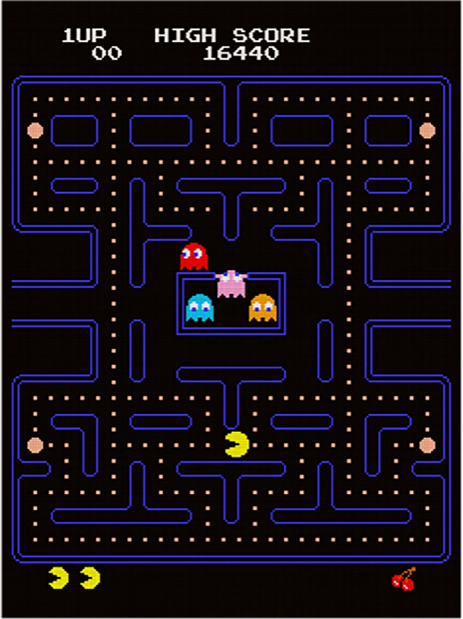
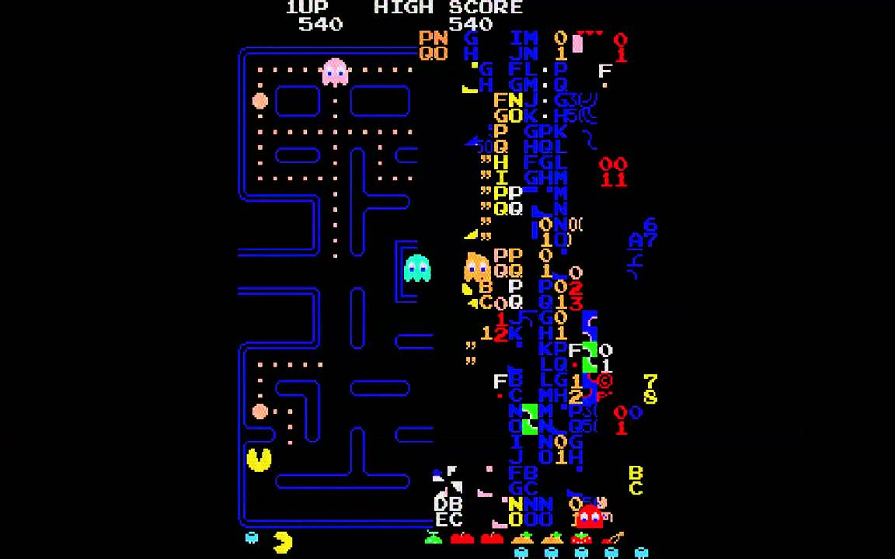
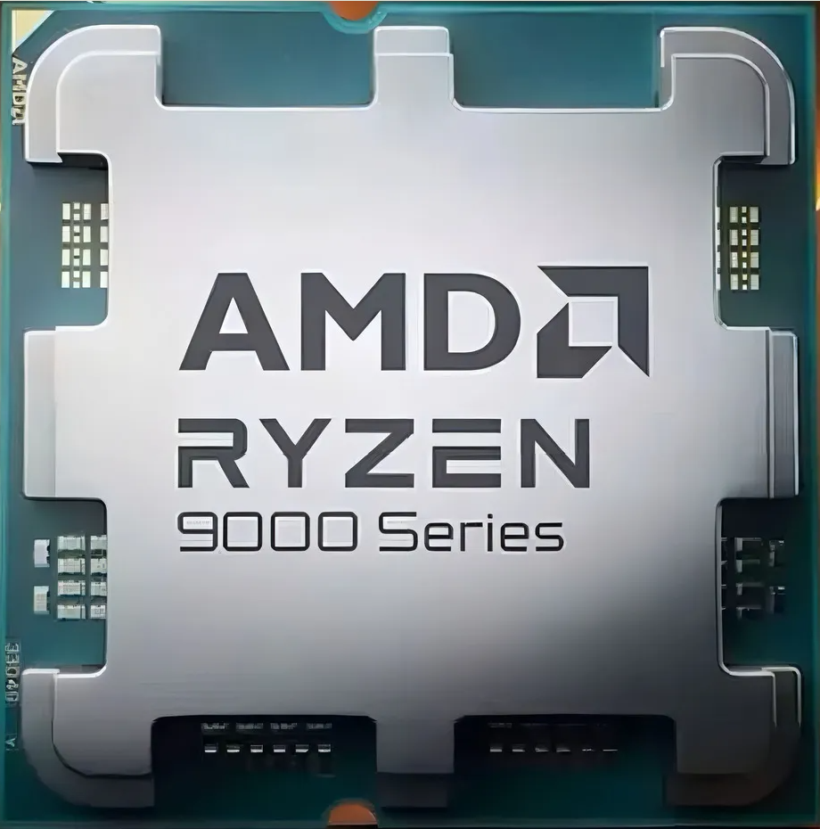
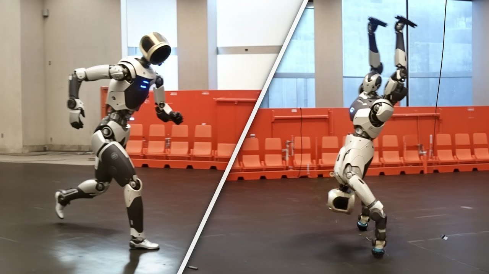

**Arquitectura y Sistemas Operativos**

# Clase 4 — Arquitectura: integración

**Tecnicatura Universitaria en Programación**

---

## Objetivos de la clase

Al finalizar esta clase deberías poder:

- comprender la arquitectura como un conjunto de decisiones de diseño;
- reconocer diferencias generales entre PC, servidores, móviles y sistemas embebidos;
- interpretar qué significa hablar de arquitecturas de 32 y 64 bits;
- distinguir procesador físico, núcleo y procesador lógico;
- relacionar multinúcleo, paralelismo y sistema operativo;
- comprender distintos niveles de abstracción desde un lenguaje de alto nivel hasta el
  lenguaje máquina;
- diferenciar instrucción de máquina, microoperación y microcódigo;
- explicar CISC y RISC sin tratarlos como categorías absolutas de rendimiento;
- relacionar arquitectura, virtualización, redes y sistemas embebidos;
- reconocer desde Linux la arquitectura visible para el sistema operativo.

---

## 1. Integración de arquitectura

En las clases anteriores estudiamos:

- componentes básicos de un computador;
- CPU;
- registros;
- ciclo de instrucción;
- memoria;
- almacenamiento;
- buses e interconexiones;
- firmware.

Ahora vamos a ampliar la mirada.

La arquitectura de computadoras no consiste solamente en enumerar componentes.

También estudia **cómo se organiza un sistema para cumplir determinados objetivos**.

Esas decisiones influyen en:

- rendimiento;
- consumo;
- costo;
- compatibilidad;
- capacidad de expansión;
- confiabilidad;
- usos posibles.

La pregunta deja de ser solamente:

> ¿qué partes tiene esta computadora?

y comienza a ser:

> ¿para qué problemas fue diseñada y qué compromisos se tomaron para resolverlos?

---

## 2. No existe una única computadora ideal

Distintos sistemas tienen necesidades diferentes.

Un teléfono, un servidor y una computadora de escritorio pueden ejecutar programas,
pero sus prioridades son distintas.

---

## 3. Computadoras personales

Incluyen, entre otros:

- notebooks;
- computadoras de escritorio;
- estaciones de trabajo personales.

Buscan habitualmente un equilibrio entre:

- costo;
- rendimiento;
- consumo;
- compatibilidad;
- facilidad de uso.

No siempre priorizan “comodidad sobre eficiencia”. El diseño depende del producto y de
su objetivo.

Una notebook ultraliviana, por ejemplo, puede priorizar autonomía mucho más que una PC
de escritorio.

---

## 4. Servidores

Un servidor está orientado principalmente a ofrecer servicios a otros sistemas o
usuarios.

Ejemplos:

- servidor web;
- base de datos;
- servidor de archivos;
- plataforma de aplicaciones;
- infraestructura de virtualización.

Suelen ser importantes:

- disponibilidad;
- confiabilidad;
- capacidad de memoria;
- almacenamiento;
- conectividad;
- mantenimiento;
- escalabilidad;
- trabajo concurrente.

En un servidor la interacción mediante monitor, teclado y mouse puede ser secundaria o
incluso inexistente durante el funcionamiento normal.

Por eso más adelante Linux y Bash van a adquirir especial importancia:

> muchos servidores se administran habitualmente mediante terminal.

---

## 5. Sistemas embebidos

Un sistema embebido es una computadora incorporada dentro de un dispositivo más amplio.

Ejemplos:

- router;
- automóvil;
- electrodoméstico;
- sensor;
- controlador industrial;
- dron;
- equipo médico.

Puede tener restricciones de:

- energía;
- memoria;
- tamaño;
- costo;
- tiempo de respuesta;
- temperatura.

En algunos casos también aparecen requisitos de **tiempo real**.

---

## 6. Dispositivos móviles

Teléfonos y tablets deben equilibrar:

- rendimiento;
- autonomía;
- temperatura;
- conectividad;
- tamaño;
- sensores;
- experiencia interactiva.

Esto ayuda a comprender una idea central:

> **una arquitectura debe evaluarse en función del problema que intenta resolver.**

---

## 7. Bits: cantidad de combinaciones

Con `n` bits pueden representarse:

```text
2^n combinaciones
```

Ejemplos:

```text
1 bit  → 2 valores
2 bits → 4 valores
3 bits → 8 valores
8 bits → 256 valores
```

En forma matemática:

```text
32 bits → 2^32 combinaciones
64 bits → 2^64 combinaciones
```

Esto no significa que todo sistema de 64 bits utilice literalmente las `2^64`
direcciones posibles.

La cantidad realmente implementada depende de:

- arquitectura;
- procesador;
- sistema operativo;
- diseño de memoria.

---

## 8. Arquitecturas de 32 y 64 bits

Decir que una arquitectura es de 32 o 64 bits es una simplificación útil que suele
relacionarse con características como:

- tamaño de registros de propósito general;
- tamaño natural de determinados operandos;
- conjunto de instrucciones;
- capacidad de direccionamiento;
- convenciones del sistema y de los programas.

En un sistema de 32 bits, un espacio de direcciones lineal de 32 bits permite, en
teoría:

```text
2^32 bytes = 4 GiB
```

Pero los límites reales pueden ser diferentes debido a mecanismos de hardware y del
sistema operativo.

En una arquitectura de 64 bits el espacio teórico es enormemente mayor, pero los
procesadores actuales **no necesariamente implementan los 64 bits completos como
dirección utilizable**.

---

## 9. Arquitectura y compatibilidad

Un programa compilado contiene instrucciones para una arquitectura determinada.

Por ejemplo:

```text
x86-64
ARM64
```

Por eso arquitectura y compatibilidad están relacionadas.

Un programa compilado para x86-64 no puede ejecutarse directamente sobre ARM64 si no
existe algún mecanismo de:

- traducción;
- emulación;
- recompilación;
- compatibilidad proporcionada por la plataforma.

También existen mecanismos que permiten ejecutar software de una arquitectura o modo
anterior dentro de ciertos límites.

---

## 10. El ejemplo de Pac-Man y el nivel 256

El Pac-Man arcade original es un buen ejemplo histórico para mostrar cómo una
representación con cantidad limitada de bits puede provocar un desbordamiento.

El famoso problema del nivel 256 está relacionado con el uso de valores de 8 bits en
rutinas internas del juego.



*Pantalla normal del juego: el contador de nivel todavía está dentro de rango.*



*El "split screen" del nivel 256: al desbordarse el contador de 8 bits, la rutina que dibuja la pantalla toma valores fuera de rango y llena media pantalla con basura.*

Un byte puede representar:

```text
256 combinaciones
```

Cuando ciertos contadores superan el rango previsto, aparece el comportamiento conocido
como *split screen*.

> El ejemplo sirve para comprender desbordamiento. No debemos concluir que “todo
> programa de 8 bits falla al llegar a 256”; el efecto depende de cómo fue programada
> cada variable y cada rutina.

---

## 11. Compatibilidad de software antiguo

En Windows de 64 bits existe, para determinados casos, **WOW64**.

WOW64 permite ejecutar muchas aplicaciones Windows de 32 bits sobre Windows de 64
bits.

No significa que cualquier programa antiguo pueda ejecutarse automáticamente.

Por ejemplo:

- muchas aplicaciones Win32 pueden funcionar mediante WOW64;
- aplicaciones de 16 bits no funcionan de forma nativa en las versiones modernas de
  Windows de 64 bits;
- software diseñado para máquinas arcade antiguas suele requerir emulación.

Por eso conviene distinguir:

```text
compatibilidad
emulación
virtualización
```

Son conceptos relacionados, pero diferentes.

---

## 12. Multinúcleo

Un procesador multinúcleo contiene varios núcleos físicos de ejecución dentro del mismo
procesador.



*Un procesador de escritorio actual concentra muchos núcleos en una sola pieza. Por ejemplo, el Ryzen 9 9950X3D reúne 16 núcleos físicos y 32 procesadores lógicos.*

Ejemplo:

```text
1 procesador físico
        │
        ├── núcleo 0
        ├── núcleo 1
        ├── núcleo 2
        └── núcleo 3
```

Cada núcleo puede ejecutar instrucciones.

Esto permite que exista procesamiento realmente simultáneo cuando diferentes núcleos
trabajan al mismo tiempo.

---

## 13. SMT y procesadores lógicos

Algunos núcleos implementan **Simultaneous Multithreading (SMT)**.

Intel utilizó históricamente el nombre comercial **Hyper-Threading** para una
implementación de esta idea.

Ejemplo:

```text
1 procesador físico
4 núcleos
2 hilos de hardware por núcleo
        │
        ▼
8 procesadores lógicos visibles para el SO
```

Un procesador lógico **no equivale a un núcleo físico completo**.

Los hilos de hardware de un mismo núcleo comparten parte de sus recursos.

> **Núcleos heterogéneos.** No todos los núcleos de un procesador son necesariamente
> iguales. Intel combina *P-cores* (rendimiento) y *E-cores* (eficiencia) desde
> *Alder Lake* (2021); ARM usa el esquema *big.LITTLE* desde hace años; y Apple Silicon
> mezcla núcleos de rendimiento y de eficiencia en un mismo chip. Esto es relevante para
> la unidad de **procesos y planificación**: el sistema operativo debe tener en cuenta
> que los núcleos no rinden igual al decidir dónde ejecutar cada hilo.

---

## 14. Multiprocesamiento

La palabra **multiprocesamiento** puede utilizarse en un sentido amplio para describir
un sistema operativo capaz de utilizar múltiples unidades de procesamiento.

Históricamente también hablamos de sistemas con varios procesadores físicos o
*sockets*.

Ejemplo:

```text
Socket 0                Socket 1
+------------+          +------------+
| varios     |          | varios     |
| núcleos    |          | núcleos    |
+------------+          +------------+
       \                    /
        \                  /
         +----------------+
         | memoria / I/O  |
         +----------------+
```

En sistemas actuales podemos encontrar simultáneamente:

- varios sockets;
- varios núcleos por socket;
- varios hilos de hardware por núcleo.

Desde el punto de vista del sistema operativo, todos ellos terminan formando un conjunto
de **CPU lógicas disponibles para planificación**.

Esto será fundamental en la unidad de:

- procesos;
- hilos;
- planificación;
- concurrencia.

---

## 15. Concurrencia y paralelismo

Estos conceptos no son exactamente iguales.

### Concurrencia

Varias tareas progresan durante un mismo período de tiempo.

Puede existir incluso con un único núcleo mediante alternancia rápida.

### Paralelismo

Varias tareas se ejecutan realmente al mismo tiempo sobre diferentes unidades de
procesamiento.

```text
1 núcleo:
A A B A B B A B       → concurrencia

2 núcleos:
núcleo 0: A A A A
núcleo 1: B B B B     → paralelismo
```

Más adelante estudiaremos cómo el sistema operativo decide qué tarea utiliza cada CPU.

---

## 16. Rendimiento

El rendimiento de un sistema no depende de una sola cifra.

Importan:

- frecuencia;
- arquitectura;
- núcleos;
- SMT;
- memoria caché;
- RAM;
- ancho de banda;
- almacenamiento;
- tipo de aplicación;
- sistema operativo;
- capacidad del software para trabajar en paralelo.

Por eso:

```text
más GHz ≠ siempre más rendimiento
más núcleos ≠ siempre programa más rápido
```

Un programa secuencial no se vuelve automáticamente ocho veces más rápido por ejecutarse
en una CPU de ocho núcleos.

---

## 17. Niveles de abstracción

Podemos pensar la ejecución de un programa mediante capas.

```text
Programa escrito en un lenguaje de programación
           │
           ▼
Compilador / intérprete / VM
           │
           ▼
Instrucciones de máquina
           │
           ▼
Implementación interna de la CPU
           │
           ▼
microoperaciones / unidades de ejecución
```

Cada capa oculta detalles de la que está debajo.

---

## 18. Lenguaje máquina

El lenguaje máquina está formado por instrucciones codificadas como bits.

La CPU interpreta esas instrucciones de acuerdo con su **ISA**.

ISA significa:

```text
Instruction Set Architecture
```

Una ISA define, entre otras cosas:

- instrucciones disponibles;
- registros visibles;
- formatos de instrucción;
- modos de direccionamiento;
- comportamiento arquitectónico.

Ejemplos de familias de ISA:

```text
x86-64
ARM
RISC-V
```

---

## 19. Lenguaje ensamblador

El ensamblador utiliza nombres mnemotécnicos para representar instrucciones de máquina.

Ejemplo x86-64:

```asm
mov eax, 2
mov edx, 3
add eax, edx
```

Interpretación:

```text
mov eax, 2   → colocar 2 en EAX
mov edx, 3   → colocar 3 en EDX
add eax, edx → sumar EDX a EAX
```

Después de `add`, EAX contiene:

```text
5
```

El lenguaje ensamblador depende de la arquitectura.

El ensamblador de x86-64 no es el mismo que el de ARM64.

---

## 20. De ensamblador a código máquina

Para x86, una codificación posible de:

```asm
mov eax, 2
```

es:

```text
B8 02 00 00 00
```

En hexadecimal.

Ese conjunto de bytes es el que forma parte del código ejecutable.

> Un archivo ejecutable contiene mucho más que instrucciones: también posee cabeceras,
> metadatos, secciones, información para el cargador y otros datos.

Si abrimos un ejecutable con un editor de texto, veremos caracteres extraños porque un
editor intenta interpretar como texto bytes que **no fueron creados para representar
texto**.


*Los bytes `B8 02 00 00 00 …` abiertos en un editor de texto: el editor los fuerza a la tabla de caracteres y devuelve símbolos sin sentido.*

No significa que el ejecutable “esté guardado en ASCII”.

---

## 21. C y ensamblador: una aclaración importante

Supongamos:

```c
int a = 2;
int b = 3;
int c = a + b;
```

Podemos escribir manualmente una versión simplificada en ensamblador.

Pero un compilador real **no está obligado** a producir exactamente esas instrucciones.

Puede:

- eliminar variables;
- calcular el resultado durante la compilación;
- utilizar registros diferentes;
- reorganizar instrucciones;
- optimizar completamente el código.

Por eso:

> el ensamblador mostrado en clase es una representación didáctica, no una predicción
> exacta de lo que siempre genera un compilador.

---

## 22. Microoperaciones

Una instrucción de máquina visible al programador puede requerir internamente varias
acciones.

Por ejemplo, de manera conceptual:

```text
add eax, edx
     │
     ├── leer EAX
     ├── leer EDX
     ├── realizar suma
     ├── escribir resultado
     └── actualizar flags
```

A estas acciones internas podemos llamarlas **microoperaciones**.

Los procesadores modernos pueden además:

- decodificar varias instrucciones;
- convertir instrucciones en operaciones internas;
- mantener múltiples instrucciones en vuelo;
- ejecutar fuera de orden;
- utilizar diferentes unidades de ejecución.

La realidad es bastante más compleja que el ciclo de instrucción introductorio.

---

## 23. Microcódigo y microinstrucción

Conviene no confundir tres conceptos.

### Instrucción de máquina

Es visible para el programador de bajo nivel y pertenece a la ISA.

Ejemplo:

```asm
add eax, edx
```

### Microoperación

Es una operación interna en la que una implementación puede descomponer una instrucción.

### Microinstrucción

En una unidad de control **microprogramada**, una microinstrucción es una palabra de
control perteneciente al microprograma interno del procesador.

No todas las CPU ni todas las instrucciones deben explicarse como una secuencia simple
de microinstrucciones.

Por eso evitamos afirmar:

```text
instrucción C
    ↓
microinstrucciones
```

La relación correcta incluye varias capas:

```text
código de alto nivel
    ↓
instrucciones de máquina
    ↓
implementación interna
    ↓
microoperaciones y, en algunos diseños, microcódigo
```

---

## 24. CISC y RISC

Históricamente se distinguen dos filosofías.

### CISC

CISC significa **Complex Instruction Set Computer**.

Tiende históricamente a ofrecer:

- un repertorio amplio;
- instrucciones con comportamientos complejos;
- múltiples modos de direccionamiento.

x86 es el ejemplo clásico.

### RISC

RISC significa **Reduced Instruction Set Computer**.

Históricamente busca:

- instrucciones más regulares;
- formatos más simples;
- operaciones sencillas;
- facilidad para implementar pipelines eficientes.

ARM y RISC-V son ejemplos importantes.

---

## 25. CISC vs RISC no es “lento vs rápido”

Esta distinción es útil para estudiar historia y filosofía de diseño, pero las CPU
modernas hacen mucho más difícil una separación absoluta.

Por ejemplo:

- procesadores x86 modernos pueden traducir instrucciones complejas a microoperaciones
  internas;
- arquitecturas RISC actuales también incorporan instrucciones sofisticadas;
- tanto x86-64 como ARM64 pueden alcanzar altísimo rendimiento;
- el consumo depende de la implementación completa, no solo de la etiqueta CISC/RISC;
- los procesadores Apple Silicon (M1, M2, M3, M4) son ARM (RISC) y logran mejor
  rendimiento por watt que muchos x86 en varias cargas de trabajo, lo que muestra que
  no hay una categoría "más rápida" o "más eficiente" en abstracto.

Por eso no debemos memorizar:

```text
CISC = lento
RISC = rápido
```

ni:

```text
CISC = consume mucho
RISC = consume poco
```

Una formulación mejor es:

> CISC y RISC describen enfoques históricos diferentes sobre el diseño de la ISA; el
> rendimiento y la eficiencia reales dependen de la implementación concreta.

---

## 26. ARM no es solamente “arquitectura de celulares”

ARM tuvo enorme difusión en dispositivos móviles por su eficiencia y por el ecosistema
construido alrededor de esa arquitectura.

Pero actualmente también se utiliza en:

- notebooks y computadoras de escritorio: Apple Silicon (M1 a M4) en las Mac y
  Snapdragon X Elite en PC con Windows;
- servidores e infraestructura en la nube: AWS Graviton3 y Graviton4;
- sistemas embebidos;
- placas de desarrollo.

Esto permite observar cómo las fronteras entre tipos de computadoras también cambian.

---

## 27. Tendencias actuales

Algunos temas que conectan la arquitectura con el resto de la materia son:

- multinúcleo;
- paralelismo;
- virtualización;
- sistemas distribuidos;
- redes;
- sistemas embebidos;
- aceleradores;
- GPU;
- procesamiento especializado;
- eficiencia energética.

No estudiaremos todos en profundidad en esta unidad.

Nos interesa reconocer que la computadora personal clásica es solamente **un caso** entre
muchos sistemas de cómputo posibles.

---

## 28. Virtualización

La virtualización permite presentar recursos virtuales a un sistema invitado.

Por ejemplo:

```text
Hardware físico
      │
      ▼
Hipervisor / plataforma de virtualización
      │
      ├── máquina virtual A
      └── máquina virtual B
```

Cada máquina virtual puede creer que posee:

- CPU;
- memoria;
- almacenamiento;
- interfaces de red.

aunque esos recursos estén siendo administrados por otra capa.

---

## 29. WSL2 como caso real de virtualización

Durante esta materia muchos estudiantes utilizarán:

```text
Windows
   │
   ▼
WSL2
   │
   ▼
Linux / Ubuntu
```

WSL2 utiliza un kernel Linux real ejecutado dentro de un entorno virtualizado.

Eso explica por qué algunos comandos Linux muestran recursos desde la perspectiva del
entorno WSL2 y no exactamente como los muestra Windows.

Esta diferencia nos permite unir las cuatro primeras clases:

```text
CPU
memoria
almacenamiento
red
       │
       ▼
virtualización
       │
       ▼
Linux ve una representación de esos recursos
```

---

## 30. Redes y sistemas distribuidos

Una computadora actual rara vez trabaja completamente aislada.

En una red aparecen:

- clientes;
- servidores;
- protocolos;
- interfaces;
- servicios.

En un sistema distribuido, varios computadores cooperan para resolver un problema.

Más adelante tendremos una introducción específica a redes.

---

## 31. Sistemas embebidos: drones, vehículos y robots

Los sistemas embebidos permiten integrar todos los conceptos estudiados.

### Dron


*Un dron integra en muy poco espacio procesador, sensores, firmware y control en tiempo real.*

Puede combinar:

- procesador;
- sensores;
- memoria;
- buses internos;
- firmware;
- control en tiempo real;
- comunicación.

### Vehículo moderno


*Un vehículo actual lleva muchos computadores y redes internas. El Maextro S800, por ejemplo, combina varias unidades lidar y decenas de sensores para conducción asistida.*

Puede incluir múltiples computadores y redes internas para:

- control del motor;
- seguridad;
- entretenimiento;
- asistencia a la conducción;
- sensores.

### Robot



*Un robot humanoide reúne CPU, aceleradores, sensores, actuadores y control en tiempo real. El ejemplo visto en clase es el nuevo Atlas de Boston Dynamics.*

Puede combinar:

- CPU;
- GPU o aceleradores;
- sensores;
- actuadores;
- redes internas;
- control;
- algoritmos de percepción.

Estos ejemplos muestran que arquitectura y software deben diseñarse conjuntamente según
el problema.

---

## 32. Laboratorio Linux — ¿qué arquitectura ve el sistema?

Dentro de Linux:

```bash
uname -m
```

En una PC x86-64 probablemente aparezca:

```text
x86_64
```

En una máquina ARM64 podría aparecer:

```text
aarch64
```

---

## 33. ¿32 o 64 bits?

```bash
getconf LONG_BIT
```

En un entorno Linux de 64 bits normalmente devuelve:

```text
64
```

También podemos observar:

```bash
lscpu
```

Buscá:

- Architecture;
- CPU(s);
- Thread(s) per core;
- Core(s) per socket;
- Socket(s).

---

## 34. Núcleos y procesadores lógicos

```bash
nproc
```

Luego compará con:

```bash
lscpu
```

El número de `nproc` no significa necesariamente “cantidad de núcleos físicos”.

Puede representar procesadores lógicos disponibles para el sistema.

---

## 35. ¿De qué arquitectura es un programa?

Podemos consultar un ejecutable:

```bash
file /bin/bash
```

También:

```bash
file /bin/ls
```

En un sistema x86-64 podemos encontrar información semejante a:

```text
ELF 64-bit ... x86-64
```

Esto conecta directamente:

```text
hardware
    +
arquitectura
    +
sistema operativo
    +
programa compilado
```

---

## 36. ¿Estoy dentro de WSL2?

Podemos observar:

```bash
cat /proc/version
```

En WSL2 normalmente aparece alguna referencia a Microsoft o WSL.

Podemos filtrar:

```bash
grep -i microsoft /proc/version
```

Otra herramienta que puede estar disponible:

```bash
systemd-detect-virt
```

En una instalación Linux nativa puede responder algo diferente o indicar que no detecta
virtualización.

---

## 37. Actividad práctica

Ejecutá:

```bash
uname -m
getconf LONG_BIT
lscpu
nproc
file /bin/bash
cat /proc/version
```

Respondé:

1. ¿Qué arquitectura informa `uname -m`?
2. ¿El entorno es de 32 o 64 bits?
3. ¿Cuántos sockets informa Linux?
4. ¿Cuántos núcleos por socket?
5. ¿Cuántos hilos por núcleo?
6. ¿Cuántos procesadores lógicos aparecen?
7. ¿Coincide ese número con `nproc`?
8. ¿De qué arquitectura es `/bin/bash`?
9. ¿Tu entorno parece nativo o virtualizado?
10. Si utilizás WSL2, ¿qué relación existe entre la arquitectura del equipo físico y la
    arquitectura que informa Ubuntu?

---

## 38. Mini desafío Bash

Creá:

```text
arquitectura.sh
```

Contenido:

```bash
#!/bin/bash

echo "=== ARQUITECTURA DEL SISTEMA ==="
echo

echo "Arquitectura:"
uname -m

echo
echo "Bits del entorno:"
getconf LONG_BIT

echo
echo "Procesadores logicos disponibles:"
nproc

echo
echo "Resumen de CPU:"
lscpu

echo
echo "Arquitectura de Bash:"
file /bin/bash

echo
echo "Kernel:"
uname -r

echo
echo "Informacion del entorno:"
cat /proc/version
```

Dale permiso:

```bash
chmod +x arquitectura.sh
```

Ejecutalo:

```bash
./arquitectura.sh
```

Guardá el resultado para compararlo más adelante con la clase de virtualización.

---

## 39. Actividad opcional: del C al ensamblador

Si el equipo dispone de GCC:

```bash
gcc --version
```

creá un archivo:

```text
suma.c
```

con:

```c
int suma(void) {
    int a = 2;
    int b = 3;
    return a + b;
}
```

Pedile a GCC generar ensamblador sin ejecutar el programa:

```bash
gcc -O0 -S suma.c -o suma.s
```

Abrilo:

```bash
less suma.s
```

Salir:

```text
q
```

Después generá una versión optimizada:

```bash
gcc -O2 -S suma.c -o suma_O2.s
```

Compará:

```bash
diff suma.s suma_O2.s
```

La pregunta importante no es memorizar ensamblador.

Es observar:

> **¿por qué el código generado cambia si el programa C es exactamente el mismo?**

La respuesta comienza a mostrarnos que entre el lenguaje de alto nivel y el hardware
existe una enorme capa de traducción y optimización.

---

## 40. Ideas para recordar

```text
TIPO DE SISTEMA
      │
      ▼
necesidades diferentes
      │
      ▼
decisiones de arquitectura
```

También:

```text
Programa de alto nivel
        │
        ▼
código máquina
        │
        ▼
ISA
        │
        ▼
CPU concreta
```

Y:

```text
procesador físico
     │
     ├── núcleos
     │      │
     │      └── procesadores lógicos
     │
     ▼
Sistema operativo
     │
     ▼
planificador
```

Este último esquema será central en las próximas clases.

---

## Glosario

**Arquitectura de computadoras:** organización conceptual y funcional de un sistema de
cómputo.

**ISA:** interfaz arquitectónica que define las instrucciones visibles para el software.

**32/64 bits:** clasificación relacionada con características de la ISA, registros,
operandos y direccionamiento.

**Núcleo:** unidad física de procesamiento dentro de un procesador.

**Procesador lógico:** unidad de ejecución visible para el planificador del sistema
operativo.

**SMT:** técnica que permite mantener varios hilos de hardware dentro de un núcleo.

**Concurrencia:** progreso de múltiples tareas durante un mismo período.

**Paralelismo:** ejecución simultánea de tareas sobre varias unidades de procesamiento.

**Lenguaje máquina:** instrucciones binarias interpretadas según una ISA.

**Ensamblador:** representación textual y mnemotécnica de instrucciones de máquina.

**Microoperación:** operación interna utilizada por una implementación del procesador.

**Microcódigo:** mecanismo interno utilizado por ciertos procesadores para implementar
determinadas operaciones.

**CISC:** enfoque histórico de ISA con repertorio amplio y operaciones complejas.

**RISC:** enfoque histórico de ISA que favorece instrucciones regulares y relativamente
simples.

**Emulación:** reproducción por software del comportamiento de otra plataforma.

**Virtualización:** presentación de recursos virtuales a un sistema invitado.

**Sistema embebido:** computadora integrada dentro de otro dispositivo.

**Sistema distribuido:** conjunto de computadores que cooperan mediante una red.

---

## Desafiate con preguntas de examen

1. ¿Por qué no existe una única arquitectura ideal para todos los sistemas?
2. ¿Qué diferencias generales existen entre una PC y un servidor?
3. ¿Qué caracteriza a un sistema embebido?
4. ¿Por qué el consumo energético es importante en dispositivos móviles?
5. ¿Cuántas combinaciones pueden representarse con `n` bits?
6. ¿Qué significa, en términos generales, hablar de una arquitectura de 64 bits?
7. ¿Por qué `2^64` no implica que una CPU actual utilice necesariamente todas esas
   direcciones?
8. ¿Qué relación existe entre arquitectura y compatibilidad de software?
9. ¿Qué diferencia existe entre compatibilidad, emulación y virtualización?
10. ¿Qué diferencia hay entre procesador físico, núcleo y procesador lógico?
11. ¿Qué es SMT?
12. ¿Qué diferencia existe entre concurrencia y paralelismo?
13. ¿Por qué más núcleos no garantizan que cualquier programa se ejecute más rápido?
14. ¿Qué es una ISA?
15. ¿Qué relación existe entre ensamblador y lenguaje máquina?
16. ¿Por qué un compilador puede generar ensamblador diferente para el mismo código
    fuente?
17. ¿Qué diferencia hay entre una instrucción de máquina y una microoperación?
18. ¿Qué significa microcódigo?
19. ¿Qué características históricas diferencian CISC y RISC?
20. ¿Por qué no es correcto afirmar simplemente “RISC es más rápido que CISC”?
21. ¿Por qué ARM ya no puede considerarse solamente una arquitectura de celulares?
22. ¿Qué significa virtualizar hardware?
23. ¿Por qué WSL2 es un ejemplo útil para estudiar virtualización?
24. ¿Qué información nos brinda `lscpu` que será importante al estudiar planificación?

---

## Cierre de la unidad de arquitectura

Durante estas cuatro clases construimos el siguiente recorrido:

```text
CLASE 1
Sistema computacional
hardware + software + SO

        ↓

CLASE 2
CPU
instrucciones + registros + ejecución

        ↓

CLASE 3
Memoria y comunicación
caché + RAM + almacenamiento + buses + firmware

        ↓

CLASE 4
Integración
arquitecturas + paralelismo + ISA + virtualización
```

A partir de la [próxima clase](CLASE_05_SISTEMA_OPERATIVO_FUNCIONES_EVOLUCION.md) el protagonista será el **Sistema Operativo**.

La pregunta central cambia.

Hasta ahora preguntamos:

> ¿cómo está construida una computadora?

A partir de ahora preguntaremos:

> **¿cómo administra el sistema operativo todo ese hardware para permitir que varios
> programas se ejecuten de forma segura y eficiente?**

Los primeros conceptos que necesitaremos serán:

- programa;
- proceso;
- hilo;
- estado de un proceso;
- planificación;
- cambio de contexto.

Y Linux pasará de ser solamente una herramienta de observación a convertirse en nuestro
**laboratorio del sistema operativo**.
