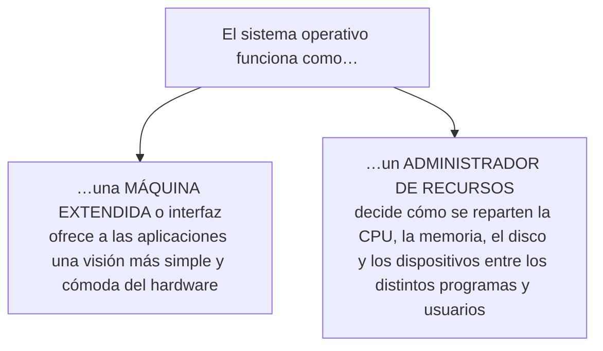
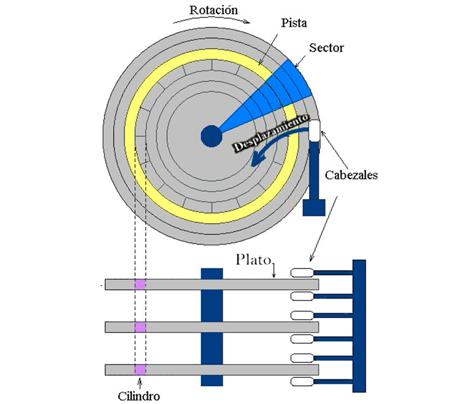
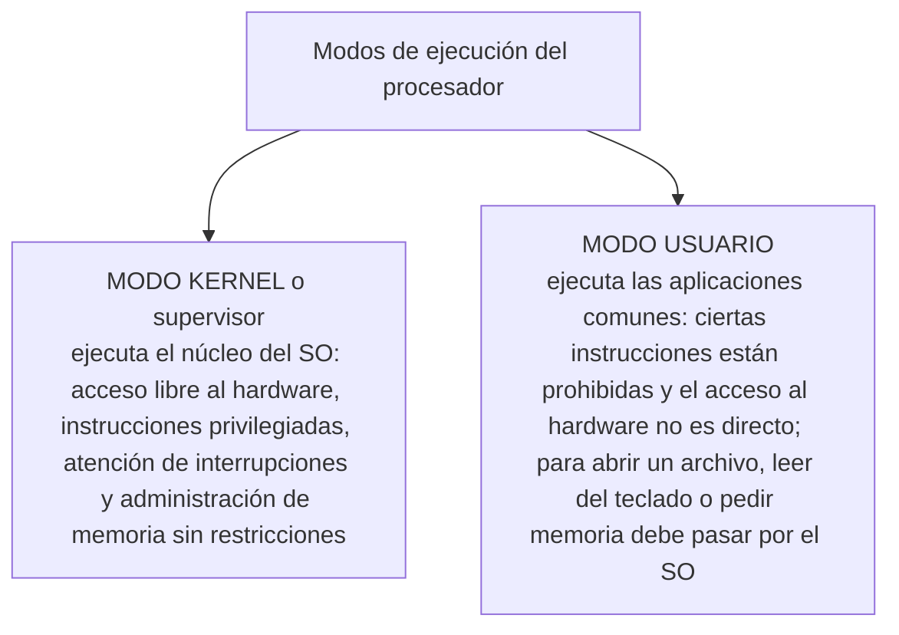
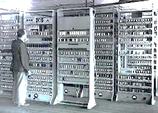
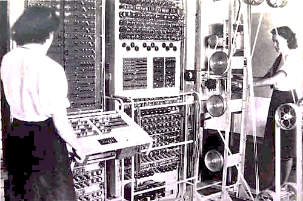
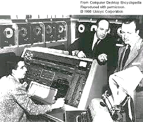
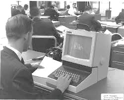
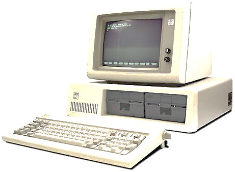

**Arquitectura y Sistemas Operativos**

# Clase 5 — Sistema operativo: funciones y evolución

**Tecnicatura Universitaria en Programación**

---

## Objetivos de la clase

Al finalizar esta clase deberías poder:

- explicar por qué existe un sistema operativo;
- comprender el doble papel del sistema operativo como **máquina extendida** y
  **administrador de recursos**;
- reconocer sus funciones principales;
- diferenciar **modo usuario** y **modo kernel**;
- explicar qué es una **llamada al sistema**;
- reconocer, a grandes rasgos, la evolución histórica de los sistemas operativos;
- clasificar sistemas operativos según distintos criterios;
- diferenciar el sistema operativo, el kernel y la shell;
- utilizar Linux y Bash para observar características reales del sistema.

---

## 1. Del hardware al sistema operativo

En las cuatro clases anteriores estudiamos:

- organización general del computador;
- CPU y ciclo de instrucción;
- memoria y almacenamiento;
- buses e interconexiones;
- firmware;
- arquitecturas de 32 y 64 bits;
- multinúcleo y virtualización.

Ahora cambia el protagonista.

Hasta este momento preguntamos:

> ¿cómo está construida una computadora?

A partir de esta clase comenzamos a preguntar:

> **¿cómo se administra todo ese hardware para que los programas puedan ejecutarse?**

Una computadora moderna dispone de recursos limitados:

- tiempo de CPU;
- memoria;
- almacenamiento;
- dispositivos de entrada/salida;
- interfaces de red.

Si cada aplicación tuviera que controlar directamente todos esos componentes, programar
sería extremadamente complejo y varias aplicaciones difícilmente podrían compartir la
máquina de forma segura.

Ahí aparece el **sistema operativo**.

---

## 2. ¿Qué es un sistema operativo?

Podemos definirlo, en forma introductoria, como:

> **el software base que ofrece servicios a los programas y administra los recursos del
> sistema.**

Una representación simple:

```text
Usuario
   │
   ▼
Aplicaciones
   │
   ▼
Sistema operativo
   │
   ▼
Hardware
```

Dentro del sistema operativo existe una parte especialmente importante:

```text
Sistema operativo
├── kernel
├── servicios del sistema
├── bibliotecas
├── utilidades
└── interfaces de usuario
```

La organización exacta depende del sistema.

> El **kernel** es la parte que permanece en control privilegiado del hardware.
> No todo programa asociado al sistema operativo se ejecuta en modo kernel.

---

## 3. Dos formas de entender al sistema operativo

Hay dos ideas clásicas que ayudan a comprender su función.



*Hacia arriba, el sistema operativo simplifica el hardware para las aplicaciones; hacia abajo, reparte y protege los recursos entre todos los programas y usuarios.*

### Sistema operativo como máquina extendida

El hardware real es complejo.

Un dispositivo puede requerir:

- registros;
- protocolos;
- comandos;
- sincronización;
- controladores;
- tratamiento de errores.

El sistema operativo ofrece abstracciones más simples.

Ejemplos:

| Hardware o recurso real | Abstracción utilizada por el software            |
| ----------------------- | ------------------------------------------------ |
| almacenamiento físico   | archivos y directorios                           |
| CPU                     | procesos e hilos                                 |
| memoria física          | espacios de direcciones y memoria virtual        |
| interfaz de red         | sockets                                          |
| dispositivos            | archivos, controladores o interfaces específicas |

La aplicación trabaja con conceptos más manejables y el sistema operativo se encarga
de coordinar los detalles necesarios.

---

## 4. Ejemplo: guardar un archivo

Un programa que guarda un archivo hace, en pseudocódigo, algo como esto:

```text
abrir archivo "datos.txt" en modo escritura
escribir "hola" en el archivo
cerrar archivo
```

El programador piensa en:

```text
archivo
nombre
abrir
escribir
cerrar
```

No necesita conocer directamente:

- sectores físicos;
- bloques internos del dispositivo;
- comandos SATA o NVMe;
- registros del controlador;
- tiempos de acceso;
- colas de operaciones.

En un sistema moderno, el recorrido real puede involucrar varias capas:

```text
Programa
   │
   ▼
biblioteca / runtime
   │
   ▼
llamada al sistema
   │
   ▼
kernel
   │
   ├── sistema de archivos
   ├── cachés y buffers
   └── controlador del dispositivo
   │
   ▼
almacenamiento
```

En un HDD existen componentes mecánicos. En un SSD no hay cabezales ni platos, pero
siguen existiendo controladores, protocolos, bloques y otras abstracciones de bajo nivel.



*Cuando el programa escribe `archivo.write("hola")`, el sistema operativo traduce esa operación a pistas, sectores y cilindros como estos. La aplicación nunca ve este nivel.*

La idea importante es:

> la aplicación trabaja con una abstracción de alto nivel y el sistema operativo
> coordina el acceso al recurso real.

---

## 5. Sistema operativo como administrador de recursos

La segunda función central consiste en **repartir y proteger recursos**.

El sistema operativo debe decidir, entre otras cosas:

- qué tarea utiliza la CPU;
- qué memoria puede utilizar cada proceso;
- qué programa puede acceder a un archivo;
- qué operaciones de entrada/salida deben atenderse;
- qué usuario tiene permiso para utilizar determinado recurso;
- cómo se comparten dispositivos e interfaces de red.

Esto conecta directamente con las próximas unidades de la materia.

```text
CPU              → planificación
memoria          → gestión de memoria
almacenamiento   → sistemas de archivos
dispositivos     → gestión de E/S
red              → comunicaciones
usuarios         → permisos y seguridad
```

---

## 6. Funciones principales de un sistema operativo

### Administración de procesos

Un **proceso** es, en términos iniciales, una instancia de un programa en ejecución.

El sistema operativo:

- crea procesos;
- mantiene información sobre ellos;
- permite su ejecución;
- los bloquea cuando deben esperar;
- los vuelve a habilitar;
- los termina;
- distribuye tiempo de CPU.

Las próximas clases profundizarán en:

- procesos;
- estados;
- planificación;
- hilos;
- concurrencia.

---

### Administración de memoria

El sistema operativo participa en:

- asignación de memoria;
- protección entre procesos;
- memoria virtual;
- traducción de direcciones;
- paginación;
- recuperación de memoria.

La gestión concreta se realiza conjuntamente con mecanismos de hardware como la MMU.

---

### Sistemas de archivos

El sistema operativo ofrece una estructura para organizar información persistente.

Trabajamos con conceptos como:

```text
archivo
directorio
nombre
ruta
permisos
propietario
metadatos
```

En lugar de trabajar directamente con la organización física del medio de
almacenamiento.

---

### Entrada/Salida

Los dispositivos son diferentes entre sí.

El sistema operativo permite que las aplicaciones utilicen interfaces relativamente
uniformes mediante:

- controladores o *drivers*;
- interrupciones;
- buffers;
- colas;
- llamadas al sistema.

---

### Usuarios, protección y seguridad

Un sistema moderno necesita distinguir:

- usuarios;
- grupos;
- permisos;
- procesos;
- propietarios de archivos;
- privilegios.

El aislamiento no es un agregado opcional: forma parte del diseño del sistema.

---

### Comunicaciones y red

El sistema operativo administra:

- interfaces;
- direcciones;
- protocolos;
- puertos;
- conexiones;
- comunicación entre procesos.

Más adelante tendremos una introducción específica a redes.

---

## 7. Interfaz de usuario y shell

Un sistema puede ofrecer:

- interfaz gráfica;
- interfaz de línea de comandos;
- interfaces remotas;
- APIs.

Una **shell** es un programa que interpreta órdenes del usuario y permite lanzar otros
programas.

Ejemplos:

```text
Bash
Zsh
PowerShell
```

La shell **no es el kernel**.

Tampoco debemos identificar:

```text
Linux = Bash
```

Linux puede utilizar muchas shells diferentes.

En esta materia utilizaremos principalmente:

```text
Windows
   │
   ▼
PowerShell
   │
   ▼
WSL2
   │
   ▼
Ubuntu
   │
   ▼
Bash
```

Quienes tengan Linux instalado de forma nativa trabajarán directamente en una terminal
Linux.

---

## 8. Comando, shell y programa

Cuando escribimos:

```bash
ls
```

Bash interpreta nuestra orden.

Puede ocurrir que la orden sea:

- un comando interno de Bash;
- un programa ejecutable;
- una función;
- un alias.

Podemos preguntar:

```bash
type cd
type echo
type ls
```

También:

```bash
command -v ls
command -v bash
```

Esto permite descubrir algo importante:

> **la terminal no ejecuta mágicamente órdenes: una shell interpreta lo que escribimos y
> decide cómo resolverlo.**

---

## 9. Modo usuario y modo kernel

Los procesadores modernos ofrecen mecanismos de privilegio.

Para una primera aproximación podemos trabajar con dos modos.



*El kernel puede todo; las aplicaciones corren restringidas y deben pedir al sistema operativo cualquier operación privilegiada.*

### Modo usuario

Aquí se ejecutan normalmente:

- aplicaciones;
- navegadores;
- editores;
- shells;
- gran cantidad de servicios del sistema.

El código tiene restricciones.

No puede controlar arbitrariamente:

- memoria física;
- dispositivos;
- interrupciones;
- estructuras internas del kernel.

### Modo kernel

El kernel puede ejecutar instrucciones privilegiadas y administrar recursos protegidos.

Una representación simple:

```text
Aplicación / Bash
    modo usuario
        │
        │ solicitud
        ▼
+----------------------+
|      KERNEL          |
|     modo kernel      |
+----------------------+
        │
        ▼
     hardware
```

La separación protege la estabilidad y seguridad del sistema.

---

## 10. Llamadas al sistema

Una aplicación necesita alguna forma de solicitar operaciones privilegiadas.

Para eso existen las **llamadas al sistema** (*system calls*).

Ejemplos conceptuales:

```text
abrir un archivo
leer datos
escribir datos
crear un proceso
reservar o mapear memoria
usar una interfaz de red
```

En Linux existen llamadas como:

```text
read
write
openat
close
fork/clone
execve
mmap
```

Es importante distinguir:

> una función que utilizamos en C o en otro lenguaje puede ser una función de biblioteca
> que finalmente utilice una o varias llamadas al sistema.

Por ejemplo, `printf()` no es una llamada al sistema de Linux. Una biblioteca puede
terminar utilizando `write()` para producir la salida.

---

## 11. ¿Qué ocurre durante una llamada al sistema?

Modelo simplificado:

```text
Programa en modo usuario
        │
        │ syscall
        ▼
CPU cambia a modo privilegiado
        │
        ▼
Kernel valida la solicitud
        │
        ├── realiza operación
        └── devuelve resultado/error
        │
        ▼
Programa continúa en modo usuario
```

El cambio se realiza mediante mecanismos definidos por la arquitectura y el sistema
operativo.

---

## 12. Cuando una operación falla

Supongamos:

```bash
cat archivo_que_no_existe.txt
```

Podemos recibir:

```text
No such file or directory
```

O intentar acceder a algo sin permisos:

```text
Permission denied
```

La idea importante es que la aplicación pidió una operación y el sistema respondió que
no podía completarla bajo esas condiciones.

Los errores también son parte de la interfaz entre programas y sistema operativo.

---

## 13. Laboratorio opcional: observar llamadas al sistema

En Ubuntu puede estar disponible `strace`.

Probalo:

```bash
strace --version
```

Si no está instalado:

```bash
sudo apt update
sudo apt install strace
```

Creá un archivo:

```bash
echo "hola" > datos.txt
```

Luego:

```bash
strace -e trace=openat,read,write,close cat datos.txt
```

No hace falta comprender toda la salida.

Buscá nombres como:

```text
openat
read
write
close
```

La idea es observar que un comando sencillo termina solicitando servicios al kernel.

> `strace` es una herramienta de diagnóstico. La usamos para mirar el sistema, no para
> memorizar sus detalles.

---

## 14. Evolución histórica de los sistemas operativos

La historia puede estudiarse de muchas maneras. Aquí utilizaremos una secuencia
didáctica, no una división rígida universal.



*Los primeros computadores ocupaban salas enteras y se operaban de forma totalmente manual.*

---

### Primeros computadores: sin sistema operativo

En las primeras máquinas no existía un sistema operativo moderno.



*Sin sistema operativo: los programas se cargaban a mano y la máquina quedaba ociosa entre un trabajo y el siguiente.*

Los programas se cargaban y ejecutaban con intervención directa de operadores.

La utilización de la máquina era costosa y poco flexible.

---

### Procesamiento por lotes — batch



*En los grandes equipos centrales, un monitor residente encadenaba los trabajos uno tras otro para no dejar la CPU ociosa.*

Luego aparecieron sistemas capaces de organizar una secuencia de trabajos.

```text
Trabajo 1
   ↓
Trabajo 2
   ↓
Trabajo 3
```

Un monitor residente podía cargar y ejecutar trabajos sin que un operador tuviera que
intervenir constantemente entre ellos.

Objetivo:

> aumentar el aprovechamiento del computador.

---

### Multiprogramación

La CPU es mucho más rápida que muchos dispositivos de entrada/salida.

Si un programa está esperando una operación de E/S:

```text
Proceso A → espera disco
```

la CPU podría ejecutar otro:

```text
CPU → Proceso B
```

Aparece así una idea central:

> mantener varios trabajos disponibles para aprovechar mejor el procesador.

Esto prepara directamente el concepto de **proceso**.

---

### Tiempo compartido



*Con el tiempo compartido cada usuario trabajaba desde su terminal y el sistema repartía pequeños intervalos de CPU entre todos.*

El tiempo compartido amplía la idea anterior para permitir interacción de varios usuarios.

```text
Usuario A ─┐
Usuario B ─┼── computador
Usuario C ─┘
```

El sistema distribuye pequeños intervalos de CPU entre distintas actividades.

Para los usuarios parece que sus programas avanzan simultáneamente.

---

### Computadoras personales



*La llegada de la computadora personal trajo sistemas operativos pensados para un solo equipo de uso individual, al principio con poca protección y sin multitarea real.*

Con la expansión de las computadoras personales aparecieron sistemas diseñados para
equipos de uso individual.

Inicialmente muchos tenían:

- protección limitada;
- poca o ninguna multitarea;
- escasa separación de usuarios.

Con el tiempo incorporaron:

- multitarea;
- protección;
- redes;
- interfaces gráficas;
- seguridad;
- múltiples usuarios.

---

### Sistemas actuales

Hoy conviven:

- sistemas de escritorio;
- servidores;
- sistemas móviles;
- sistemas embebidos;
- sistemas de tiempo real;
- plataformas de virtualización;
- infraestructura de nube.

La evolución continúa respondiendo a cambios en:

- hardware;
- redes;
- seguridad;
- escala;
- movilidad;
- nuevos tipos de dispositivos.

---

## 15. UNIX, Linux y Windows NT

### UNIX

UNIX introdujo y consolidó muchas ideas que siguen siendo fundamentales:

- procesos;
- jerarquía de archivos;
- usuarios y permisos;
- herramientas pequeñas combinables;
- shells;
- pipes.

### GNU/Linux

Linux es el **kernel**.

Una distribución GNU/Linux combina ese kernel con:

- utilidades;
- bibliotecas;
- gestores de paquetes;
- servicios;
- aplicaciones.

Ejemplos:

```text
Ubuntu
Debian
Fedora
Arch Linux
```

### Windows NT

Los Windows modernos pertenecen a la familia tecnológica iniciada con Windows NT.

También poseen:

- procesos;
- memoria virtual;
- separación de privilegios;
- sistemas de archivos;
- planificación;
- red.

Los conceptos generales de la materia no son exclusivos de Linux.

Linux será nuestro principal laboratorio porque permite observar muchos mecanismos de
forma cómoda desde la terminal.

---

## 16. Clasificación de sistemas operativos

Las categorías siguientes son **criterios de clasificación**, no cajas excluyentes.

Un mismo sistema puede pertenecer a varias categorías.

---

### Según cantidad de tareas

#### Monotarea

Permite ejecutar una actividad principal a la vez.

Fue común en sistemas personales antiguos.

#### Multitarea

Permite mantener múltiples tareas activas y repartir recursos entre ellas.

Los sistemas de propósito general actuales son multitarea.

---

### Según cantidad de usuarios

Históricamente se habló de:

- monousuario;
- multiusuario.

Un sistema multiusuario posee mecanismos para mantener simultáneamente:

- identidades;
- permisos;
- archivos;
- procesos;
- sesiones.

Los sistemas modernos de escritorio, aunque normalmente haya una sola persona sentada
frente a la pantalla, suelen poseer internamente soporte para múltiples usuarios.

Por eso esta clasificación debe utilizarse con cuidado.

---

### Según forma de procesamiento

#### Batch

Trabajos ejecutados por lotes.

#### Interactivo / tiempo compartido

El usuario interactúa mientras los programas se ejecutan.

#### Tiempo real

El criterio fundamental es cumplir **restricciones temporales**.

No significa simplemente “ser muy rápido”.

Un sistema de tiempo real debe poder garantizar o controlar tiempos de respuesta según
los requerimientos del problema.

Ejemplos:

- control industrial;
- sistemas automotrices;
- dispositivos médicos;
- robótica.

---

### Sistemas de red y sistemas distribuidos

Un sistema en red utiliza servicios de comunicación entre equipos que conservan su
identidad individual.

Un sistema distribuido intenta coordinar múltiples computadoras para ofrecer servicios o
recursos de manera integrada.

La frontera puede ser compleja y las plataformas actuales combinan muchas técnicas.

---

## 17. Linux, Bash, PowerShell y WSL2

Para esta materia conviene distinguir claramente las capas.

### En un equipo con Linux nativo

```text
hardware
   ↓
Linux
   ↓
Bash
   ↓
comandos
```

### En Windows con WSL2

```text
hardware
   ↓
Windows
   ↓
WSL2
   ↓
kernel Linux
   ↓
Ubuntu
   ↓
Bash
```

### PowerShell

PowerShell es una shell independiente que puede utilizarse en Windows y también existe
para otras plataformas.

En nuestro caso se utilizará principalmente para:

- administrar Windows;
- iniciar WSL;
- consultar las distribuciones instaladas.

Ejemplo desde PowerShell:

```powershell
wsl -l -v
wsl
```

Luego, dentro de Ubuntu, utilizaremos comandos Linux.

---

## 18. Laboratorio Linux — identificar el sistema

Dentro de Ubuntu o Linux:

```bash
uname -a
```

Información específica de la distribución:

```bash
cat /etc/os-release
```

Versión del kernel:

```bash
uname -r
```

Arquitectura:

```bash
uname -m
```

---

## 19. ¿Qué shell estoy usando?

```bash
echo "$SHELL"
```

Información sobre Bash:

```bash
bash --version
```

PID de la shell actual:

```bash
echo $$
```

Podemos observarla como proceso:

```bash
ps -p $$ -o pid,ppid,user,stat,comm,args
```

Este comando anticipa el tema de la [próxima clase](CLASE_06_PROCESOS_ESTADOS_PCB.md):

> **Bash también es un proceso.**

---

## 20. Comandos internos y ejecutables

Probá:

```bash
type cd
type echo
type ls
type cat
```

Luego:

```bash
command -v ls
command -v cat
```

Preguntas:

1. ¿`cd` aparece como un archivo ejecutable?
2. ¿`ls` aparece como un ejecutable?
3. ¿Por qué una shell necesita algunos comandos internos?

---

## 21. `/proc`: una ventana al kernel

Linux expone mucha información mediante un sistema de archivos virtual:

```text
/proc
```

Probá:

```bash
ls /proc | head
```

Información del kernel:

```bash
cat /proc/version
```

Información de la shell actual:

```bash
cat /proc/$$/status
```

`/proc` parece un directorio lleno de archivos, pero gran parte de esa información no
está almacenada como archivos normales en un disco.

Es una interfaz que el kernel presenta al espacio de usuario.

---

## 22. Actividad práctica

Ejecutá:

```bash
uname -a
uname -r
uname -m
cat /etc/os-release
echo "$SHELL"
bash --version
echo $$
ps -p $$ -o pid,ppid,user,stat,comm,args
type cd
type ls
command -v ls
cat /proc/version
```

Respondé:

1. ¿Qué distribución estás utilizando?
2. ¿Qué kernel informa el sistema?
3. ¿Qué arquitectura aparece?
4. ¿Qué shell estás usando?
5. ¿Cuál es el PID de tu Bash?
6. ¿Cuál es su proceso padre?
7. ¿`cd` es un comando interno o un ejecutable?
8. ¿Dónde está el ejecutable de `ls`?
9. Si utilizás WSL2, ¿aparece alguna referencia a Microsoft en `/proc/version`?
10. ¿Qué diferencia conceptual existe entre kernel, sistema operativo y shell?

---

## 23. Mini desafío Bash

Creá:

```text
sistema.sh
```

Contenido:

```bash
#!/bin/bash

echo "=== SISTEMA ==="
echo

echo "Usuario:"
whoami

echo
echo "Distribucion:"
grep -E '^(NAME|VERSION)=' /etc/os-release

echo
echo "Kernel:"
uname -r

echo
echo "Arquitectura:"
uname -m

echo
echo "Shell:"
echo "$SHELL"

echo
echo "Proceso de la shell:"
ps -p $$ -o pid,ppid,user,stat,comm,args
```

Dale permiso:

```bash
chmod +x sistema.sh
```

Ejecutalo:

```bash
./sistema.sh
```

El objetivo sigue siendo utilizar Bash como **instrumento para observar el sistema
operativo**.

---

## 24. Ideas para recordar

```text
                SISTEMA OPERATIVO
                /               \
               /                 \
              ▼                   ▼
       máquina extendida     administrador
       / abstracciones       de recursos
```

También:

```text
aplicación
    │
    │ llamada al sistema
    ▼
kernel
    │
    ▼
hardware
```

Y finalmente:

```text
Linux ≠ Bash
kernel ≠ sistema operativo completo
shell ≠ kernel
```

---

## Glosario

**Sistema operativo:** software base que ofrece servicios y administra recursos.

**Kernel:** núcleo privilegiado del sistema operativo.

**Máquina extendida:** visión más abstracta y manejable de los recursos físicos.

**Administrador de recursos:** rol que coordina CPU, memoria, E/S y otros recursos.

**Modo usuario:** nivel restringido de ejecución utilizado por aplicaciones.

**Modo kernel:** nivel privilegiado utilizado por el kernel.

**Llamada al sistema:** mecanismo mediante el cual un programa solicita un servicio al
kernel.

**Shell:** programa que interpreta órdenes y permite ejecutar comandos.

**Bash:** shell muy utilizada en sistemas Unix-like.

**PowerShell:** shell y entorno de automatización orientado a objetos.

**Batch:** procesamiento de trabajos organizados en lotes.

**Multiprogramación:** mantenimiento de varios programas disponibles para utilizar mejor
la CPU.

**Tiempo compartido:** reparto de CPU para permitir interacción concurrente de varios
usuarios o tareas.

**Sistema de tiempo real:** sistema cuyo comportamiento correcto incluye el cumplimiento
de restricciones temporales.

**GNU/Linux:** sistema construido alrededor del kernel Linux junto con utilidades,
bibliotecas y otros componentes.

**/proc:** sistema de archivos virtual utilizado por Linux para exponer información del
kernel y de los procesos.

---

## Desafiate con preguntas de examen

1. ¿Por qué existe un sistema operativo?
2. ¿Qué significa pensar al sistema operativo como máquina extendida?
3. ¿Qué significa considerarlo administrador de recursos?
4. ¿Qué abstracciones ofrece el SO sobre CPU, memoria y almacenamiento?
5. ¿Qué funciones principales cumple un sistema operativo?
6. ¿Qué diferencia hay entre sistema operativo y kernel?
7. ¿Qué diferencia hay entre kernel y shell?
8. ¿Qué diferencia existe entre modo usuario y modo kernel?
9. ¿Qué es una llamada al sistema?
10. ¿Una función de biblioteca es necesariamente una llamada al sistema?
11. ¿Qué relación existe entre multiprogramación y aprovechamiento de la CPU?
12. ¿Qué diferencia existe entre multiprogramación y tiempo compartido?
13. ¿Qué significa que un sistema sea multitarea?
14. ¿Por qué la clasificación monousuario/multiusuario debe interpretarse con cuidado en
    sistemas actuales?
15. ¿Qué caracteriza a un sistema de tiempo real?
16. ¿Qué diferencias generales existen entre un sistema en red y uno distribuido?
17. ¿Por qué Linux es útil como laboratorio para estudiar sistemas operativos?
18. ¿Qué función cumple Bash?
19. ¿Qué es `/proc`?
20. ¿Por qué Bash aparece como un proceso cuando ejecutamos `ps`?

---

## Próxima clase

En la [próxima clase](CLASE_06_PROCESOS_ESTADOS_PCB.md) vamos a trabajar con una de las abstracciones centrales del sistema
operativo:

> **el proceso**

Veremos:

- programa vs proceso;
- PID y PPID;
- PCB;
- estados;
- espacio de direcciones;
- procesos padre e hijo;
- creación y terminación;
- señales;
- cambio de contexto.

Y esta vez podremos **crear, suspender, reanudar y terminar procesos reales desde Bash**.
