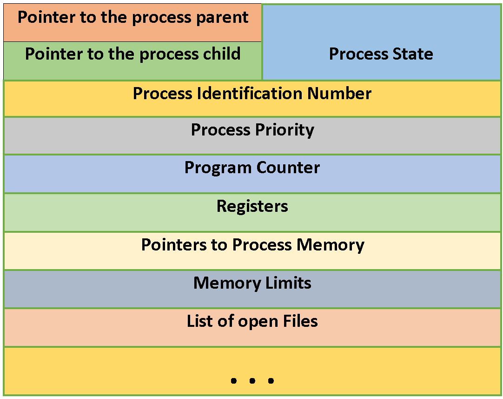
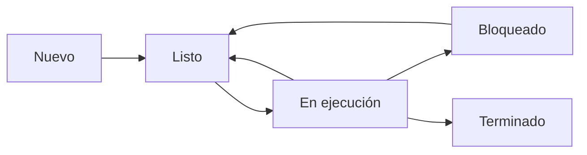
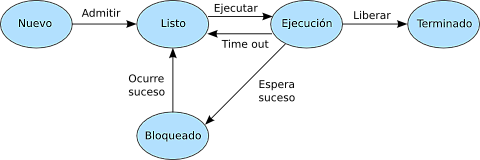

**Arquitectura y Sistemas Operativos**

# Clase 6 — Procesos: concepto, estados y PCB

**Tecnicatura Universitaria en Programación**

---

## Objetivos de la clase

Al finalizar esta clase deberías poder:

- diferenciar un programa de un proceso;
- reconocer qué recursos y estado forman parte de un proceso;
- explicar el concepto de PCB;
- describir un espacio de direcciones típico;
- comprender el aislamiento entre procesos;
- reconocer el modelo clásico de estados de un proceso;
- explicar las transiciones entre estados;
- comprender qué es un cambio de contexto;
- describir la creación y terminación de procesos;
- diferenciar PID y PPID;
- utilizar Bash para observar y controlar procesos reales en Linux.

---

## 1. El proceso como abstracción

En la [clase anterior](CLASE_05_SISTEMA_OPERATIVO_FUNCIONES_EVOLUCION.md) estudiamos al sistema operativo como:

- máquina extendida;
- administrador de recursos;
- intermediario entre aplicaciones y hardware.

Ahora vamos a estudiar una de sus abstracciones más importantes:

> **el proceso**

La idea de proceso nos permite comprender:

- cómo se ejecutan varios programas;
- cómo se reparte la CPU;
- cómo se mantiene estado de ejecución;
- cómo se protege la memoria;
- cómo se administran recursos.

---

## 2. Programa y proceso

### Programa

Un programa es una entidad pasiva.

Puede estar almacenado como:

- archivo ejecutable;
- script;
- bytecode;
- conjunto de archivos y bibliotecas.

Contiene instrucciones y datos necesarios para realizar una tarea.

Mientras está almacenado y no se ejecuta, no consume CPU como proceso.

### Proceso

Un proceso es una **instancia de ejecución**.

Incluye mucho más que las instrucciones originales:

- estado de CPU;
- memoria;
- recursos abiertos;
- identidad;
- información administrativa.

Podemos resumir:

```text
PROGRAMA
archivo / instrucciones
        │
        │ ejecutar
        ▼
PROCESO
instancia activa
```

---

## 3. El mismo programa puede crear varios procesos

Ejecutemos desde Bash:

```bash
sleep 300 &
sleep 300 &
sleep 300 &
```

Ahora:

```bash
ps -C sleep -o pid,ppid,stat,comm,args
```

Tenemos un solo programa:

```text
sleep
```

pero varias instancias ejecutándose.

Cada una tiene su propio:

- PID;
- estado;
- contexto;
- información administrativa.

Este ejemplo es más claro que utilizar un navegador moderno, porque navegadores como
Firefox o Chrome pueden crear muchos procesos incluso al abrir una sola ventana.

---

## 4. ¿Qué posee un proceso?

Un proceso no es solamente código.

Podemos pensar en dos grandes grupos:

1. **estado y recursos de ejecución**;
2. **información administrativa mantenida por el kernel**.

---

## 5. Estado y recursos de ejecución

Un proceso puede incluir:

- instrucciones del programa;
- datos;
- memoria dinámica;
- pila;
- registros;
- archivos abiertos;
- sockets;
- pipes;
- credenciales;
- mapas de memoria;
- bibliotecas cargadas.

El conjunto exacto depende del sistema operativo y del tipo de proceso.

---

## 6. Estado del procesador

Cuando una tarea está ejecutándose, los registros contienen información necesaria para
continuar.

Ejemplos:

- contador de programa;
- puntero de pila;
- registros de propósito general;
- flags;
- registros de control asociados al contexto.

Si el sistema deja de ejecutar temporalmente esa tarea y luego quiere continuarla, debe
poder reconstruir el estado necesario.

---

## 7. El PCB

En los libros de sistemas operativos se utiliza el concepto de:

```text
PCB
Process Control Block
Bloque de Control de Proceso
```

Es una **estructura conceptual** que representa la información que el sistema operativo
mantiene para administrar un proceso.



*Campos típicos de un PCB. El nombre y la organización exacta cambian según el sistema, pero la idea es siempre la misma: los datos que el kernel necesita para gestionar el proceso.*

Puede contener:

- PID;
- estado;
- información de planificación;
- estado de CPU guardado;
- credenciales;
- información de memoria;
- relaciones con otros procesos;
- recursos abiertos;
- datos de contabilidad.

> No todos los sistemas operativos poseen una única estructura llamada literalmente
> `PCB`. Es un modelo conceptual.

En Linux, por ejemplo, gran parte de la información de las tareas se representa mediante
estructuras internas como `task_struct`.

---

## 8. Proceso y PCB no son lo mismo

Una simplificación útil:

```text
PROCESO
├── memoria
├── código
├── datos
├── recursos
└── ejecución

PCB / estructuras del kernel
├── PID
├── estado
├── planificación
├── referencias a memoria
├── credenciales
└── referencias a recursos
```

El kernel no necesita inspeccionar constantemente todos los datos privados del proceso
para planificarlo.

Mantiene estructuras administrativas específicas con la información necesaria para
gestionarlo.

---

## 9. Espacio de direcciones de un proceso

En programas nativos es habitual enseñar un modelo como:

```text
direcciones altas
+----------------------+
|        stack         |
+----------------------+
|          ↓           |
|                      |
|          ↑           |
+----------------------+
|         heap         |
+----------------------+
|         BSS          |
+----------------------+
|         data         |
+----------------------+
|        text          |
+----------------------+
direcciones bajas
```

Es un **modelo pedagógico**.

Un proceso moderno puede tener muchas otras regiones:

- bibliotecas compartidas;
- archivos mapeados;
- memoria anónima;
- regiones reservadas;
- páginas especiales;
- múltiples stacks para distintos hilos.

---

## 10. Sección de código — text

Contiene instrucciones ejecutables.

Habitualmente las páginas que contienen código tienen permisos semejantes a:

```text
lectura + ejecución
```

y no escritura.

Esto ayuda a evitar modificaciones accidentales o maliciosas.

---

## 11. Data y BSS

### Data

Suele contener variables globales o estáticas inicializadas.

Ejemplo en C:

```c
int contador = 10;
```

### BSS

Suele representar globales o estáticas sin un valor inicial explícito distinto de cero.

Ejemplo:

```c
int contador;
```

El cargador y el sistema preparan la región para que su contenido inicial sea cero según
el formato ejecutable y las reglas de la plataforma.

---

## 12. Heap

El heap se utiliza para asignación dinámica de memoria.

En C:

```c
malloc()
free()
```

En lenguajes con administración automática de memoria, el runtime puede administrar esa
zona de otras maneras.

El dibujo tradicional dice que el heap “crece hacia arriba”, pero no debemos tomarlo como
una regla universal.

Los sistemas modernos pueden utilizar múltiples áreas y mecanismos como `mmap()`.

---

## 13. Stack

La pila se utiliza para mantener información relacionada con llamadas a funciones.

Puede contener:

- direcciones de retorno;
- registros guardados;
- variables locales;
- parámetros, según la ABI;
- información temporal.

Una precisión importante:

> el sistema operativo prepara inicialmente la pila del proceso o del hilo, pero **no crea
> un nuevo marco cada vez que se llama a una función**.

Los marcos de pila son administrados por el código generado por el compilador, el runtime
y la convención de llamadas de la arquitectura.

---

## 14. Direcciones virtuales

Cada proceso trabaja normalmente con **direcciones virtuales**.

No necesita conocer dónde están físicamente sus páginas en RAM.

Una representación conceptual:

```text
Proceso
dirección virtual
      │
      ▼
MMU + tablas de páginas
      │
      ▼
dirección física / memoria
```

El sistema operativo configura las estructuras necesarias y el hardware de memoria
realiza gran parte de la traducción durante la ejecución.

---

## 15. Espacio virtual no significa “todo está en disco”

La memoria virtual no debe reducirse a:

```text
RAM llena → mover todo al disco
```

Incluye mecanismos como:

- traducción de direcciones;
- protección;
- paginación;
- páginas compartidas;
- mapeo de archivos;
- carga bajo demanda;
- eventualmente swap.

Una página puede:

- estar en RAM;
- estar respaldada por un archivo;
- todavía no haber sido materializada;
- poder descartarse y reconstruirse;
- utilizar swap, según la política del sistema.

Profundizaremos en esto en la unidad de memoria.

---

## 16. Aislamiento de procesos

Una de las propiedades más importantes es que un proceso no puede acceder
arbitrariamente al espacio de direcciones de otro.

Esto se consigue mediante cooperación entre:

- hardware;
- MMU;
- tablas de páginas;
- kernel;
- permisos.

Si un proceso intenta realizar un acceso inválido, puede ocurrir un **fault** de memoria.

El kernel decide cómo tratar ese evento.

En muchos casos el proceso recibe una señal y termina, pero existen situaciones en las
que el fallo puede ser tratado de otra manera.

---

## 17. Excepciones al aislamiento

Dos procesos pueden compartir información de manera controlada.

Ejemplos:

- memoria compartida;
- archivos mapeados;
- pipes;
- sockets;
- archivos.

La regla importante es:

> compartir recursos requiere mecanismos explícitos controlados por el sistema.

---

## 18. Estados de un proceso: modelo clásico

Un modelo didáctico ampliamente utilizado utiliza cinco estados:

```text
NUEVO
LISTO
EJECUCIÓN
BLOQUEADO / ESPERA
TERMINADO
```



Los sistemas operativos reales pueden tener más estados y nombres diferentes.

---

## 19. Nuevo

El proceso está siendo creado.

El sistema prepara:

- identificadores;
- estructuras administrativas;
- espacio de direcciones;
- recursos iniciales.

Después queda disponible para ser ejecutado.

---

## 20. Listo — Ready

La tarea puede ejecutarse, pero no está usando una CPU en ese instante.

Está **runnable**.

Puede haber muchas tareas listas.

El planificador decide cuál utilizará una CPU disponible.

---

## 21. En ejecución — Running

La tarea está utilizando una CPU lógica.

En un modelo simple:

```text
1 CPU lógica → como máximo 1 flujo ejecutándose allí en ese instante
```

En una máquina con varias CPU lógicas puede haber varios flujos de ejecución reales al
mismo tiempo.

Una precisión que retomaremos al estudiar hilos:

> los sistemas modernos planifican unidades de ejecución como hilos o tareas, no
> necesariamente “procesos completos” como una unidad indivisible.

Para esta clase usaremos el modelo de proceso porque permite comprender la idea general.

---

## 22. Bloqueado o en espera — Waiting

La tarea no puede continuar hasta que ocurra determinado evento.

Ejemplos:

- finalización de una operación de E/S;
- llegada de datos;
- disponibilidad de un recurso;
- temporizador;
- sincronización.

Mientras el evento no ocurra, no tiene sentido asignarle CPU para continuar esa parte
de la ejecución.

---

## 23. Terminado

La ejecución finalizó.

El sistema libera progresivamente recursos asociados.

En sistemas Unix puede quedar temporalmente una entrada mínima con información de salida
hasta que el proceso padre la recoja.

Ese caso se relaciona con los procesos **zombie**.

---

## 24. Transiciones principales



*Las seis transiciones del modelo clásico. Notá que no hay flecha directa de Bloqueado a Ejecución.*

### Nuevo → Listo

La creación terminó y la tarea puede competir por CPU.

### Listo → Ejecución

El planificador selecciona la tarea.

### Ejecución → Listo

Puede ocurrir por:

- fin del quantum;
- preempción;
- aparición de una tarea de mayor prioridad;
- decisiones del planificador.

### Ejecución → Bloqueado

La tarea debe esperar un evento.

### Bloqueado → Listo

El evento terminó y vuelve a estar disponible para ejecución.

### Ejecución → Terminado

El proceso finaliza normalmente o es terminado.

---

## 25. ¿Puede pasar de Bloqueado directamente a Ejecución?

En el modelo clásico:

```text
Bloqueado
   │
   ▼
Listo
   │
   ▼
Ejecución
```

Cuando termina el evento que esperaba, el proceso vuelve a ser **runnable**.

Que efectivamente obtenga una CPU depende del planificador.

Por eso primero vuelve a **Listo**.

---

## 26. Estados reales de Linux

Linux no utiliza exactamente los mismos cinco nombres del modelo pedagógico.

Podemos observar una representación resumida mediante:

```bash
ps -o pid,stat,comm
```

Algunas letras habituales son:

```text
R → running o runnable
S → interruptible sleep
D → uninterruptible sleep
T → stopped
Z → zombie
```

No debemos intentar hacer una equivalencia uno a uno perfecta.

El modelo de cinco estados sirve para aprender principios generales; `ps` muestra estados
concretos definidos por Linux.

---

## 27. Cambio de contexto

Supongamos:

```text
CPU ejecuta A
```

El sistema decide ejecutar B.

Debe conservar suficiente estado de A y cargar el necesario para B.

```text
A ejecutando
    │
    ▼
guardar contexto de A
    │
    ▼
cargar contexto de B
    │
    ▼
B ejecutando
```

Eso es un **cambio de contexto**.

---

## 28. ¿Qué puede formar parte del contexto?

Dependiendo de la arquitectura y del tipo de cambio:

- contador de programa;
- puntero de pila;
- registros generales;
- flags;
- información del estado del procesador;
- referencias al espacio de direcciones.

El detalle real depende del kernel y de la arquitectura.

---

## 29. El cambio de contexto tiene costo

Cambiar entre tareas requiere trabajo del sistema.

Además del tiempo necesario para guardar y restaurar estado, puede afectar:

- cachés;
- TLB;
- predictores;
- localidad de memoria.

Esto produce **overhead**.

Pero no debemos decir que ese trabajo sea inútil:

> es trabajo necesario para implementar multitarea, aislamiento y respuesta del sistema.

El planificador busca equilibrar:

```text
respuesta rápida
        vs
evitar cambios innecesarios
```

La [próxima clase](CLASE_07_PLANIFICACION_CPU.md) se dedica precisamente a planificación.

---

## 30. Creación de procesos en sistemas Unix-like

En Unix existen mecanismos clásicos.

### `fork()`

Crea un nuevo proceso a partir del proceso actual.

Conceptualmente:

```text
padre
  │
 fork
  ├── padre
  └── hijo
```

Padre e hijo tienen:

- PID diferentes;
- espacios de direcciones separados.

En sistemas modernos `fork()` suele aprovechar técnicas como **copy-on-write**, por lo
que no necesariamente se copia físicamente toda la memoria en el mismo instante.

---

## 31. `exec()`

La familia de funciones `exec` reemplaza la imagen del proceso actual por otro programa.

Conceptualmente:

```text
proceso
 programa A
    │
   exec
    ▼
mismo proceso
 programa B
```

El PID puede mantenerse porque no se está creando necesariamente otro proceso en esa
operación: se reemplaza el programa que ejecuta el proceso.

En Linux la llamada al sistema fundamental de esta familia es `execve()`.

---

## 32. `wait()`

Un proceso padre puede esperar que finalice un hijo y recoger su estado de terminación.

```text
padre
  │
  ├── hijo ejecutando
  │
 wait
  │
  ▼
recoge resultado
```

Existen varias funciones relacionadas, como `wait()` y `waitpid()`.

---

## 33. Windows

Windows utiliza un modelo diferente.

Una API típica es:

```text
CreateProcess
```

que crea un nuevo proceso y su hilo inicial.

No sigue el patrón clásico Unix:

```text
fork → exec
```

Los conceptos generales siguen siendo comparables:

- creación;
- identificador;
- espacio de memoria;
- recursos;
- planificación;
- terminación.

---

## 34. Terminación de procesos

Un proceso puede terminar por:

- finalización normal;
- error no controlado;
- excepción;
- señal;
- decisión de otro proceso con permisos;
- acción administrativa;
- finalización del sistema.

Al terminar se liberan recursos como:

- memoria;
- descriptores de archivos;
- conexiones;
- objetos del kernel.

---

## 35. `kill` no significa necesariamente “matar”

En Unix:

```bash
kill PID
```

es un comando que **envía una señal**.

Por defecto suele enviar:

```text
SIGTERM
```

SIGTERM solicita al proceso que termine.

También podemos enviar otras señales:

```bash
kill -STOP PID
kill -CONT PID
kill -TERM PID
```

Y existe:

```bash
kill -KILL PID
```

`SIGKILL` no puede ser capturada ni ignorada por el proceso.

Por eso la regla práctica es:

> intentar primero una terminación normal y reservar `SIGKILL` para situaciones en las
> que realmente sea necesario.

---

## 36. Procesos zombie

En Unix, cuando un hijo termina:

- su memoria ya puede liberarse;
- sus archivos y gran parte de sus recursos se liberan;
- queda temporalmente información mínima con su estado de salida.

Hasta que el padre realiza un `wait`, puede aparecer como:

```text
Z
```

o **zombie**.

Por eso un zombie **no es un proceso muerto ocupando toda su memoria anterior**.

Lo que permanece es principalmente una entrada necesaria para que el padre pueda
recoger información de terminación.

---

## 37. PID y PPID

Cada proceso posee un identificador:

```text
PID
```

En Unix también podemos observar el identificador del proceso padre:

```text
PPID
```

Ejemplo:

```bash
ps -o pid,ppid,comm
```

---

## 38. El proceso PID 1

En un Linux tradicional, el proceso con PID 1 suele ser:

```text
systemd
```

o históricamente:

```text
init
```

Cumple funciones especiales durante la vida del sistema.

En:

- contenedores;
- WSL;
- entornos especiales;

el árbol de procesos puede presentar diferencias.

Por eso conviene **observar el sistema real** en lugar de asumir que todos los entornos
son idénticos.

---

## 39. Laboratorio 1 — crear procesos

Ejecutá:

```bash
sleep 300 &
```

Bash mostrará un número de trabajo y el proceso tendrá un PID.

La variable:

```bash
$!
```

contiene el PID del último proceso iniciado en segundo plano.

Probá:

```bash
echo $!
```

Guardalo:

```bash
pid=$!
```

Ahora:

```bash
ps -p "$pid" -o pid,ppid,stat,comm,args
```

---

## 40. Segundo plano y jobs

Bash puede controlar trabajos lanzados desde esa shell.

```bash
jobs
```

Más detalle:

```bash
jobs -l
```

La palabra **job** es un concepto de la shell.

No es exactamente lo mismo que un proceso.

Un trabajo puede estar formado por uno o varios procesos.

---

## 41. `fg` y `bg`

Podemos traer un trabajo al primer plano:

```bash
fg
```

Si suspendemos desde la terminal con:

```text
Ctrl+Z
```

el trabajo queda detenido.

Podemos verlo:

```bash
jobs
```

y reanudarlo en segundo plano:

```bash
bg
```

Esto permite experimentar con estados reales desde Bash.

---

## 42. Laboratorio 2 — STOP y CONT

Creá otro proceso:

```bash
sleep 300 &
pid=$!
```

Ver estado:

```bash
ps -p "$pid" -o pid,ppid,stat,comm
```

Detenerlo:

```bash
kill -STOP "$pid"
```

Volver a mirar:

```bash
ps -p "$pid" -o pid,ppid,stat,comm
```

Reanudarlo:

```bash
kill -CONT "$pid"
```

Comprobar:

```bash
ps -p "$pid" -o pid,ppid,stat,comm
```

Finalmente:

```bash
kill -TERM "$pid"
```

---

## 43. Laboratorio 3 — árbol de procesos

Probá:

```bash
pstree -p
```

Si querés centrarte en tu shell:

```bash
pstree -p $$
```

También:

```bash
ps -o pid,ppid,user,stat,comm,args --forest
```

Buscá:

- tu Bash;
- comandos lanzados desde Bash;
- procesos padre e hijo.

---

## 44. Laboratorio 4 — `/proc/PID`

Creá:

```bash
sleep 300 &
pid=$!
```

Información:

```bash
cat /proc/$pid/status
```

Filtrá:

```bash
grep -E '^(Name|State|Pid|PPid|VmSize|VmRSS|Threads):' /proc/$pid/status
```

Mapas de memoria:

```bash
head /proc/$pid/maps
```

Esto nos muestra algo importante:

> el proceso aparece en Linux no solamente como una fila de `ps`, sino como una entidad
> sobre la que el kernel expone gran cantidad de información.

---

## 45. Tamaño virtual y memoria residente

Dentro de `/proc/PID/status` podemos encontrar:

```text
VmSize
VmRSS
```

En una primera aproximación:

- **VmSize**: tamaño del espacio virtual mapeado por el proceso;
- **VmRSS**: parte aproximadamente residente en memoria física en ese momento.

No significa:

```text
VmSize = RAM realmente consumida
```

Esa diferencia será central en la unidad de memoria virtual.

---

## 46. Cambios de contexto observables

Linux puede exponer estadísticas como:

```bash
grep ctxt /proc/$pid/status
```

Podemos encontrar:

```text
voluntary_ctxt_switches
nonvoluntary_ctxt_switches
```

En términos generales:

- voluntarios: la tarea deja de ejecutar, por ejemplo al esperar;
- no voluntarios: el planificador la desplaza.

Los detalles dependen de la carga y del comportamiento del proceso.

---

## 47. `top`

Ejecutá:

```bash
top
```

Observá:

- PID;
- usuario;
- estado;
- CPU;
- memoria;
- comando.

Salir:

```text
q
```

`top` permite ver que el sistema es dinámico: los procesos aparecen, cambian de estado,
consumen CPU y terminan.

---

## 48. `ps` no es una fotografía perfecta de los cinco estados

Ejecutar:

```bash
ps aux
```

produce una fotografía de procesos en un instante.

Pero:

- los estados cambian muy rápido;
- Linux posee estados propios;
- el planificador trabaja a escalas mucho menores que nuestro tiempo de observación.

Por eso un proceso puede parecer siempre `S` cuando lo observamos y, sin embargo, haber
ejecutado repetidamente entre una consulta y otra.

---

## 49. PowerShell: comparación breve

Desde Windows podemos utilizar:

```powershell
Get-Process
```

Por ejemplo:

```powershell
Get-Process | Sort-Object CPU -Descending | Select-Object -First 10
```

Pero para estudiar los conceptos del kernel Linux en esta materia utilizaremos
principalmente:

```bash
ps
top
pstree
jobs
kill
/proc
```

---

## 50. Actividad práctica guiada

Realizá la siguiente secuencia.

```bash
sleep 300 &
pid=$!

echo "PID: $pid"

ps -p "$pid" -o pid,ppid,stat,comm,args

grep -E '^(Name|State|Pid|PPid|VmSize|VmRSS|Threads):' /proc/$pid/status

kill -STOP "$pid"

ps -p "$pid" -o pid,ppid,stat,comm

kill -CONT "$pid"

ps -p "$pid" -o pid,ppid,stat,comm

grep ctxt /proc/$pid/status

kill -TERM "$pid"

wait "$pid"

echo "Codigo de salida: $?"
```

Respondé:

1. ¿Qué diferencia existe entre el PID y el número de job?
2. ¿Cuál es el PPID del proceso?
3. ¿Qué estado muestra antes del `STOP`?
4. ¿Qué estado muestra después de `STOP`?
5. ¿Qué ocurre después de `CONT`?
6. ¿Qué diferencia existe entre `VmSize` y `VmRSS`?
7. ¿Aparecen cambios de contexto?
8. ¿Qué ocurre cuando enviás `SIGTERM`?
9. ¿Qué hace `wait`?
10. ¿Por qué este experimento no coincide exactamente con el modelo clásico de cinco
    estados?

---

## 51. Mini desafío Bash

Creá:

```text
inspeccionar_proceso.sh
```

Contenido:

```bash
#!/bin/bash

if [ -z "$1" ]; then
    echo "Uso: $0 PID"
    exit 1
fi

pid="$1"

if [ ! -d "/proc/$pid" ]; then
    echo "No existe un proceso con PID $pid"
    exit 1
fi

echo "=== PROCESO $pid ==="
echo

ps -p "$pid" -o pid,ppid,user,stat,%cpu,%mem,comm,args

echo
echo "=== STATUS ==="
grep -E '^(Name|State|Pid|PPid|VmSize|VmRSS|Threads):' "/proc/$pid/status"

echo
echo "=== CAMBIOS DE CONTEXTO ==="
grep ctxt "/proc/$pid/status"
```

Dale permisos:

```bash
chmod +x inspeccionar_proceso.sh
```

Creá un proceso:

```bash
sleep 300 &
```

Y ejecutá:

```bash
./inspeccionar_proceso.sh $!
```

---

## 52. Ideas para recordar

```text
PROGRAMA
entidad pasiva
      │
      ▼
PROCESO
instancia de ejecución
```

El sistema mantiene:

```text
proceso
   +
estado
   +
recursos
   +
información administrativa
```

Y durante su vida:

```text
Nuevo
  ↓
Listo
  ↓
Ejecución
  ├──→ Bloqueado ──→ Listo
  ├──→ Listo
  └──→ Terminado
```

---

## Glosario

**Programa:** conjunto de instrucciones y datos almacenados.

**Proceso:** instancia de ejecución con estado y recursos propios.

**PID:** identificador de proceso.

**PPID:** identificador del proceso padre en sistemas que exponen esa relación.

**PCB:** modelo conceptual de la información administrativa mantenida por el sistema
operativo para gestionar un proceso.

**task_struct:** estructura central utilizada por Linux para representar tareas.

**Text:** región de código ejecutable.

**Data:** región de datos inicializados.

**BSS:** región asociada a datos estáticos inicialmente en cero.

**Heap:** memoria utilizada para asignaciones dinámicas.

**Stack:** pila de ejecución de un hilo.

**Dirección virtual:** dirección utilizada por un proceso y traducida mediante mecanismos
de memoria virtual.

**Listo:** tarea disponible para ser planificada.

**Bloqueado:** tarea que espera un evento.

**Cambio de contexto:** operación necesaria para cambiar la ejecución entre tareas.

**Overhead:** costo adicional asociado a la administración del sistema.

**fork:** mecanismo Unix para crear un proceso hijo.

**exec:** familia de operaciones que reemplazan la imagen de un proceso por otro
programa.

**wait:** mecanismo para esperar y recoger la terminación de un hijo.

**Señal:** mecanismo Unix para notificar eventos a un proceso.

**SIGTERM:** solicitud de terminación.

**SIGKILL:** señal de terminación que el proceso no puede capturar ni ignorar.

**Zombie:** proceso terminado cuya información mínima de salida todavía no fue recogida
por su padre.

**Job:** unidad administrada por el control de trabajos de una shell; puede contener uno
o varios procesos.

---

## Desafiate con preguntas de examen

1. ¿Qué diferencia existe entre programa y proceso?
2. ¿Por qué un mismo programa puede producir varios procesos?
3. ¿Qué información necesita mantener el sistema operativo sobre un proceso?
4. ¿Qué es un PCB?
5. ¿Por qué PCB es un concepto y no necesariamente el nombre literal de una estructura
   en todos los sistemas?
6. ¿Cómo se organiza, en un modelo clásico, el espacio de direcciones de un proceso?
7. ¿Qué diferencia hay entre text, data y BSS?
8. ¿Para qué se utilizan heap y stack?
9. ¿Quién crea los marcos de pila de las funciones?
10. ¿Qué significa que un proceso utilice direcciones virtuales?
11. ¿Por qué memoria virtual no significa simplemente “usar disco como RAM”?
12. ¿Cómo se consigue el aislamiento entre procesos?
13. ¿Cuáles son los cinco estados del modelo clásico?
14. ¿Por qué un proceso bloqueado vuelve a Listo antes de Ejecutarse?
15. ¿Qué diferencia existe entre el modelo clásico y los estados mostrados por Linux?
16. ¿Qué es un cambio de contexto?
17. ¿Por qué un cambio de contexto tiene costo?
18. ¿Qué diferencia hay entre `fork` y `exec`?
19. ¿Qué ventaja aporta copy-on-write a `fork()`?
20. ¿Para qué sirve `wait()`?
21. ¿Por qué `kill` no significa necesariamente “matar” un proceso?
22. ¿Qué diferencia hay entre SIGTERM y SIGKILL?
23. ¿Qué es un zombie y qué recursos conserva realmente?
24. ¿Qué diferencia hay entre PID, PPID y número de job de Bash?
25. ¿Qué información podemos observar en `/proc/PID/status`?
26. ¿Qué diferencia inicial podemos establecer entre `VmSize` y `VmRSS`?
27. ¿Qué representan los cambios de contexto voluntarios y no voluntarios?

---

## Próxima clase

En esta clase vimos **qué es un proceso** y cómo cambia de estado.

La próxima pregunta es inevitable:

> si hay muchos procesos listos, **¿a cuál le damos la CPU?**

En la [próxima clase](CLASE_07_PLANIFICACION_CPU.md) estudiaremos:

- planificación;
- scheduler;
- dispatcher;
- ráfagas de CPU y E/S;
- criterios de evaluación;
- FCFS;
- SJF;
- Round Robin;
- prioridades;
- preempción.

Y utilizaremos nuevamente Linux para observar decisiones reales del planificador.
