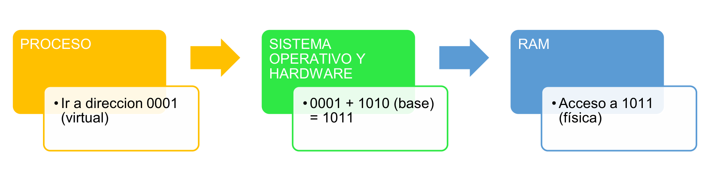

**Arquitectura y Sistemas Operativos**

# Clase 9 — Memoria: organización, administración y seguridad

**Tecnicatura Universitaria en Programación**

---

## Objetivos de la clase

Al finalizar esta clase deberías poder:

- diferenciar memoria física y espacio de direcciones virtual;
- comprender por qué el sistema operativo administra la memoria;
- reconocer fragmentación interna y externa;
- explicar el modelo clásico de asignación contigua;
- comprender páginas, marcos, tablas de páginas y TLB;
- explicar qué es un fallo de página;
- diferenciar una página no residente de un acceso inválido;
- comprender paginación por demanda;
- explicar el papel de swap sin identificarlo con toda la memoria virtual;
- reconocer los algoritmos clásicos de reemplazo de páginas;
- comprender el concepto de thrashing;
- explicar cómo paginación y permisos colaboran con el aislamiento;
- observar memoria virtual y residente desde Linux.

---

## 1. Volvemos a la memoria, ahora desde Sistemas Operativos

En Arquitectura estudiamos:

- registros;
- caché;
- RAM;
- almacenamiento;
- jerarquía de memoria.

Ahora la pregunta es diferente.

No queremos estudiar cómo está fabricada la memoria.

Queremos comprender:

> **¿cómo administra el sistema operativo la memoria que utilizan los procesos?**

En clases anteriores afirmamos que cada proceso trabaja con su propio espacio de
direcciones.

Ahora vamos a explicar cómo puede sostenerse esa abstracción.

---

## 2. Repaso mínimo: jerarquía de memoria

La jerarquía continúa siendo importante:

```text
Registros
   ↓
Cachés
   ↓
RAM
   ↓
Almacenamiento
```

La razón general es:

```text
velocidad
capacidad
costo
```

ninguna tecnología optimiza simultáneamente todas esas propiedades.

No volveremos a estudiar aquí la electrónica de DRAM o las características de L1, L2 y
L3.

Eso pertenece al bloque de Arquitectura.

---

## 3. Localidad

Sí recuperaremos un concepto porque será fundamental para memoria virtual:

### Localidad temporal

Si una posición fue utilizada recientemente, puede volver a utilizarse pronto.

### Localidad espacial

Si se utiliza una posición, pueden utilizarse pronto posiciones cercanas.

Estos principios ayudan a explicar:

- cachés;
- TLB;
- conjuntos de trabajo;
- reemplazo de páginas.

---

## 4. La RAM como recurso administrado

Varios procesos pueden ejecutar simultáneamente.

Todos necesitan memoria.

El sistema operativo debe colaborar con el hardware para resolver preguntas como:

- ¿qué direcciones puede utilizar cada proceso?
- ¿qué páginas están en RAM?
- ¿qué permisos tiene cada región?
- ¿qué ocurre si una página todavía no está residente?
- ¿cómo se comparte memoria de forma controlada?
- ¿qué hacer bajo presión de memoria?

La administración de memoria no es solamente:

```text
"repartir pedazos de RAM"
```

También incluye:

- traducción;
- protección;
- mapeo;
- carga bajo demanda;
- recuperación de páginas.

---

## 5. Un modelo histórico: asignación contigua

Una estrategia conceptualmente simple sería entregar a cada proceso un bloque físico
contiguo.

```text
RAM
+-----------+
| Proceso A |
+-----------+
| Proceso B |
+-----------+
| libre     |
+-----------+
| Proceso C |
+-----------+
```

Este modelo ayuda a comprender dos problemas clásicos:

- fragmentación externa;
- fragmentación interna.

No describe directamente cómo se administra la memoria de procesos en un Linux moderno,
pero sigue siendo muy útil para entender por qué se desarrollaron otros mecanismos.

---

## 6. Fragmentación externa

Supongamos:

```text
+-----+---+------+----+------+
| P1  | L |  P2  | L  | P3   |
+-----+---+------+----+------+
```

`L` representa memoria libre.

Podemos tener suficiente memoria libre **en total**, pero dividida en huecos pequeños.

Si un proceso necesita un único bloque mayor que cualquiera de esos huecos:

```text
no puede ubicarse
```

Eso es **fragmentación externa**.

---

## 7. Fragmentación interna

Supongamos que el sistema asigna bloques de tamaño fijo.

Un proceso necesita:

```text
6 KiB
```

pero recibe:

```text
8 KiB
```

quedan:

```text
2 KiB
```

sin utilizar dentro del bloque asignado.

Eso es **fragmentación interna**.

---

## 8. Estrategias clásicas de asignación contigua

### First fit

Usar el primer hueco suficientemente grande.

### Best fit

Buscar el hueco más pequeño que alcance.

### Worst fit

Elegir el hueco más grande disponible.

Estas estrategias son modelos clásicos.

Sirven para estudiar:

- velocidad de búsqueda;
- desperdicio;
- distribución de huecos.

No constituyen el mecanismo principal de asignación del espacio virtual de procesos en
los sistemas actuales de propósito general.

---

## 9. Memoria virtual

La memoria virtual crea una separación entre:

```text
dirección utilizada por el programa
```

y:

```text
ubicación física real
```

Cada proceso dispone de su propio **espacio de direcciones virtuales**.

Una precisión importante:

> ese espacio no tiene por qué estar completamente ocupado, ser físicamente contiguo ni
> comenzar con una página válida en la dirección cero.

De hecho, es habitual mantener regiones sin mapear para detectar accesos inválidos.

---

## 10. Dirección virtual y dirección física

Cuando una instrucción utiliza una dirección:

```text
dirección virtual
```

el hardware de memoria y las estructuras configuradas por el sistema permiten obtener
la ubicación correspondiente.

Modelo conceptual:

```text
CPU
 │
 │ dirección virtual
 ▼
MMU
 │
 ├── TLB
 │
 └── tablas de páginas
 │
 ▼
dirección física
 │
 ▼
RAM
```

La **MMU** es la unidad de administración de memoria del procesador.

Un ejemplo simplificado del recorrido de una dirección:



*El proceso trabaja siempre con la dirección virtual; el sistema operativo y el hardware la convierten en la dirección física real antes de tocar la RAM. El ejemplo con base es una simplificación: la traducción real de la paginación se hace por número de página y desplazamiento (sección 13).*

---

## 11. Páginas y marcos

En paginación:

- el espacio virtual se divide en **páginas**;
- la memoria física se divide en **marcos** (*frames*);
- página y marco tienen el mismo tamaño para ese mapeo.

Ejemplo típico:

```text
4 KiB
```

aunque los sistemas pueden utilizar otros tamaños y páginas grandes.

Consultar el tamaño habitual del sistema:

```bash
getconf PAGESIZE
```

> **Páginas grandes (*huge pages*).** El tamaño de 4 KiB no es la única opción. Los
> sistemas operativos modernos también usan **páginas grandes** (2 MiB en x86-64,
> configurable) para procesos con grandes cantidades de memoria: con menos entradas se
> cubre la misma cantidad de RAM, lo que reduce la presión sobre la TLB (ver sección 16).
> En Linux esto se ofrece, entre otros mecanismos, como *transparent huge pages* (THP).

---

## 12. Una página no necesita conservar su número de marco

Podemos tener:

```text
Página virtual 0 → Marco 27
Página virtual 1 → Marco 4
Página virtual 2 → Marco 103
```

Para el proceso:

```text
página 0
página 1
página 2
```

siguen formando parte de un mismo espacio virtual.

La ubicación física no necesita ser contigua.

---

## 13. Traducción mediante número de página y desplazamiento

Una dirección virtual puede pensarse como:

```text
+----------------------+-------------+
| número de página     | offset      |
+----------------------+-------------+
```

La traducción modifica la parte correspondiente a la página:

```text
página virtual
      │
      ▼
tabla de páginas
      │
      ▼
marco físico
```

El desplazamiento dentro de la página se conserva.

Resultado:

```text
+----------------------+-------------+
| marco físico         | offset      |
+----------------------+-------------+
```

Este modelo es más apropiado para paginación que imaginar simplemente:

```text
dirección + base
```

que corresponde a otros mecanismos de relocalización.

---

## 14. Tabla de páginas

Conceptualmente, el sistema mantiene información que relaciona:

```text
página virtual → marco físico
```

y además puede indicar:

- presente/no presente;
- lectura;
- escritura;
- ejecución;
- modificada;
- accedida;
- otros atributos.

En arquitecturas actuales las tablas suelen ser **multinivel**.

Por eso es mejor pensar en:

> una estructura de traducción asociada al espacio de direcciones

y no necesariamente en una única tabla plana gigante.

---

## 15. Hilos y espacio de direcciones

Los hilos de un mismo proceso comparten normalmente:

- código;
- heap;
- mapeos;
- archivos del proceso.

Cada hilo posee su propio:

- estado de CPU;
- stack.

Por eso:

```text
proceso
    │
    ├── espacio de direcciones compartido
    ├── hilo 1 → stack propio
    ├── hilo 2 → stack propio
    └── hilo 3 → stack propio
```

Esta idea conecta memoria con concurrencia.

---

## 16. TLB

Traducir direcciones consultando estructuras en memoria todo el tiempo sería costoso.

Por eso la CPU dispone de una caché especializada:

```text
TLB
Translation Lookaside Buffer
```

Guarda traducciones recientes.

Modelo:

```text
dirección virtual
     │
     ▼
    TLB
   /   \
 hit   miss
 │      │
 ▼      ▼
rápido  consultar tablas
```

La TLB es otro ejemplo de aprovechamiento de la localidad.

---

## 17. Paginación y fragmentación

Como todos los marcos de un determinado tamaño son equivalentes para alojar páginas:

- no necesitamos un gran bloque físico contiguo para cada proceso;
- desaparece la fragmentación externa asociada a ese modelo de asignación de marcos.

Puede existir fragmentación interna, por ejemplo en una página parcialmente utilizada.

En sistemas reales existen además:

- distintos tamaños de página;
- grandes páginas;
- asignadores del kernel;
- otras fuentes de fragmentación.

El modelo sigue siendo válido como primera aproximación.

---

## 18. Paginación por demanda

No es necesario cargar de antemano cada página potencial de un proceso.

Podemos cargar o materializar páginas cuando realmente se necesitan.

A esto lo llamamos:

```text
demand paging
paginación por demanda
```

Esto permite:

- iniciar programas sin cargar todo;
- utilizar memoria de manera más eficiente;
- compartir bibliotecas;
- mapear archivos;
- reservar espacios virtuales grandes.

---

## 19. Page fault

Cuando una CPU intenta acceder a una página y la traducción actual no permite completar
directamente el acceso, se produce un **page fault**.

El término no significa automáticamente:

```text
"error fatal"
```

Puede ser un evento totalmente normal.

El kernel analiza la causa.

Camino habitual cuando la página existe pero todavía no está en RAM:


*Resolución típica de un fallo de página: el sistema operativo localiza la página, le asigna un marco libre, la carga y actualiza la tabla de páginas; después el proceso continúa como si nada.*

---

## 20. Un page fault puede tener distintos resultados

### Página válida pero todavía no materializada

El kernel puede:

- asignar una página física;
- inicializarla;
- actualizar el mapeo;
- continuar.

### Página respaldada por un archivo

Puede ser necesario leer datos desde un archivo.

### Copy-on-write

El kernel puede crear una copia privada de una página cuando un proceso intenta
modificarla.

### Página que estaba en swap

Puede ser necesario recuperarla.

### Acceso inválido

Si la dirección no pertenece al proceso o viola permisos:

```text
el acceso no puede resolverse normalmente
```

y el proceso puede recibir una señal como `SIGSEGV`.

Por eso:

> **page fault no significa necesariamente que el sistema vaya al disco.**

---

## 21. Fallos menores y mayores

Linux puede distinguir, entre otras categorías:

### Minor fault

El fallo puede resolverse sin leer contenido desde almacenamiento secundario.

### Major fault

Resolverlo requiere una operación de E/S más costosa, por ejemplo leer una página
respaldada por un archivo.

Podemos observar contadores con herramientas como:

```bash
/usr/bin/time -v comando
```

si esa versión de `time` está instalada.

---

## 22. Swap

Swap es espacio de almacenamiento utilizado por el sistema para determinadas páginas de
memoria que pueden dejar temporalmente la RAM.

En Linux puede existir como:

- partición;
- archivo.

Consultar:

```bash
swapon --show
```

También:

```bash
free -h
```

No debemos identificar:

```text
memoria virtual = swap
```

La memoria virtual existe aunque no haya swap.

Tampoco todas las páginas no residentes tienen que estar almacenadas en swap.

Una página respaldada por un archivo puede volver a leerse desde ese archivo.

---

## 23. Memoria virtual no es simplemente "más RAM"

La memoria virtual resuelve varios problemas diferentes:

- aislamiento;
- protección;
- traducción;
- mapeo de archivos;
- compartición;
- carga bajo demanda;
- copy-on-write;
- espacios de direcciones grandes.

Poder utilizar almacenamiento como respaldo es solamente una de sus posibilidades.

Con una sola idea —interponer una capa de traducción entre lo que el proceso cree y lo
que realmente ocurre— se resuelven varios problemas a la vez:

![Lista numerada con los cuatro beneficios de la capa de traducción de la memoria virtual: (1) el proceso no necesita saber dónde está físicamente en la RAM y el SO puede ubicarlo donde quiera e incluso moverlo; (2) se acaba la fragmentación externa porque ya no hace falta un bloque contiguo en la RAM física; (3) se puede dar la ilusión de tener más memoria de la que físicamente hay, usando el disco como respaldo; (4) cada proceso queda naturalmente aislado de los demás porque cada uno tiene su propio mapa de traducción](img/clase09/beneficios-memoria-virtual.png)

*La misma indirección habilita la ubicación flexible, elimina la fragmentación externa, permite la ilusión de más memoria y garantiza el aislamiento entre procesos.*

---

## 24. Cuando falta memoria física

Si el sistema necesita un marco y no dispone inmediatamente de uno libre, puede intentar
recuperar memoria.

Entre otras posibilidades:

- descartar páginas limpias que pueden reconstruirse;
- escribir páginas modificadas si corresponde;
- utilizar swap;
- recuperar cachés;
- aplicar políticas de reemplazo.

La estrategia real de un kernel moderno es bastante más compleja que un algoritmo de
libro ejecutado de forma aislada.

---

## 25. Algoritmos clásicos de reemplazo de páginas

Los algoritmos clásicos permiten estudiar el problema:

> ¿qué página conviene reemplazar?

---

## 26. Óptimo

Elegir la página cuyo próximo uso se encuentre más lejano en el futuro.

Ventaja:

```text
sirve como referencia teórica
```

Problema:

```text
requiere conocer el futuro
```

Por eso no puede implementarse literalmente en un sistema real.

---

## 27. FIFO

Eliminar la página que lleva más tiempo cargada.

Ventaja:

- simple.

Problema:

- antigüedad no significa falta de utilidad.

FIFO puede sufrir la conocida:

```text
anomalía de Belady
```

donde agregar marcos puede, para ciertas secuencias, aumentar la cantidad de fallos.

### Un ejemplo de la anomalía de Belady

Normalmente esperamos que **más marcos ⇒ menos fallos**. Con FIFO eso no siempre se
cumple. Tomemos esta cadena de referencias a páginas:

```text
1  2  3  4  1  2  5  1  2  3  4  5
```

**Con 3 marcos (FIFO):**

```text
1* 2* 3* 4* 1* 2* 5* 1  2  3* 4* 5      →  9 fallos
```

**Con 4 marcos (FIFO):**

```text
1* 2* 3* 4* 1  2  5* 1* 2* 3* 4* 5*     →  10 fallos
```

(el asterisco marca cada fallo de página)

Pasamos de 9 fallos con 3 marcos a **10 fallos con 4 marcos**: agregar memoria empeoró
el resultado. Esto ocurre porque FIFO no tiene en cuenta el uso real de las páginas.
Los algoritmos basados en el uso reciente, como LRU y el óptimo, no presentan esta
anomalía.

---

## 28. LRU

LRU significa **Least Recently Used**.

Reemplazar la página que lleva más tiempo sin ser utilizada.

Se apoya en:

```text
localidad temporal
```

Implementar LRU exacto puede ser costoso.

Por eso los sistemas reales suelen utilizar aproximaciones y estructuras más complejas.

Un ejemplo clásico de aproximación es el **algoritmo del reloj**.

---

## 29. Thrashing — hiperpaginación

Si el conjunto activo de páginas de las tareas supera ampliamente la RAM disponible,
puede producirse una gran cantidad de fallos y recuperaciones.

El sistema pasa demasiado tiempo:

```text
recuperando memoria
moviendo datos
esperando E/S
```

y poco tiempo realizando el trabajo útil esperado.

Eso es **thrashing**.

No debe provocarse intencionalmente en una computadora de trabajo como práctica normal.

---

## 30. Working set

Una idea útil para comprender el thrashing es el **conjunto de trabajo**.

Representa, conceptualmente, las páginas que una tarea utiliza activamente durante un
intervalo.

Si los conjuntos de trabajo de las tareas pueden mantenerse razonablemente residentes:

```text
pocos fallos
```

Si no entran:

```text
presión
fallos frecuentes
thrashing
```

---

## 31. Protección mediante páginas

Las entradas de las tablas pueden incluir permisos.

Ejemplos:

```text
R → lectura
W → escritura
X → ejecución
```

Una región de código puede estar:

```text
r-x
```

Una región de datos:

```text
rw-
```

Esto permite que hardware y kernel impidan accesos no autorizados.

---

## 32. Aislamiento entre procesos

Dos procesos pueden utilizar exactamente el mismo número de dirección virtual.

Por ejemplo:

```text
Proceso A: 0x400000
Proceso B: 0x400000
```

pero esas direcciones pueden mapear a:

```text
marcos físicos diferentes
```

Por eso no es correcto decir que un proceso está protegido simplemente porque "no puede
nombrar" la dirección de otro.

La protección aparece porque:

- cada espacio de direcciones posee sus mapeos;
- las páginas tienen permisos;
- el hardware comprueba esos permisos;
- el kernel controla las estructuras de traducción.

---

## 33. Compartición controlada

Dos procesos también pueden compartir memoria deliberadamente.

El kernel puede configurar:

```text
Proceso A: página virtual X ─┐
                            ├── mismo marco físico
Proceso B: página virtual Y ─┘
```

Esto permite:

- memoria compartida;
- bibliotecas compartidas;
- mapeos de archivos;
- IPC eficiente.

El aislamiento y la compartición no son ideas contradictorias:

> el sistema impide accesos arbitrarios y permite compartir cuando se configura
> explícitamente.

---

## 34. Protección del kernel

El espacio de usuario no puede acceder libremente a memoria reservada para el kernel.

La protección combina:

- niveles de privilegio;
- permisos de páginas;
- configuración de la MMU;
- mecanismos del kernel.

Un acceso inválido genera una excepción de hardware.

El kernel determina la respuesta.

---

## 35. `segmentation fault`

Cuando un proceso realiza determinado acceso inválido en un sistema Unix-like, puede
recibir:

```text
SIGSEGV
```

y la shell puede mostrar:

```text
Segmentation fault
```

El nombre histórico "segmentation fault" no significa que el sistema moderno esté
utilizando necesariamente segmentación como mecanismo principal de memoria virtual.

---

## 36. Laboratorio Linux — estado general de memoria

```bash
free -h
```

Información detallada:

```bash
grep -E 'MemTotal|MemAvailable|SwapTotal|SwapFree' /proc/meminfo
```

Swap:

```bash
swapon --show
```

Tamaño de página:

```bash
getconf PAGESIZE
```

---

## 37. `vmstat`

Probá:

```bash
vmstat 1 5
```

Algunas columnas interesantes:

```text
r   tareas ejecutables
si  swap in
so  swap out
us  CPU en usuario
sy  CPU en kernel
id  CPU ociosa
wa  espera asociada a E/S
```

No interpretes un valor aislado como diagnóstico definitivo.

Nos interesa aprender a observar tendencias.

---

## 38. Memoria de un proceso

Podemos observar nuestra shell:

```bash
echo $$
```

Luego:

```bash
grep -E '^(Name|Pid|VmSize|VmRSS|VmSwap|Threads):' /proc/$$/status
```

También:

```bash
head /proc/$$/maps
```

---

## 39. VIRT y RES

En `top` aparecen campos como:

```text
VIRT
RES
SHR
```

Interpretación inicial:

### VIRT

Tamaño del espacio virtual mapeado o reservado para el proceso según la herramienta.

Puede incluir:

- regiones no residentes;
- bibliotecas;
- archivos mapeados;
- memoria compartida.

No equivale a:

```text
RAM consumida
```

### RES

Memoria residente asociada al proceso.

Representa páginas actualmente residentes, pero tampoco debe confundirse siempre con
"RAM exclusiva", porque algunas páginas pueden compartirse.

---

## 40. Laboratorio controlado: observar una reserva

No vamos a llenar toda la RAM ni provocar thrashing.

Vamos a crear un proceso que utilice una cantidad limitada de memoria.

Ejecutá esto: crea un bloque de unos 128 MiB en memoria (`head` genera los bytes y `tr`
los transforma para que se escriban de verdad), lo mantiene vivo durante dos minutos y
guarda el identificador del proceso en `pid`:

```bash
bash -c '
  bloque=$(head -c $((128 * 1024 * 1024)) /dev/zero | tr "\0" "A")
  sleep 120
  : "${#bloque}"
' &
pid=$!
```

Ahora:

```bash
grep -E '^(Name|Pid|VmSize|VmRSS|VmSwap):' /proc/$pid/status
```

Y:

```bash
free -h
```

Finalmente:

```bash
kill "$pid"
wait "$pid" 2>/dev/null
```

> La reserva de 128 MiB es deliberadamente acotada. Si el equipo disponible tiene muy
> poca memoria, podés reducirla.

---

## 41. ¿Por qué hace falta escribir en la memoria?

Reservar un espacio virtual no implica necesariamente que todas sus páginas físicas se
materialicen inmediatamente. Muchos sistemas entregan las páginas recién cuando el
proceso realmente las usa.

Por eso el laboratorio no solo pide memoria: además **escribe** en todo el bloque (esa
es la función del `tr` en el comando anterior). Al escribir en cada página, forzamos a
que se materialice en memoria física, y así `VmRSS` refleja el tamaño reservado.

La memoria se administra en unidades llamadas **páginas**. Un tamaño habitual es de
4 KiB (4096 bytes). Confirmá el de tu sistema:

```bash
getconf PAGESIZE
```

Si tu sistema usa otro tamaño, la idea conceptual sigue siendo la misma.

---

## 42. Mapas de memoria

Para el proceso anterior:

```bash
head -n 20 /proc/$pid/maps
```

Podemos ver líneas similares a:

```text
r--p
r-xp
rw-p
```

Esos caracteres permiten observar permisos sobre regiones de memoria.

Interpretación inicial:

```text
r → lectura
w → escritura
x → ejecución
p → mapeo privado
s → mapeo compartido
```

---

## 43. `pmap`

Si está disponible:

```bash
pmap -x "$pid" | tail
```

`pmap` resume regiones del espacio virtual de un proceso.

No hace falta aprender cada columna.

La idea es comprobar que un proceso posee muchos mapeos, no solamente:

```text
text + data + heap + stack
```

como mostraba nuestro modelo pedagógico inicial.

---

## 44. WSL2 y memoria

En WSL2 Linux se ejecuta dentro de una máquina virtual liviana administrada por Windows.

Por eso:

```bash
free -h
```

describe la memoria visible para Linux en WSL2.

No necesariamente debe coincidir de forma directa con la presentación del Administrador
de tareas de Windows.

Además intervienen políticas propias de WSL2 sobre:

- asignación;
- recuperación;
- swap;
- memoria de la VM.

La diferencia es una excelente demostración de virtualización.

---

## 45. No provocar thrashing como ejercicio

No recomiendo como práctica:

```text
"abrir aplicaciones hasta llenar toda la RAM"
```

o ejecutar un programa que consuma memoria sin límite.

Puede:

- bloquear el entorno;
- disparar el OOM killer;
- perder trabajo;
- afectar otras aplicaciones;
- volver muy lento WSL2 o la máquina nativa.

Para estudiar memoria alcanza con experimentos **acotados y medibles**.

---

## 46. OOM — Out Of Memory

Si un sistema Linux queda bajo presión extrema y no puede satisfacer necesidades de
memoria, puede intervenir el mecanismo de **Out Of Memory**.

En determinadas situaciones el kernel puede seleccionar tareas para terminar y recuperar
memoria.

No estudiaremos aquí el algoritmo del OOM killer.

Nos interesa saber que:

> swap no garantiza que un sistema pueda aceptar memoria ilimitada.

---

## 47. Actividad práctica

Ejecutá:

```bash
free -h
swapon --show
getconf PAGESIZE
vmstat 1 5
```

Luego lanzá el proceso controlado de 128 MiB.

Observá:

```bash
grep -E '^(Name|Pid|VmSize|VmRSS|VmSwap):' /proc/$pid/status
head /proc/$pid/maps
```

Respondé:

1. ¿Cuál es el tamaño de página informado?
2. ¿Cuánta RAM total ve Linux?
3. ¿Existe swap?
4. ¿Qué diferencia observás entre `VmSize` y `VmRSS`?
5. ¿El proceso tiene una única región de memoria?
6. ¿Qué permisos aparecen en `/proc/PID/maps`?
7. ¿Por qué `VIRT` no equivale a RAM física?
8. ¿Qué función cumple la TLB?
9. ¿Un page fault implica siempre acceso a disco?
10. ¿Por qué memoria virtual y swap no son sinónimos?
11. ¿Qué diferencias esperás entre WSL2 y Linux nativo?
12. ¿Por qué evitamos provocar thrashing deliberadamente?

---

## 48. Mini desafío Bash

Creá:

```text
memoria_proceso.sh
```

Contenido:

```bash
#!/bin/bash

if [ -z "$1" ]; then
    echo "Uso: $0 PID"
    exit 1
fi

pid="$1"

if [ ! -r "/proc/$pid/status" ]; then
    echo "No puedo leer informacion del PID $pid"
    exit 1
fi

echo "=== MEMORIA DEL PROCESO $pid ==="
echo

grep -E '^(Name|Pid|PPid|Threads|VmSize|VmRSS|VmSwap):' \
    "/proc/$pid/status"

echo
echo "=== PRIMEROS MAPEOS ==="
head -n 10 "/proc/$pid/maps"
```

Permisos:

```bash
chmod +x memoria_proceso.sh
```

Uso:

```bash
./memoria_proceso.sh $$
```

Después probalo sobre el proceso del laboratorio de la sección 40.

---

## 49. Ejercicio de paginación

Supongamos:

```text
tamaño de página = 1024 bytes
```

La dirección virtual:

```text
2500
```

puede separarse en:

```text
página = 2500 // 1024 = 2
offset = 2500 % 1024 = 452
```

Si la tabla indica:

```text
página 2 → marco 7
```

la dirección física conceptual será:

```text
7 × 1024 + 452
= 7620
```

Este ejercicio muestra:

> la traducción sustituye el número de página por el número de marco y conserva el
> desplazamiento.

---

## 50. Ejercicio de reemplazo

Tenemos tres marcos y la referencia:

```text
1 2 3 1 4 1 2 5
```

Simular:

1. FIFO.
2. LRU.

Registrar después de cada referencia:

```text
marco 1
marco 2
marco 3
fallo sí/no
```

Comparar la cantidad de fallos.

No buscamos memorizar una secuencia.

Buscamos entender:

> **la política de reemplazo modifica el rendimiento aunque la secuencia de accesos sea
> la misma.**

---

## 51. Ideas para recordar

```text
Proceso
direcciones virtuales
      │
      ▼
MMU + TLB + tablas
      │
      ▼
memoria física
```

Y:

```text
page fault
≠
siempre error
≠
siempre acceso a swap
```

Finalmente:

```text
memoria virtual
≠
swap
```

La memoria virtual es una abstracción mucho más amplia.

---

## Glosario

**Memoria física:** RAM disponible físicamente para el sistema.

**Espacio de direcciones virtual:** conjunto de direcciones que puede utilizar un
proceso.

**MMU:** hardware que participa en la traducción y protección de memoria.

**Página:** bloque de memoria virtual.

**Marco / frame:** bloque de memoria física utilizado para alojar una página.

**Tabla de páginas:** estructura de traducción entre páginas virtuales y marcos.

**TLB:** caché de traducciones de direcciones.

**Fragmentación externa:** memoria libre dispersa en bloques no aprovechables para una
solicitud contigua.

**Fragmentación interna:** espacio sin utilizar dentro de una unidad asignada.

**Paginación por demanda:** materialización o carga de páginas cuando se necesitan.

**Page fault:** excepción asociada a una traducción o acceso de página que requiere
intervención del sistema.

**Minor fault:** fallo resoluble sin una lectura costosa desde almacenamiento.

**Major fault:** fallo que requiere una operación de E/S para obtener contenido.

**Swap:** almacenamiento utilizado como respaldo para determinadas páginas.

**FIFO:** reemplazo de la página cargada hace más tiempo.

**LRU:** reemplazo de la página menos recientemente utilizada.

**Algoritmo óptimo:** reemplazo teórico basado en conocimiento del futuro.

**Thrashing:** degradación severa provocada por actividad excesiva de paginación o
recuperación de memoria.

**Working set:** conjunto de páginas activamente utilizadas durante un intervalo.

**SIGSEGV:** señal Unix asociada normalmente a un acceso inválido de memoria.

**VIRT:** medida del espacio virtual asociado a un proceso según la herramienta.

**RES:** medida de páginas residentes asociadas a un proceso.

---

## Desafiate con preguntas de examen

1. ¿Por qué volvemos a estudiar memoria después de haberla visto en Arquitectura?
2. ¿Qué papel cumple la localidad en administración de memoria?
3. ¿Qué diferencia existe entre fragmentación interna y externa?
4. ¿Qué estudian first fit, best fit y worst fit?
5. ¿Qué significa memoria virtual?
6. ¿Por qué un espacio virtual no tiene que estar físicamente contiguo?
7. ¿Qué diferencia existe entre dirección virtual y física?
8. ¿Qué función cumple la MMU?
9. ¿Qué diferencia hay entre una página y un marco?
10. ¿Cómo se divide conceptualmente una dirección en número de página y offset?
11. ¿Qué información contiene una entrada de tabla de páginas?
12. ¿Por qué existen tablas multinivel?
13. ¿Qué memoria comparten los hilos de un proceso?
14. ¿Qué función cumple la TLB?
15. ¿Por qué paginación evita la fragmentación externa del modelo contiguo?
16. ¿Qué es paginación por demanda?
17. ¿Qué es un page fault?
18. ¿Por qué un page fault no implica siempre acceder al disco?
19. ¿Qué diferencia existe entre un fallo menor y uno mayor?
20. ¿Qué es swap?
21. ¿Por qué swap y memoria virtual no son sinónimos?
22. ¿Qué diferencia existe entre FIFO, LRU y óptimo?
23. ¿Qué es la anomalía de Belady?
24. ¿Por qué LRU exacto puede resultar costoso?
25. ¿Qué significa thrashing?
26. ¿Qué es el working set?
27. ¿Cómo colaboran las tablas de páginas y sus permisos con el aislamiento?
28. ¿Pueden dos procesos utilizar el mismo número de dirección virtual?
29. ¿Cómo pueden dos procesos compartir deliberadamente un marco físico?
30. ¿Qué diferencias hay entre `VIRT` y `RES`?
31. ¿Qué información podemos observar en `/proc/PID/maps`?
32. ¿Por qué no conviene provocar falta extrema de memoria como práctica?
33. ¿Por qué WSL2 puede mostrar una visión de memoria diferente de Windows?

---

## Próxima clase

Después de estudiar cómo el sistema operativo crea una abstracción sobre la memoria,
vamos a estudiar otra de sus grandes abstracciones:

> **el sistema de archivos**

La pregunta será:

> ¿cómo transforma el sistema operativo un dispositivo de almacenamiento en archivos,
> directorios, rutas y permisos?

Trabajaremos con:

- archivos;
- directorios;
- metadatos;
- enlaces;
- permisos;
- montajes;
- sistemas de archivos;
- herramientas Bash para inspeccionarlos.
