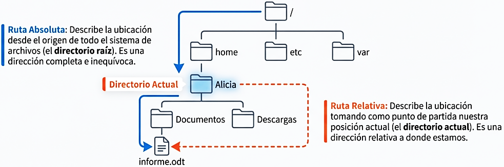
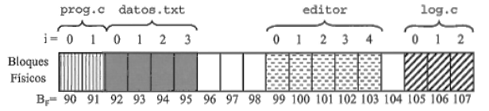
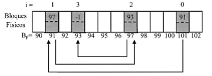
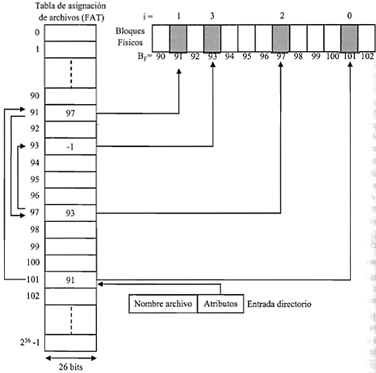
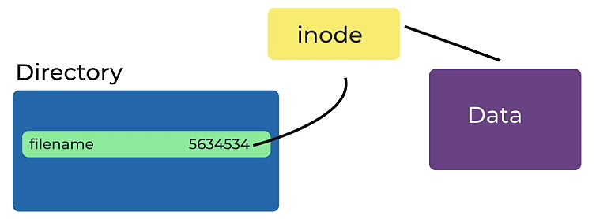
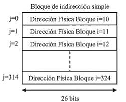
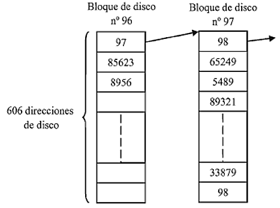
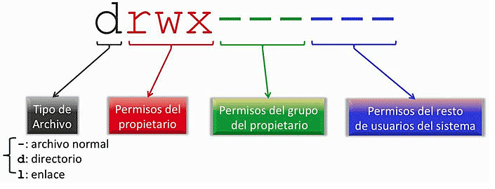
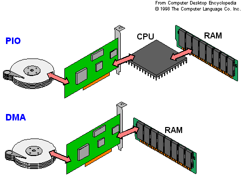

**Arquitectura y Sistemas Operativos**

# Clase 10 — Sistemas de archivos y dispositivos de E/S

**Tecnicatura Universitaria en Programación**

---

## Objetivos de la clase

Al finalizar esta clase deberías poder:

- explicar por qué un sistema de archivos es una abstracción del sistema operativo;
- diferenciar contenido, nombre y metadatos de un archivo;
- comprender qué es un descriptor de archivo;
- distinguir rutas absolutas y relativas;
- comprender el papel de directorios, inodos y enlaces;
- reconocer métodos clásicos de asignación de bloques;
- explicar cómo se administra el espacio libre;
- comprender montaje, formateo y journaling;
- interpretar permisos `rwx` en Linux;
- distinguir dispositivos de bloque y de carácter;
- explicar el papel de drivers, controladoras e interrupciones;
- diferenciar polling, interrupciones y DMA;
- comprender buffering, caché y spooling;
- reconocer los algoritmos clásicos de planificación de discos;
- inspeccionar archivos, permisos, sistemas de archivos y dispositivos desde Bash.

---

## 1. Del espacio virtual al sistema de archivos

En la [clase anterior](CLASE_09_MEMORIA_ORGANIZACION_ADMINISTRACION_SEGURIDAD.md) estudiamos cómo el sistema operativo administra la memoria.

Apareció una abstracción fundamental:

```text
direcciones virtuales
        ↓
sistema operativo + hardware
        ↓
memoria física
```

Ahora estudiaremos otra abstracción central:

```text
archivo
        ↓
sistema de archivos
        ↓
bloques del dispositivo
```

El usuario y el programador trabajan con:

```text
archivo
directorio
ruta
nombre
permisos
```

sin tener que conocer en qué bloques físicos se encuentra cada byte.

---

## 2. ¿Qué es un archivo?

Un archivo es una **abstracción de almacenamiento persistente** ofrecida por el sistema
operativo.

En los sistemas tipo UNIX podemos pensarlo, inicialmente, como:

> una secuencia de bytes asociada a metadatos y accesible mediante uno o más nombres.

La persistencia es la diferencia inmediata con una variable común en memoria RAM:

```text
RAM
    → normalmente pierde su contenido al apagar

archivo
    → permanece almacenado
```

El programa no necesita conocer:

- sectores físicos;
- páginas de memoria flash;
- pistas de un HDD;
- ubicación exacta de cada bloque.

Solicita operaciones al sistema operativo.

---

## 3. Contenido, nombre y metadatos

Conviene separar tres cosas.

### Contenido

Los bytes almacenados.

### Nombre

El nombre mediante el cual encontramos al archivo dentro de un directorio.

Ejemplo:

```text
informe.txt
```

### Metadatos

Información administrativa sobre el archivo.

Puede incluir:

- tamaño;
- propietario;
- grupo;
- permisos;
- marcas de tiempo;
- cantidad de enlaces;
- referencias a los bloques de datos;
- tipo de objeto.


*Una sola línea de `ls -l` reúne casi todos los metadatos del archivo. El nombre aparece al final y, como veremos, no forma parte del inodo: lo aporta el directorio.*

Esta separación será muy importante cuando estudiemos **inodos y enlaces duros**.

---

## 4. Operaciones sobre archivos

Los sistemas operativos ofrecen operaciones conceptuales como:

```text
crear
abrir
leer
escribir
reposicionar
cerrar
eliminar
```

Desde un lenguaje de programación solemos trabajar mediante bibliotecas que finalmente
solicitan servicios al sistema operativo.

Ejemplo en pseudocódigo:

```text
abrir archivo "datos.txt" en modo escritura
escribir "Hola"
cerrar archivo
```

La aplicación no controla directamente el SSD.

Existe una cadena aproximada:

```text
programa
   ↓
biblioteca / runtime
   ↓
llamadas al sistema
   ↓
sistema de archivos
   ↓
subsistema de E/S
   ↓
driver
   ↓
hardware
```


*Cada nivel ofrece una interfaz más simple al de arriba: la aplicación pide «abrí este archivo» y no toca nunca el disco directamente.*

---

## 5. Descriptor de archivo

Cuando un proceso abre un archivo, Linux le devuelve un pequeño número denominado
**descriptor de archivo**.

Ejemplos tradicionales:

```text
0 → entrada estándar
1 → salida estándar
2 → error estándar
```

Los archivos abiertos después pueden recibir:

```text
3
4
5
...
```

El proceso utiliza ese descriptor para operaciones posteriores.

Esto evita resolver nuevamente el nombre completo en cada lectura o escritura.

---

## 6. Ver los descriptores de nuestra shell

PID de Bash:

```bash
echo $$
```

Descriptores:

```bash
ls -l /proc/$$/fd
```

Podés encontrar algo semejante a:

```text
0 -> /dev/pts/0
1 -> /dev/pts/0
2 -> /dev/pts/0
```

Eso muestra que:

> `stdin`, `stdout` y `stderr` son recursos abiertos del proceso.

---

## 7. Directorios

Un directorio permite asociar nombres con objetos del sistema de archivos.

Modelo conceptual:

```text
directorio
├── informe.txt → identificador interno
├── foto.jpg    → identificador interno
└── proyecto    → identificador interno
```

En sistemas UNIX tradicionales ese identificador interno está relacionado con el
**número de inodo**.

Por eso el nombre no tiene que formar parte del inodo.

---

## 8. Estructura jerárquica

Linux utiliza un único árbol que comienza en:

```text
/
```

Ejemplo:

```text
/
├── home
│   └── alumno
│       ├── documentos
│       └── proyecto
├── etc
├── usr
├── var
└── tmp
```


*El árbol único permite agrupar, delegar permisos y reutilizar nombres: `tarea.c` puede existir en varios directorios porque cada ruta lo identifica de forma inequívoca.*

Esta organización permite:

- agrupar;
- delegar permisos;
- utilizar nombres repetidos en directorios diferentes;
- construir rutas.

---

## 9. Ruta absoluta

Una ruta absoluta comienza desde la raíz.

Ejemplo:

```text
/home/alumno/proyecto/informe.txt
```

No depende del directorio actual.

En Linux siempre comienza con:

```text
/
```

---

## 10. Ruta relativa

Una ruta relativa se interpreta desde el directorio actual.

Si estamos en:

```text
/home/alumno
```

podemos escribir:

```text
proyecto/informe.txt
```

Entradas especiales:

```text
.   → directorio actual
..  → directorio padre
```



*La ruta absoluta es completa e inequívoca y no depende de dónde estemos parados; la relativa es más corta pero solo tiene sentido desde el directorio actual.*

---

## 11. Laboratorio de rutas

```bash
pwd
```

```bash
mkdir -p ~/aso/clase10/documentos
cd ~/aso/clase10
```

```bash
pwd
ls
```

Crear:

```bash
touch documentos/informe.txt
```

Ruta relativa:

```bash
ls documentos/informe.txt
```

Ruta absoluta:

```bash
realpath documentos/informe.txt
```

---

## 12. ¿Dónde está realmente el archivo?

Desde el punto de vista lógico vemos:

```text
archivo = bytes consecutivos
```

Pero el dispositivo se administra mediante unidades o bloques.

Esos bloques pueden encontrarse distribuidos.

Los libros clásicos describen varios métodos de asignación.

---

## 13. Asignación contigua

El archivo ocupa bloques consecutivos.

```text
10 11 12 13 14
```



*Cada archivo ocupa bloques seguidos: la lectura secuencial es rapidísima, pero cuesta encontrar un hueco del tamaño justo y el archivo casi no puede crecer.*

Ventajas:

- simple;
- buen acceso secuencial;
- fácil acceso directo.

Problemas:

- crecimiento;
- necesidad de encontrar espacio contiguo;
- fragmentación externa en el modelo clásico.

Es importante aclarar que las técnicas actuales son más sofisticadas.

Algunos sistemas modernos utilizan **extents**, que describen conjuntos contiguos de
bloques sin exigir que todo el archivo ocupe una única extensión.

---

## 14. Asignación enlazada

Cada bloque permite localizar el siguiente.

```text
bloque 8
   ↓
bloque 31
   ↓
bloque 17
```



*Los bloques ya no necesitan estar contiguos, pero para llegar al bloque N hay que recorrer la cadena desde el principio: el acceso aleatorio se vuelve caro.*

Ventaja:

- los bloques no deben estar físicamente contiguos.

Problema clásico:

- el acceso aleatorio resulta costoso si debemos recorrer la cadena.

---

## 15. FAT

FAT mantiene la relación entre bloques en una tabla separada.

```text
FAT
bloque 8  → 31
bloque 31 → 17
bloque 17 → fin
```



*La cadena de bloques se guarda en una tabla aparte, no dentro de los bloques de datos: se puede seguir toda la secuencia leyendo solo la FAT.*

Esto permite recorrer la cadena sin leer los bloques de datos para descubrir el
siguiente.

FAT y sus variantes continúan apareciendo en:

- unidades extraíbles;
- tarjetas;
- particiones de compatibilidad;
- EFI System Partition, habitualmente FAT32.

---

## 16. Asignación indexada

Una estructura mantiene referencias a los bloques del archivo.

```text
índice
├── bloque 15
├── bloque 90
├── bloque 27
└── bloque 31
```


*Todos los punteros del archivo se reúnen en una estructura: para llegar al bloque N se lo busca directamente en la lista, sin recorrer cadena alguna.*

Esto permite localizar bloques sin recorrer una cadena completa.

La idea se relaciona con la organización clásica de los inodos UNIX.

---

## 17. Inodo

Un **inodo** es una estructura de metadatos utilizada por sistemas de archivos de la
familia UNIX.

Puede representar información como:

- tipo;
- permisos;
- propietario;
- grupo;
- tamaño;
- marcas de tiempo;
- cantidad de enlaces;
- referencias al contenido.

Una idea fundamental:

> **el nombre del archivo no está en el inodo.**

El directorio relaciona:

```text
nombre → número de inodo
```



*El directorio solo guarda la pareja nombre → número de inodo. Todo lo demás —permisos, tamaño, ubicación de los datos— vive en el inodo.*

---

## 18. El modelo clásico de punteros directos e indirectos

En la explicación tradicional de los sistemas UNIX, un inodo puede disponer de:

- punteros directos;
- indirecto simple;
- indirecto doble;
- indirecto triple.

Esto permite representar archivos pequeños eficientemente y archivos muy grandes
mediante niveles de indirección.

```text
inodo
├── directo → datos
├── directo → datos
├── indirecto → tabla → datos
└── doble indirecto → tabla → tabla → datos
```


*Los primeros bloques se alcanzan de forma directa, así que los archivos chicos son muy rápidos; los niveles de indirección solo se pagan cuando el archivo realmente crece.*



*Un bloque de indirección no guarda datos del archivo: guarda más punteros. Su tamaño y el de cada dirección determinan cuántos bloques puede direccionar cada nivel.*

> Este es un modelo clásico extremadamente útil para aprender. Sistemas modernos como
> ext4 pueden utilizar **extents** en lugar de representar todos los archivos mediante
> exactamente este esquema de punteros.

---

## 19. Ver inodos desde Linux

Crear:

```bash
echo "hola" > archivo.txt
```

Consultar:

```bash
ls -li archivo.txt
```

Más información:

```bash
stat archivo.txt
```

Buscá:

```text
Inode
Size
Blocks
Access
Modify
Change
```

---

## 20. Enlace duro — hard link

Crear:

```bash
ln archivo.txt otro_nombre.txt
```

Consultar:

```bash
ls -li archivo.txt otro_nombre.txt
```

Los dos nombres deberían mostrar el mismo número de inodo.

Modelo:

```text
archivo.txt ──────┐
                  ├── inodo ──→ datos
otro_nombre.txt ──┘
```

No son dos copias.

Son dos entradas de directorio asociadas al mismo objeto.

---

## 21. ¿Qué ocurre al borrar un nombre?

```bash
rm archivo.txt
```

El contenido puede seguir accesible mediante:

```text
otro_nombre.txt
```

El sistema puede liberar definitivamente el archivo cuando:

- ya no existen enlaces duros que lo nombren;
- y no permanece abierto por procesos que todavía lo estén utilizando.

Esta segunda condición es importante en UNIX.

---

## 22. Enlace simbólico

Crear:

```bash
ln -s otro_nombre.txt acceso.txt
```

Ver:

```bash
ls -li
```

Un enlace simbólico es un objeto diferente que almacena una referencia textual a otra
ruta.

```text
acceso.txt
    │
    ▼
"otro_nombre.txt"
```

Por eso:

```text
hard link ≠ symbolic link
```


*El enlace duro es otro nombre para el mismo inodo; el simbólico es un archivo distinto que contiene una ruta. Si se borra el destino, el enlace duro sigue funcionando y el simbólico queda roto.*

---

## 23. Espacio libre

El sistema de archivos necesita conocer:

```text
bloques utilizados
bloques disponibles
```

Una técnica clásica es el **bitmap**:

```text
1 1 0 0 1 0 1 ...
```

Cada bit representa el estado de una unidad.

Otra técnica histórica utiliza listas de bloques libres.



*Es el mismo problema que tenía el sistema operativo para saber qué marcos de RAM estaban libres: solo cambia el recurso administrado, de marcos de memoria a bloques de disco.*

Los sistemas actuales implementan estructuras optimizadas según sus necesidades.

---

## 24. Formatear

Formatear un volumen significa crear las estructuras iniciales de un sistema de archivos.

Dependiendo del sistema pueden crearse:

- superblock;
- estructuras de metadatos;
- mapas de espacio;
- directorio raíz;
- journals;
- otras estructuras.

No significa simplemente:

```text
"borrar archivos"
```

sino preparar una organización que permita almacenarlos.

---

## 25. Montaje

En Linux diferentes sistemas de archivos se integran en un único árbol.

```text
/
├── home
├── mnt
└── media
```

Un volumen puede montarse, por ejemplo, en:

```text
/mnt/datos
```

A partir de entonces se accede a su contenido mediante esa ruta.

---

## 26. Observar montajes

```bash
findmnt
```

También:

```bash
mount
```

Dispositivos:

```bash
lsblk -f
```

Uso:

```bash
df -h
```

---

## 27. WSL2 y montaje

En WSL2 aparecen además recursos de Windows montados dentro del árbol Linux.

Habitualmente:

```text
/mnt/c
```

Podés observar:

```bash
ls /mnt
```

```bash
findmnt /mnt/c
```

Esto permite discutir nuevamente:

```text
sistema de archivos Linux
+
virtualización
+
integración con Windows
```

---

## 28. Journaling

Un sistema de archivos puede mantener un **journal** para aumentar la capacidad de
recuperación ante fallas.

La idea general es registrar información sobre determinadas modificaciones antes de
considerarlas completadas definitivamente.

Después de un corte inesperado, el sistema puede utilizar ese registro para llevar las
estructuras a un estado consistente.

> El comportamiento exacto depende del sistema de archivos y de su modo de journaling.
> No siempre se registran de la misma manera todos los datos y metadatos.

Ejemplos de sistemas con journaling:

```text
ext4
XFS
NTFS
```

> **Una generación más nueva.** Sistemas de archivos como **Btrfs** (predeterminado en
> Fedora y openSUSE) y ZFS ya no se apoyan solo en journaling: usan **copy-on-write**
> (nunca sobrescriben un bloque en su lugar), y suman *snapshots* y *checksums*
> integrados de datos y metadatos. Es otra forma de resolver la consistencia frente a
> la arquitectura de inodo clásica. No hace falta profundizar en esta materia.

---

## 29. Permisos UNIX

El modelo clásico distingue:

```text
user
group
others
```

Y tres permisos:

```text
r → read
w → write
x → execute / search
```

Ejemplo:

```text
-rwxr-xr--
```

Separación:

```text
- | rwx | r-x | r--
    user  group others
```



*Los nueve bits que muestra `ls -l` se leen en tres bloques de `rwx`: propietario, grupo y otros. El primer carácter, antes de los nueve, no es un permiso: indica el tipo de objeto.*

---

## 30. El permiso `x` en un directorio

En un archivo ejecutable:

```text
x → permite ejecutar
```

En un directorio significa principalmente:

> **poder atravesar o buscar nombres dentro de ese directorio.**

No es exactamente “poder listar”.

Por ejemplo:

```text
r sobre directorio → leer sus entradas
x sobre directorio → atravesarlo/acceder a nombres conocidos
```

La combinación de permisos determina lo que realmente puede hacerse.

---

## 31. Laboratorio de permisos

```bash
mkdir permisos_demo
cd permisos_demo
```

```bash
echo "secreto" > dato.txt
ls -l dato.txt
```

Cambiar:

```bash
chmod 600 dato.txt
```

Ver:

```bash
ls -l dato.txt
```

Ahora:

```text
rw-------
```

---

## 32. Permisos octales

Cada permiso puede representarse:

```text
r = 4
w = 2
x = 1
```

Por ejemplo:

```text
7 = rwx
6 = rw-
5 = r-x
4 = r--
```

Entonces:

```bash
chmod 644 dato.txt
```

significa:

```text
user   = rw-
group  = r--
others = r--
```

---

## 33. Propietario y grupo

Consultar:

```bash
ls -l dato.txt
```

Identidad actual:

```bash
id
```

Cambio de propietario:

```bash
chown
```

Normalmente cambiar arbitrariamente el propietario requiere privilegios.

En un entorno de clase no es necesario modificar propietarios del sistema.

---

## 34. Entrada/Salida

Pasamos ahora de la organización lógica de archivos al problema general de E/S.

El sistema debe manejar dispositivos muy diferentes:

- teclado;
- mouse;
- SSD;
- HDD;
- interfaz de red;
- pantalla;
- puerto serie;
- dispositivos USB.

La dificultad aparece porque tienen:

- protocolos distintos;
- velocidades distintas;
- tamaños de transferencia distintos;
- diferentes formas de notificar eventos.

---

## 35. Drivers

El **driver** o controlador de dispositivo es software que conoce cómo comunicarse con
determinado tipo de hardware.

Modelo:

```text
aplicación
   ↓
interfaces del SO
   ↓
driver
   ↓
controladora / dispositivo
```

Esto permite que las aplicaciones trabajen con interfaces generales sin conocer los
detalles eléctricos o protocolarios del hardware.

---

## 36. Driver y controladora

Conviene distinguir:

### Driver

Software.

Ejecuta como parte del sistema y traduce las operaciones generales a operaciones
comprensibles para el dispositivo.

### Controladora

Hardware que gobierna el funcionamiento interno del dispositivo o interfaz.

Ejemplo conceptual:

```text
kernel
  │
driver NVMe
  │
  ▼
controladora NVMe
  │
  ▼
memoria flash
```

La terminología en castellano puede variar, por lo que cuando haga falta ser precisos
usaremos:

```text
driver / controlador de dispositivo → software
controladora de hardware            → hardware
```

---

## 37. Firmware

Una controladora puede ejecutar su propio firmware.

Ejemplo SSD:

```text
SO
 │
driver NVMe
 │
 ▼
controladora SSD
 │
 ├── firmware
 ├── gestión de flash
 ├── corrección de errores
 └── traducción interna
```

Por eso:

```text
driver ≠ firmware
```

Se actualizan y viven en lugares diferentes.

---

## 38. Dispositivos de bloque y de carácter

Una clasificación tradicional utilizada especialmente en UNIX/Linux distingue:

### Dispositivos de bloque

Permiten operaciones orientadas a bloques y acceso a diferentes posiciones.

Ejemplos:

- HDD;
- SSD;
- volúmenes de almacenamiento.

### Dispositivos de carácter

Presentan un flujo de datos.

Ejemplos históricos o conceptuales:

- terminales;
- puertos serie;
- ciertos dispositivos simples.

Es una clasificación útil, aunque los subsistemas modernos de E/S poseen más tipos,
capas y excepciones.

---

## 39. `/dev`

Linux representa numerosos dispositivos mediante entradas en:

```text
/dev
```

Probá:

```bash
ls /dev | head
```

Ejemplos:

```text
/dev/null
/dev/zero
/dev/tty
```

---

## 40. `/dev/null`

```bash
echo "esto desaparece" > /dev/null
```

`/dev/null` descarta lo que escribimos.

También es útil para redirecciones:

```bash
comando > /dev/null 2>&1
```

Este es un excelente ejemplo de la filosofía UNIX:

> muchos recursos se exponen mediante interfaces parecidas a archivos.

---

## 41. Polling

En **polling** un procesador o software consulta repetidamente el estado de un
dispositivo.

Conceptualmente:

```text
¿listo?
¿listo?
¿listo?
¿listo?
```


*En el polling la CPU pregunta en un bucle «¿ya terminaste?» hasta que el dispositivo responde. Es simple, pero puede malgastar tiempo de procesador en la espera.*

Puede consumir tiempo de CPU.

Sin embargo, no debemos decir que polling sea siempre una técnica “mala”.

Puede ser útil cuando:

- la espera será muy breve;
- el costo de dormir/despertar sería mayor;
- se busca latencia extremadamente baja;
- se utilizan técnicas híbridas.

---

## 42. Interrupciones

Una interrupción permite que un dispositivo notifique un evento al procesador.

Modelo:

```text
CPU hace otro trabajo
      │
      ▼
dispositivo completa evento
      │
      ▼
interrupción
      │
      ▼
kernel atiende
```


*El dispositivo avisa cuando terminó; el procesador interrumpe lo que hacía, atiende el evento con el kernel y después retoma el programa. Recordá que en la [clase 6](CLASE_06_PROCESOS_ESTADOS_PCB.md) la transición «en ejecución → bloqueado» ocurría al pedir E/S: la interrupción es lo que después desbloquea al proceso.*

El tratamiento del evento puede provocar que una tarea que estaba esperando pase a
estar disponible para planificación.

No debe imaginarse que:

```text
interrupción = automáticamente proceso ejecutándose
```

Primero interviene el kernel y después el planificador decide cuándo ejecutará la tarea.

---

## 43. DMA

**DMA — Direct Memory Access** permite transferencias entre dispositivos y memoria sin
que la CPU tenga que copiar cada byte mediante instrucciones ordinarias.

Modelo simplificado:

```text
CPU configura operación
        │
        ▼
dispositivo / DMA
        │
        ▼
RAM
        │
        ▼
interrupción de finalización
```



*Con DMA la CPU solo configura la transferencia y queda libre para otro trabajo; los datos viajan del dispositivo a la memoria sin que el procesador copie byte por byte.*

La CPU continúa ejecutando otros trabajos mientras gran parte de la transferencia se
realiza.

---

## 44. Polling, interrupciones y DMA no forman una escalera absoluta

En los libros suelen presentarse como una evolución:

```text
polling → interrupciones → DMA
```

Sirve didácticamente, pero en sistemas actuales se combinan.

Por ejemplo:

- DMA suele utilizar interrupciones para notificar finalización;
- algunos sistemas utilizan polling para reducir latencia;
- existen mecanismos híbridos.

La decisión depende de:

```text
latencia
volumen
frecuencia
consumo
overhead
```

---

## 45. Capas del software de E/S

Podemos representar aproximadamente:

```text
aplicaciones
     ↓
bibliotecas
     ↓
llamadas al sistema
     ↓
E/S independiente del dispositivo
     ↓
drivers
     ↓
manejo de interrupciones
     ↓
hardware
```


*La E/S independiente del dispositivo ofrece una interfaz común; cada driver traduce esa interfaz a las particularidades de su controladora.*

Cada capa oculta parte de la complejidad de la inferior.

---

## 46. Buffering

Un **buffer** es memoria intermedia utilizada durante una transferencia.

Ejemplo:

```text
programa
   ↓ rápido
BUFFER
   ↓ más lento
dispositivo
```

Permite desacoplar velocidades.

También puede agrupar múltiples operaciones pequeñas en transferencias más convenientes.

---

## 47. Caché de páginas

Los sistemas operativos utilizan RAM para conservar información de archivos usada
recientemente.

En Linux suele hablarse de **page cache**.

Si una parte de un archivo ya está en RAM, una nueva lectura puede evitar acceder al
dispositivo.

Esto conecta nuevamente con:

```text
localidad temporal
localidad espacial
```

No debemos confundir:

```text
page cache del SO
```

con:

```text
caché L1/L2/L3 de CPU
```

---

## 48. Spooling

**Spooling** permite poner trabajos en una cola para un dispositivo o servicio que los
atiende de manera organizada.

Ejemplo clásico:

```text
documento A ─┐
documento B ─┼── cola ──→ impresora
documento C ─┘
```


*El spooling encola trabajos completos para un dispositivo compartido —el caso clásico es la impresora—, de modo que ningún proceso tenga que esperar a que el dispositivo quede libre.*

Los procesos no necesitan monopolizar directamente la impresora.

---

## 49. Planificación de discos HDD

En un disco mecánico el movimiento del cabezal introduce un costo importante.

Si existen solicitudes pendientes:

```text
20
110
25
90
31
```

el orden de atención modifica la distancia física recorrida.

Por eso los algoritmos clásicos intentan ordenar las solicitudes.

---

## 50. FCFS

Atender en orden de llegada.

Ventaja:

- simple.

Problema:

- el cabezal puede recorrer distancias innecesariamente grandes.

---

## 51. SSTF

SSTF significa **Shortest Seek Time First**: elegir la solicitud más cercana a la
posición actual del cabezal.

Ventaja:

- reduce movimiento inmediato.

Problema:

- solicitudes alejadas pueden quedar postergadas.

Se parece conceptualmente a SJF:

```text
optimizar el caso cercano
        ↓
riesgo de starvation
```

---

## 52. SCAN

El cabezal se desplaza en una dirección atendiendo solicitudes y después cambia de
sentido.

Analogía:

```text
ascensor
```

Por eso se lo conoce como algoritmo del ascensor.

---

## 53. C-SCAN

El cabezal atiende en una dirección.

Al llegar al final vuelve al inicio y comienza otra pasada.

El objetivo es ofrecer esperas más uniformes.

---

## 54. ¿Y los SSD?

Un SSD no posee:

- platos;
- pistas;
- cabezales;
- tiempo de búsqueda mecánico.

Por eso los algoritmos diseñados para minimizar movimientos físicos pierden gran parte
de su sentido.

Sin embargo, **la planificación de E/S sigue existiendo**.

Todavía pueden importar:

- colas;
- prioridades;
- latencias;
- fusiones de solicitudes;
- límites del dispositivo;
- calidad de servicio;
- múltiples colas NVMe.

Por eso es más correcto decir:

> la planificación basada en *seek time* importa mucho menos en SSD; la planificación de
> E/S no desaparece.

En la práctica, Linux usa planificadores de E/S distintos según el dispositivo: para un
HDD suele emplear un planificador con lógica de tipo ascensor (`bfq` o `mq-deadline`),
mientras que para un SSD NVMe rápido es habitual `none` (sin reordenamiento) o
`mq-deadline`. Se puede consultar en:

```bash
cat /sys/block/nvme0n1/queue/scheduler
```

Esto conecta con lo visto en arquitectura: NVMe expone múltiples colas paralelas y no
tiene un cabezal que optimizar.

---

## 55. Laboratorio integrado de archivos

Preparar:

```bash
mkdir -p ~/aso/clase10/lab
cd ~/aso/clase10/lab
```

Crear:

```bash
echo "Arquitectura y SO" > original.txt
```

Consultar:

```bash
ls -li original.txt
stat original.txt
```

Crear hard link:

```bash
ln original.txt duro.txt
```

Crear symbolic link:

```bash
ln -s original.txt simbolico.txt
```

Comparar:

```bash
ls -li
```

---

## 56. Laboratorio de sistemas de archivos

```bash
df -h
```

```bash
lsblk -f
```

```bash
findmnt
```

Espacio de una carpeta:

```bash
du -sh ~/aso
```

Tipo de sistema:

```bash
df -T .
```

---

## 57. Laboratorio de `/proc` y archivos abiertos

Mantené un archivo abierto durante unos minutos. El comando `sleep` deja su salida
redirigida al archivo `abierto.txt`, así que mientras dura conserva ese archivo abierto:

```bash
sleep 120 > abierto.txt &
pid=$!
```

Descriptores:

```bash
ls -l /proc/$pid/fd
```

Detalle:

```bash
ls -l /proc/$pid/fd | head
```

Terminar:

```bash
kill "$pid"
wait "$pid" 2>/dev/null
```

---

## 58. Herramientas de E/S

Según la distribución pueden estar disponibles:

```bash
iostat
iotop
```

No siempre vienen instaladas de forma predeterminada.

En Ubuntu:

```bash
sudo apt install sysstat
```

para `iostat`.

`iotop` puede requerir:

```bash
sudo apt install iotop
```

y ciertos datos pueden necesitar privilegios.

Para esta materia son herramientas **opcionales de observación**, no requisitos.

---

## 59. WSL2: diferencias esperables

En WSL2:

```bash
lsblk
findmnt
df -h
```

pueden mostrar:

- discos virtuales;
- sistemas de archivos propios de WSL;
- montajes de Windows;
- dispositivos presentados por la virtualización.

Por eso no todos los alumnos obtendrán exactamente la misma salida.

El objetivo es interpretar los conceptos, no copiar valores idénticos.

---

## 60. Actividad práctica

Ejecutá:

```bash
pwd
ls -la
stat .
ls -li
df -h
df -T .
lsblk -f
findmnt
id
```

Después creá un archivo y sus dos tipos de enlace:

```bash
echo "prueba" > a.txt
ln a.txt b.txt
ln -s a.txt c.txt
ls -li
```

Respondé:

1. ¿Qué inodo tiene `a.txt`?
2. ¿Qué inodo tiene `b.txt`?
3. ¿`c.txt` tiene el mismo inodo?
4. ¿Qué demuestra eso?
5. ¿Qué sistema de archivos contiene el directorio actual?
6. ¿Dónde está montado?
7. ¿Qué permisos tiene `a.txt`?
8. ¿Quién es su propietario?
9. ¿Qué diferencia hay entre `df` y `du`?
10. Si usás WSL2, ¿qué montajes parecen provenir de Windows?

---

## 61. Mini desafío Bash

Creá:

```text
filesystem_info.sh
```

Contenido:

```bash
#!/bin/bash

echo "=== SISTEMA DE ARCHIVOS ==="
echo

echo "Directorio:"
pwd

echo
echo "Sistema que contiene este directorio:"
df -T .

echo
echo "Montaje:"
findmnt -T .

echo
echo "Dispositivos:"
lsblk -f

echo
echo "Uso:"
df -h .

echo
echo "Usuario:"
id
```

Permisos:

```bash
chmod +x filesystem_info.sh
```

Ejecutar:

```bash
./filesystem_info.sh
```

---

## 62. Ideas para recordar

```text
NOMBRE
   │
   ▼
DIRECTORIO
   │
   ▼
INODO / METADATOS
   │
   ▼
BLOQUES DE DATOS
```

Y:

```text
aplicación
   ↓
sistema operativo
   ↓
driver
   ↓
hardware
```

El sistema operativo vuelve a aparecer como:

```text
abstracción
+
administración
+
protección
```

---

## Glosario

**Archivo:** abstracción de almacenamiento persistente.

**Metadatos:** información administrativa sobre un archivo.

**Descriptor de archivo:** número utilizado por un proceso para referirse a un recurso
abierto.

**Directorio:** estructura que relaciona nombres con objetos del sistema de archivos.

**Ruta absoluta:** ruta calculada desde la raíz.

**Ruta relativa:** ruta calculada desde el directorio actual.

**Inodo:** estructura de metadatos utilizada por sistemas UNIX.

**Hard link:** nombre adicional asociado al mismo inodo.

**Symbolic link:** archivo especial que contiene una referencia a otra ruta.

**Bitmap:** mapa de bits utilizado para representar disponibilidad.

**Mount:** incorporación de un sistema de archivos a un punto del árbol.

**Journaling:** registro utilizado para facilitar recuperación y consistencia.

**Driver:** software que permite al sistema operativo comunicarse con hardware.

**Controladora:** hardware que gobierna un dispositivo o interfaz.

**Firmware:** software interno asociado a un dispositivo.

**Polling:** consulta repetida del estado de un dispositivo.

**Interrupción:** evento de hardware que solicita atención de la CPU.

**DMA:** transferencia entre dispositivo y memoria sin copia byte a byte por la CPU.

**Buffer:** memoria intermedia utilizada en transferencias.

**Page cache:** uso de RAM para conservar datos de archivos usados recientemente.

**Spooling:** organización de trabajos en una cola para su atención posterior.

**FCFS / SSTF / SCAN / C-SCAN:** algoritmos clásicos de planificación para HDD.

---

## Desafiate con preguntas de examen

1. ¿Por qué un archivo es una abstracción?
2. ¿Qué diferencia existe entre nombre, contenido y metadatos?
3. ¿Qué es un descriptor de archivo?
4. ¿Qué representan los descriptores 0, 1 y 2 en UNIX?
5. ¿Qué guarda conceptualmente un directorio?
6. ¿Qué diferencia existe entre ruta absoluta y relativa?
7. ¿Qué problemas presenta la asignación contigua?
8. ¿Cómo funciona la asignación enlazada?
9. ¿Qué mejora FAT respecto de una cadena guardada dentro de los bloques?
10. ¿Qué ventaja ofrece la asignación indexada?
11. ¿Qué es un inodo?
12. ¿Por qué el nombre del archivo no está en el inodo?
13. ¿Qué diferencia existe entre hard link y symbolic link?
14. ¿Cuándo puede liberarse definitivamente un archivo en UNIX?
15. ¿Qué significa formatear?
16. ¿Qué significa montar?
17. ¿Qué problema ayuda a resolver el journaling?
18. ¿Qué representan `r`, `w` y `x`?
19. ¿Qué significa `x` sobre un directorio?
20. ¿Qué diferencia existe entre driver, controladora y firmware?
21. ¿Qué diferencia general existe entre dispositivo de bloque y de carácter?
22. ¿Qué problema presenta polling?
23. ¿Qué ventaja aportan las interrupciones?
24. ¿Qué función cumple DMA?
25. ¿Por qué polling, interrupciones y DMA pueden coexistir?
26. ¿Para qué sirve un buffer?
27. ¿Qué es la page cache?
28. ¿Qué es spooling?
29. ¿Cómo funciona SSTF?
30. ¿Por qué puede producir starvation?
31. ¿Cómo funciona SCAN?
32. ¿Por qué los algoritmos de seek son menos relevantes en SSD?
33. ¿Por qué sigue existiendo planificación de E/S en SSD y NVMe?
34. ¿Qué información muestran `stat`, `ls -i`, `df`, `du`, `findmnt` y `lsblk`?

---

## Cierre

Con esta clase completamos dos grandes abstracciones:

```text
memoria física
    ↓
memoria virtual

almacenamiento físico
    ↓
sistema de archivos
```

Y conectamos el almacenamiento con el subsistema general de entrada/salida.

En la [próxima clase](CLASE_11_NOCIONES_DE_REDES.md) incorporaremos **nociones de redes**, donde volveremos a encontrar:

- dispositivos;
- drivers;
- capas;
- protocolos;
- direcciones;
- abstracciones.
